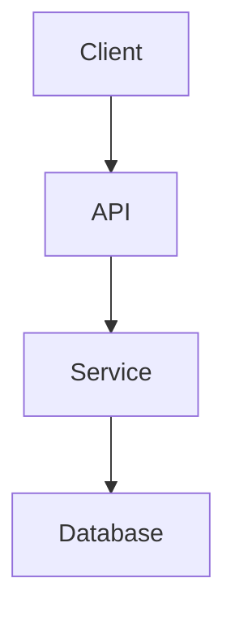

# AGENTS.md

## Objetivo

Este repositório é um Second Brain baseado nos princípios de Zettelkasten e Evergreen Notes.

O objetivo é:

* Capturar conhecimento de forma estruturada e reutilizável
* Apoiar aprendizado, ensino e pensamento de longo prazo
* Servir como fonte confiável de consulta futura

As notas devem priorizar **clareza, profundidade e aplicabilidade prática**.

---

## Princípios Fundamentais

### 1. Notas atômicas

* Cada nota deve representar **um único conceito**
* Evitar misturar múltiplas ideias

---

### 2. Clareza acima de brevidade

* A nota deve ser **autoexplicativa**
* Assuma que o leitor é seu “eu do futuro” sem contexto

---

### 3. Foco prático

Toda nota deve responder:

* O que é isso?
* Por que isso existe?
* Como funciona?
* Quando usar?

---

### 4. Forte interconexão

* Utilizar `[[links]]` entre notas
* Preferir linkar ao invés de repetir conteúdo
* Construir um grafo de conhecimento

---

### 5. Markdown como padrão

* Todas as notas devem ser escritas em Markdown
* Formatação simples, clara e consistente

---

## Idioma

* Todas as notas devem ser escritas em **Português (PT-BR)**
* Termos técnicos devem permanecer em inglês quando forem padrão da indústria
* Evitar traduções forçadas que prejudiquem clareza

---

## Estrutura obrigatória das notas

Todas as notas devem seguir exatamente este formato:

```md id="x9f2kd"
# Título

## Definição
Explicação clara e direta

## Porque iso existe
Qual problema isso resolve

## Como funciona
Explicação detalhada

## Quando usar
Cenários reais e critérios de decisão

## Exemplos
Exemplos práticos (preferencialmente reais)

## Representação visual
(Usar apenas quando fizer sentido)

## Notas Relacionadas
- [[Nota A]]
- [[Nota B]]
```

---

## Diagramas e Representações Visuais

Utilizar diagramas sempre que melhorarem o entendimento.

### Mermaid (preferencial)



### ASCII (alternativa)

```id="g6p4zt"
Client -> API -> Service -> Database
```

### Regras

* Usar para fluxos, arquitetura ou relações
* Não adicionar diagramas sem valor explicativo

---

## Estrutura de Pastas

* Pastas representam **domínios de conhecimento**, não hierarquia rígida

Exemplo:

```id="9z7l2x"
Backend/
DevOps/
Cloud/
Networking/
AI/
```

* As notas devem ser independentes da estrutura de pastas

---

## Regras de Escrita

### Estilo

* Linguagem clara, técnica e didática
* Sem uso de emojis
* Evitar excesso de formalidade acadêmica

---

### Evitar

* Explicações genéricas
* Conteúdo superficial
* Cópia direta de documentação
* Notas muito longas com múltiplos temas

---

## Estratégia de Linkagem

Sempre que possível, linkar:

* Pré-requisitos
* Conceitos relacionados
* Alternativas

Exemplo:

```md id="q1k8mv"
Veja também:
- [[Thread Pool]]
- [[Concurrency]]
- [[Parallelism]]
```

---

## Exemplos de Código

* Preferir **Java com Spring**
* Devem ser:

  * mínimos
  * claros
  * próximos de uso real em produção

---

## Tipos de Notas

### Concept

Explica um conceito (ex: Thread Pool)

### Tool

Explica uma ferramenta (ex: Docker, Redis)

### Pattern

Explica um padrão (ex: Circuit Breaker)

### Problem

Explica um problema real (ex: Fan-out HTTP)

---

## Anti-patterns

Evitar:

* Notas sem estrutura
* Notas sem exemplos práticos
* Conteúdo raso
* Misturar múltiplos conceitos
* Diagramas desnecessários

---

## Checklist de Qualidade

Antes de finalizar uma nota:

* [ ] O conceito está claro?
* [ ] Existe um exemplo prático?
* [ ] Meu “eu do futuro” entenderia isso?
* [ ] Existem links úteis para outras notas?
* [ ] Um diagrama melhoraria a explicação?

---

## Comportamento do Agente

Ao gerar notas:

1. Seguir a estrutura obrigatória
2. Priorizar profundidade sobre quantidade
3. Incluir exemplos práticos
4. Adicionar links relevantes
5. Usar diagramas quando fizer sentido
6. Escrever como um engenheiro experiente ensinando outro

---

## Filosofia

Este não é um repositório de documentação.

Este é um sistema de pensamento.

As notas existem para:

* entender melhor
* conectar ideias
* reutilizar conhecimento
* ensinar

---
