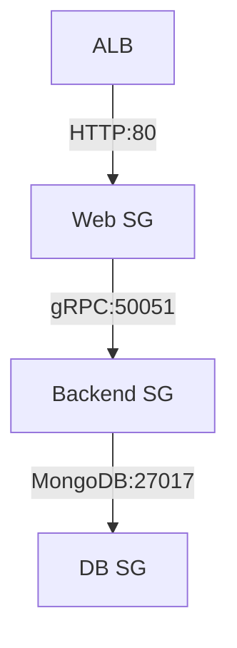

---
tags:
  - Fundamentos
  - Cloud
  - NotaBibliografica
cloud_provider: aws
categoria_servico: iaas
categoria: computacao
---
Os security Groups atuam como firewall a Nível de instancia, sua principal utilidade e controlar o trafego de rede, ou seja, controlar entrada e saída de pacotes baseado em regras explícitas,

Os **Security Groups (SGs)** atuam como firewalls virtuais no nível de instância, controlando tráfego de entrada (**inbound**) e saída (**outbound**) para recursos AWS como EC2, RDS, Lambda e ALB.

---

## **2. Comparação com Network ACLs**

|Critério|Security Groups|Network ACLs|
|---|---|---|
|**Nível**|Instância|Subnet|
|**Stateful**|Sim|Não|
|**Ordem das Regras**|Não importa|Avaliadas em ordem numérica|
|**Regras de Negação**|Não|Sim|
|**Aplicação**|Associado a instâncias|Associado a subnets|

---

## **3. Estrutura de Regras**

Cada regra contém:

- **Tipo**: Protocolo (TCP/UDP/ICMP) e faixa de portas.
- **Origem/Destino**: IPs (CIDR), outros SGs ou prefix lists.
- **Exemplo de regra inbound**:

    Permitir SSH (porta 22) apenas do IP 200.200.200.200/32
    

### **Regras Padrão**

- **Inbound**: Bloqueia TODO tráfego de entrada (por padrão).
    
- **Outbound**: Permite TODO tráfego de saída (por padrão).
    

---

## **4. Casos de Uso Práticos**

### **4.1 Cenário Básico (EC2 + RDS)**

**Security Groups:**

1. **EC2-SG** (Aplicado à instância EC2):
    
    - Inbound:
        
        - SSH (22) de `200.200.200.200/32`
            
        - HTTP (80) de `0.0.0.0/0`
            
    - Outbound:
        
        - MySQL (3306) para `RDS-SG`
            
2. **RDS-SG** (Aplicado ao banco RDS):
    
    - Inbound:
        
        - MySQL (3306) de `EC2-SG`
            

### **4.2 Referenciando Outros Security Groups**

Permita que instâncias com **SG-A** acessem instâncias com **SG-B** sem usar IPs fixos:

bash

Copy

Download

aws ec2 authorize-security-group-ingress \
  --group-id sg-123 \          # SG-B
  --protocol tcp \
  --port 8080 \
  --source-group sg-456        # SG-A

---

## **5. Melhores Práticas**

### **5.1 Princípio do Menor Privilégio**

- **Evite regras amplas** como `0.0.0.0/0` para portas críticas (ex: RDP, SSH).
    
- **Exemplo seguro**:
    
    bash
    
    Copy
    
    Download
    
    # Permitir SSH apenas de IPs corporativos
    aws ec2 authorize-security-group-ingress \
      --group-id sg-123 \
      --protocol tcp \
      --port 22 \
      --cidr 200.200.200.0/24
    

### **5.2 Organização**

- **Nomeie SGs claramente** (ex: `prod-web-sg`, `dev-db-sg`).
    
- **Use tags** para ambiente (`Environment=Prod`).
    

### **5.3 Segurança em Camadas**

Combine com **Network ACLs** para defesa em profundidade:

- SGs: Proteção no nível de instância.
    
- NACLs: Filtro adicional no nível de subnet.
    

---

## **6. Configuração via AWS CLI**

### **Criar SG e adicionar regras:**

bash

Copy

Download

# Criar SG
aws ec2 create-security-group \
  --group-name MyWebSG \
  --description "SG para servidores web" \
  --vpc-id vpc-123

# Adicionar regra HTTP (porta 80)
aws ec2 authorize-security-group-ingress \
  --group-id sg-123 \
  --protocol tcp \
  --port 80 \
  --cidr 0.0.0.0/0

# Adicionar regra de saída (opcional)
aws ec2 authorize-security-group-egress \
  --group-id sg-123 \
  --protocol tcp \
  --port 443 \
  --cidr 0.0.0.0/0

---

## **7. Troubleshooting Comum**

|Problema|Solução|
|---|---|
|Conexão recusada|1. Verifique SGs da instância   2. Confira NACLs da subnet|
|Latência alta|1. Verifique regras com muitos IPs/CIDRs|
|Falha em acessar serviços AWS|1. Verifique regras de saída (outbound)|

---

## **8. Exemplo Avançado (Microserviços)**

**Regras:**

- **Web-SG**: Permite entrada na porta 80 do ALB-SG.
    
- **Backend-SG**: Permite entrada na porta 50051 do Web-SG.
    
- **DB-SG**: Permite entrada na porta 27017 do Backend-SG.
    

---

## **9. Limitações**

- **Limite padrão**: 60 SGs por instância (podem ser aumentados via ticket AWS).
    
- **Não bloqueiam tráfego interno da VPC** (a menos que explicitamente negado via NACLs).
    

Precisa de ajuda para projetar regras para um cenário específico? Posso elaborar um exemplo customizado!