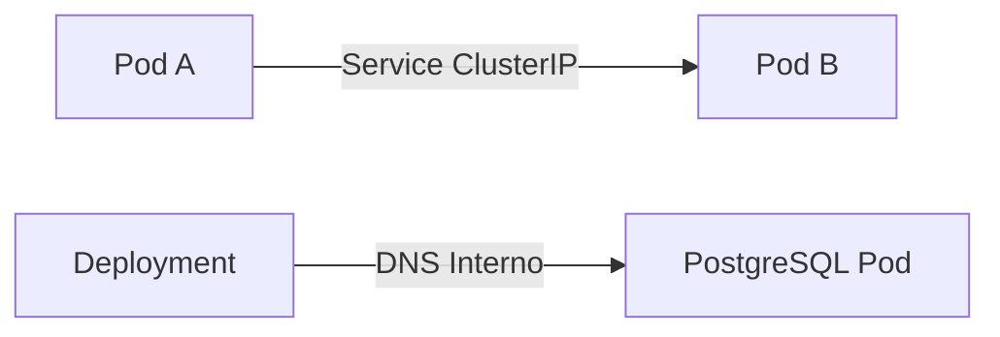
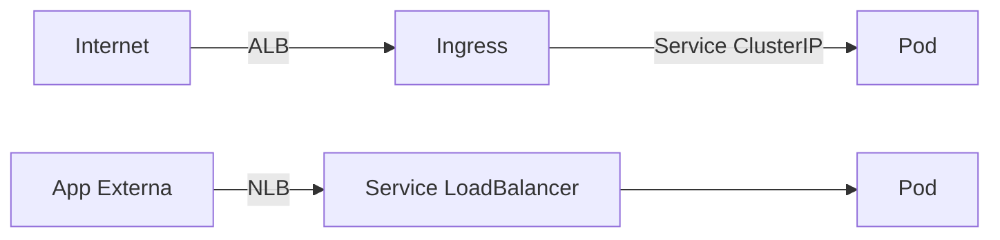

---
tags:
  - Fundamentos
  - Cloud
  - NotaBibliografica
  - Redes
categoria_servico: paas
cloud_provider: aws
categoria: balanceamento_carga
---
 **Pergunta: Para o fluxo interno do eks não é necessário Load Balancer certo?**

**Exatamente!** Dentro do fluxo interno do EKS (entre os próprios componentes do Kubernetes ou entre Pods/Services dentro do cluster), **não é necessário usar um Load Balancer da AWS (ALB/NLB)**. Vamos esclarecer quando e por que você não precisa dele:

---

### **1. Fluxo Interno no EKS: Como Funciona?**
Para comunicação **dentro do cluster** (ex.: Pod → Pod, Service → Service), o Kubernetes usa seus próprios recursos de rede, sem depender de LBs externos:

| Componente Interno          | Como a Comunicação Ocorre?                          |
|-----------------------------|----------------------------------------------------|
| **Service (ClusterIP)**     | DNS interno (`<service-name>.<namespace>.svc.cluster.local`) e IP virtual (kube-proxy). |
| **Service (NodePort)**      | Exposto em uma porta fixa em todos os nós (acessível via IP interno do node). |
| **kube-proxy**              | Encaminha tráfego entre Pods usando iptables/IPVS. |
| **CNI (AWS VPC CNI Plugin)**| Atribui IPs reais da VPC aos Pods, permitindo comunicação direta. |

---

### **2. Quando um Load Balancer (ALB/NLB) é Necessário?**
Apenas para cenários **externos ao cluster**:
- **Acesso de usuários/internet** a aplicações (ex.: frontend web).
- **Integração com serviços AWS** (ex.: um pod acessando um RDS externo via NLB).

---

### **3. Exemplo: Fluxo Interno vs. Externo**
#### **Cenário 1: Comunicação Interna (Sem LB)**

- **Como funciona**:
  1. O `Pod A` acessa o `Pod B` via `service-b.default.svc.cluster.local`.
  2. O `kube-proxy` encaminha o tráfego usando iptables/IPVS.
  3. **Nenhum LB é envolvido**.

#### **Cenário 2: Acesso Externo (Com LB)**

- **Load Balancers são usados apenas para tráfego de fora do cluster**.

---

### **4. Tipos de Services Kubernetes e Impacto no LB**
| Tipo de Service   | Load Balancer? | Uso Típico                     |
|-------------------|----------------|--------------------------------|
| **ClusterIP**     | ❌ Não          | Comunicação interna entre Pods. |
| **NodePort**      | ❌ Não          | Testes locais ou acesso via IP do Node. |
| **LoadBalancer**  | ✅ Sim (NLB)   | Expor um serviço para internet. |
| **Ingress**       | ✅ Sim (ALB)   | Roteamento HTTP avançado.       |

---

### **5. Por Que o Fluxo Interno Não Precisa de LB?**
1. **Eficiência**:
   - Comunicação direta entre Pods (via VPC CNI) é mais rápida e barata.
2. **Segurança**:
   - Toda a rede interna está dentro da VPC, isolada da internet.
3. **Simplicidade**:
   - O Kubernetes já resolve descoberta de serviços via `kube-dns` e `kube-proxy`.

---

### **6. Exemplo Prático: Banco de Dados Interno**
#### **Passo 1: Crie um Service `ClusterIP`**
```yaml
apiVersion: v1
kind: Service
metadata:
  name: postgres-internal
spec:
  type: ClusterIP  # Padrão – não cria LB!
  selector:
    app: postgres
  ports:
    - port: 5432
      targetPort: 5432
```
- **Como acessar**:
  - Outros pods usam o DNS: `postgres-internal.default.svc.cluster.local:5432`.

#### **Passo 2: Aplicação Acessando o Banco**
```yaml
apiVersion: apps/v1
kind: Deployment
metadata:
  name: minha-app
spec:
  containers:
  - name: app
    image: minha-app
    env:
    - name: DB_HOST
      value: "postgres-internal"  # DNS interno do Service
```
- **Nenhum LB é criado** – tudo roda dentro da VPC.

---

### **7. Quando um LB Interno é Usado? (Raro)**
Em casos **muito específicos**, você pode querer um **NLB interno** (não exposto à internet) para:
- **Comunicação entre clusters EKS**.
- **Integração com ferramentas legacy** que exigem balanceamento de carga em redes privadas.

#### **Exemplo: NLB Interno**
```yaml
apiVersion: v1
kind: Service
metadata:
  name: internal-nlb
  annotations:
    service.beta.kubernetes.io/aws-load-balancer-internal: "true"  # NLB interno
spec:
  type: LoadBalancer
  selector:
    app: internal-app
  ports:
    - port: 80
```
- **Acesso apenas dentro da VPC**.

---

### **8. Resumo Final**
- **Fluxo interno (Pods/Services)**: Nunca precisa de ALB/NLB – use `ClusterIP` e DNS interno.
- **Fluxo externo (Internet)**: Use `Ingress` (ALB) ou `Service type: LoadBalancer` (NLB).
- **NLB interno**: Apenas para cenários avançados de rede híbrida.

Se sua aplicação só se comunica dentro do cluster, **você não paga por LBs e não precisa configurá-los**! 🎉