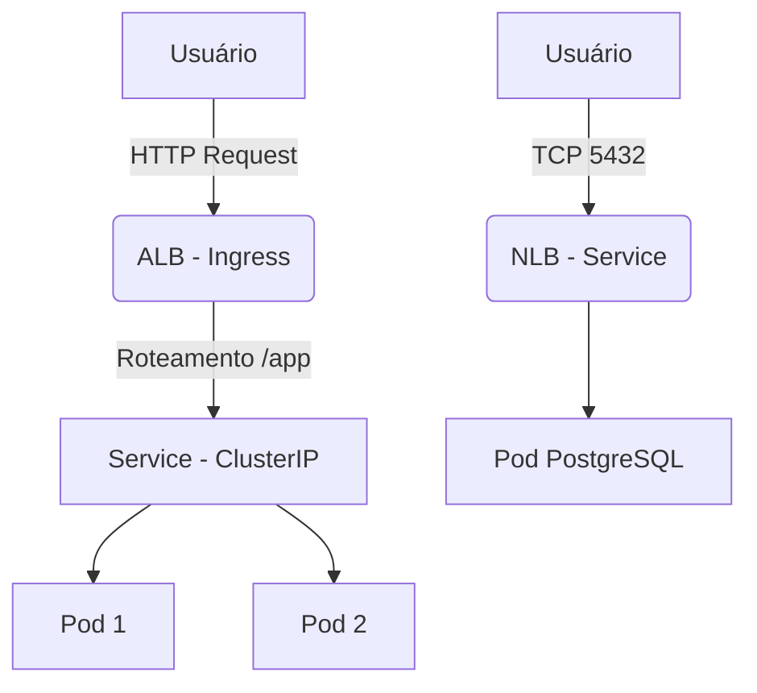

---
tags:
  - Fundamentos
  - Cloud
  - NotaBibliografica
  - Redes
categoria_servico: paas
cloud_provider: aws
categoria: balanceamento_carga
---
Ótima pergunta! Vamos esclarecer essa confusão comum sobre como o **Ingress** e o **Service** do Kubernetes funcionam no EKS, especialmente em relação aos Load Balancers da AWS (ALB e NLB).

---

### **1. O Que Cada Recurso Cria?**
| Recurso Kubernetes | Load Balancer Gerado | Quando é Usado? |
|--------------------|----------------------|-----------------|
| **`Service`** com `type: LoadBalancer` | **NLB** (padrão) ou **Classic Load Balancer** | Quando você quer expor um serviço diretamente via TCP/UDP. |
| **`Ingress`** com anotações ALB | **ALB** (Application Load Balancer) | Quando você precisa de roteamento HTTP/HTTPS avançado (hosts, paths, SSL). |

---

### **2. Por Que o Ingress Não Cria um NLB?**
O **Ingress** é um recurso de **camada 7 (HTTP/HTTPS)**, enquanto o NLB opera na **camada 4 (TCP/UDP)**. Eles têm propósitos diferentes:

- **Ingress + ALB**:
  - Roteia tráfego baseado em **caminhos URLs** (`/api`, `/app`) ou **domínios** (`app1.example.com`, `app2.example.com`).
  - Gerencia **terminação SSL**, redirecionamentos e autenticação.
  - **Não serve para tráfego não-HTTP** (ex.: banco de dados).

- **Service (LoadBalancer) + NLB**:
  - Encaminha conexões **diretamente para pods** sem inspeção de conteúdo.
  - Ideal para **TCP/UDP** (ex.: MySQL, Redis, jogos online).

---

### **3. Exemplo Prático: Quando Cada Um é Criado?**
#### **Cenário 1: Service com `type: LoadBalancer` (NLB)**
```yaml
apiVersion: v1
kind: Service
metadata:
  name: meu-app-nlb
spec:
  type: LoadBalancer  # Provisiona um NLB
  selector:
    app: meu-app
  ports:
    - protocol: TCP
      port: 80
      targetPort: 8080
```
- **Resultado**: Um **NLB** é criado na AWS, mapeando a porta 80 para a 8080 dos pods.

#### **Cenário 2: Ingress (ALB)**
```yaml
apiVersion: networking.k8s.io/v1
kind: Ingress
metadata:
  name: meu-app-ingress
  annotations:
    kubernetes.io/ingress.class: alb  # Força a criação de um ALB
spec:
  rules:
    - http:
        paths:
          - path: /app
            backend:
              service:
                name: meu-app-service  # Redireciona para um Service ClusterIP
                port:
                  number: 80
```
- **Resultado**: Um **ALB** é criado, roteando tráfego de `/app` para o `meu-app-service` (que pode ser um Service comum do tipo `ClusterIP`).

---

### **4. Por Que o Ingress Redireciona para Services?**
O Ingress **não substitui** o Service – ele depende dele! Aqui está o fluxo completo:

```
[Usuário] → [ALB (Ingress)] → [Service (ClusterIP)] → [Pods]
```

1. O **ALB** (criado pelo Ingress) recebe o tráfego HTTP.
2. O ALB consulta as **regras do Ingress** para decidir para qual **Service** enviar o tráfego.
3. O **Service** (geralmente do tipo `ClusterIP`) encaminha a requisição para os pods.

---

### **5. Comparação Direta**
| Feature               | Ingress (ALB)                  | Service (NLB)                 |
|-----------------------|--------------------------------|-------------------------------|
| **Tipo de LB**        | Application Load Balancer      | Network Load Balancer         |
| **Protocolo**         | HTTP/HTTPS                     | TCP/UDP                       |
| **Roteamento**        | Por path/host (ex.: `/api`)    | Apenas por porta              |
| **Service Associado** | Usa um `ClusterIP` interno     | É o próprio `LoadBalancer`    |
| **Custo**             | Mais caro (por regras complexas)| Mais barato                   |

---

### **6. Exemplo de Arquitetura Completa**
Suponha que você queira:
- Um **ALB** para rotear tráfego web.
- Um **NLB** para um serviço de banco de dados.

#### **Passo 1: Ingress (ALB) para Aplicação Web**
```yaml
# Ingress para roteamento HTTP
apiVersion: networking.k8s.io/v1
kind: Ingress
metadata:
  name: web-ingress
  annotations:
    kubernetes.io/ingress.class: alb
spec:
  rules:
    - http:
        paths:
          - path: /
            backend:
              service:
                name: web-service  # Service do tipo ClusterIP
                port:
                  number: 80
```

#### **Passo 2: Service (NLB) para Banco de Dados**
```yaml
# Service para expor PostgreSQL via NLB
apiVersion: v1
kind: Service
metadata:
  name: postgres-nlb
spec:
  type: LoadBalancer  # Cria um NLB
  selector:
    app: postgres
  ports:
    - protocol: TCP
      port: 5432
      targetPort: 5432
```

#### **Resultado**:
- **ALB**: Roteia `example.com/` para `web-service`.
- **NLB**: Expõe o PostgreSQL na porta 5432 publicamente.

---

### **7. Por Que Não Usar Apenas NLB para Tudo?**
- **NLB não entende HTTP**: Não pode rotear por paths/hosts ou terminar SSL.
- **ALB é mais inteligente**: Pode dividir tráfego entre múltiplos serviços baseado em URLs.

---

### **8. Perguntas Frequentes**
#### **P: Posso forçar o Ingress a criar um NLB?**
- **R**: Não. O Ingress é conceitualmente para HTTP/HTTPS. Se precisar de NLB, use `Service type: LoadBalancer`.

#### **P: Posso usar ALB sem Ingress?**
- **R**: Não diretamente. O ALB no EKS é gerenciado pelo **AWS Load Balancer Controller**, que reage a recursos Ingress.

#### **P: Por que meu Ingress não criou um ALB?**
- **R**: Verifique:
  1. Se o **AWS Load Balancer Controller** está instalado.
  2. Se a anotação `kubernetes.io/ingress.class: alb` está presente.
  3. Se o Ingress tem regras válidas.

---

### **9. Diagrama de Fluxo**


---

### **10. Resumo Final**
- **Ingress** → **ALB**: Para roteamento HTTP avançado.
- **Service type: LoadBalancer** → **NLB**: Para tráfego TCP/UDP simples.
- **São complementares**: O Ingress usa Services internamente para rotear tráfego.

Se você quer **roteamento complexo** (como múltiplos domínios ou paths), use **Ingress + ALB**. Se quer **expor um serviço diretamente** (como um banco de dados), use **Service + NLB**.