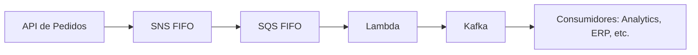

---
tags:
  - Fundamentos
  - Cloud
  - NotaBibliografica
categoria_servico: paas
cloud_provider: aws
categoria: mensageria
---
A escolha entre **Amazon SNS (FIFO)** e **[[Kafka|Apache Kafka]]** depende do seu caso de uso, requisitos de arquitetura e necessidades específicas. Vamos comparar os dois em termos de eficiência, desempenho e cenários ideais:

---

## **📌 Comparação Direta: SNS FIFO vs. Apache Kafka**
| **Característica**          | **Amazon SNS FIFO**                          | **Apache Kafka**                          |
|-----------------------------|---------------------------------------------|------------------------------------------|
| **Modelo de Mensageria**    | Pub/Sub (com suporte a FIFO)                | **Stream de eventos distribuído**        |
| **Ordenação de Mensagens**  | Por grupo (`MessageGroupId`)                | **Por partição** (ordem estrita dentro de uma partição) |
| **Taxa de Transferência**   | Até **300 mensagens/segundo por tópico**    | **Milhões de mensagens/segundo** (escalável horizontalmente) |
| **Latência**                | Baixa (ms)                                  | **Muito baixa (μs a ms)**                |
| **Deduplicação**            | Suportada (`MessageDeduplicationId`)        | **Não nativa** (requer implementação customizada) |
| **Retenção de Mensagens**   | **Não armazena** (entrega imediata)         | **Armazena por tempo/configuração** (horas/dias/bytes) |
| **Consumidores**            | **Broadcast** (múltiplas SQS FIFO)          | **Consumidores independentes** (cada um gerencia seu offset) |
| **Integração com Ecossistema** | AWS (SQS, Lambda, etc.)                   | **Multiplataforma** (Kafka Connect, clientes em várias linguagens) |
| **Complexidade de Gerenciamento** | **Gerenciado pela AWS** (sem servidores) | **Auto-gerenciado** (ou serviços como MSK) |
| **Custo**                   | Cobrança por mensagem + assinaturas         | **Custo de infraestrutura** (ou MSK na AWS) |

---

## **🎯 Quando Usar SNS FIFO?**
✔ **Cenários AWS-native** onde você já usa [[SQS FIFO]] e precisa de **ordem/deduplicação simples**.  
✔ **Workflows assíncronos** (ex: processamento de pedidos em e-commerce com garantia de ordem).  
✔ **Baixo volume** (até 300 msg/segundo por tópico).  
✔ **Sem necessidade de reprocessamento** (as mensagens não são armazenadas após a entrega).  

### **Exemplo Prático com SNS FIFO:**
```python
# Publica uma mensagem FIFO para um tópico SNS (ordenada por pedido_id)
sns.publish(
    TopicArn="arn:aws:sns:us-east-1:123456789012:pedidos.fifo",
    Message='{"pedido_id": 100, "status": "pago"}',
    MessageGroupId="pedido_100"  # Garante ordem para este pedido
)
```

---

## **🎯 Quando Usar Apache Kafka?**
✔ **Alta escala** (milhões de eventos/segundo).  
✔ **Reprocessamento** (necessidade de reler mensagens antigas).  
✔ **Arquiteturas complexas** com múltiplos consumidores independentes.  
✔ **Integração entre sistemas heterogêneos** (Kafka Connect para bancos de dados, SaaS, etc.).  
✔ **Stream processing** (com Kafka Streams ou Flink).  

### **Exemplo Prático com Kafka:**
```python
from kafka import KafkaProducer

producer = KafkaProducer(bootstrap_servers='kafka-server:9092')
producer.send(
    topic='pedidos',
    value='{"pedido_id": 100, "status": "pago"}',
    key='pedido_100'  # Ordenação por chave (partição)
)
```

---

## **🔍 Comparação Detalhada por Cenário**

### **1. Ordenação de Mensagens**
- **SNS FIFO**:  
  - Ordenação garantida apenas dentro de um `MessageGroupId`.  
  - Ex: Pedidos diferentes podem ser processados em paralelo, mas um mesmo pedido é ordenado.  
- **Kafka**:  
  - Ordenação **estrita por partição** (todas as mensagens com a mesma chave vão para a mesma partição).  
  - Mais flexível para cenários de alta concorrência.  

### **2. Escalabilidade**
- **SNS FIFO**:  
  - Limitado a **300 mensagens/segundo por tópico**.  
  - Para escalar, é preciso criar múltiplos tópicos.  
- **Kafka**:  
  - Escala horizontalmente adicionando **partições e brokers**.  
  - Suporta **picos de tráfego** sem perda de desempenho.  

### **3. Retenção e Reprocessamento**
- **SNS FIFO**:  
  - Mensagens são descartadas após a entrega.  
  - **Não suporta replay**.  
- **Kafka**:  
  - Mensagens ficam armazenadas por **dias ou TBs de dados**.  
  - Consumidores podem reprocessar a partir de qualquer offset.  

### **4. Integração com Ecossistema**
- **SNS FIFO**:  
  - Funciona melhor com **SQS FIFO** e outros serviços AWS.  
  - Limitado a assinantes SQS (não suporta HTTP, SMS, etc. em FIFO).  
- **Kafka**:  
  - Conectores para **bancos de dados (Debezium), SaaS, e sistemas legados**.  
  - Client libraries em **Java, Python, Go, etc.**  

---

## **📌 Conclusão: Qual Escolher?**
| **Critério**               | **Amazon SNS FIFO**                      | **Apache Kafka**                          |
|----------------------------|-----------------------------------------|------------------------------------------|
| **Melhor para**            | Casos simples de ordenação na AWS       | Alta escala, reprocessamento e ecossistema aberto |
| **Custo**                  | Pay-per-use (sem infra)                 | Custo de clusters (ou MSK na AWS)        |
| **Complexidade**           | Baixa (gerenciado pela AWS)            | Alta (gerenciamento de clusters)         |
| **Mensagens/segundo**      | Até 300 por tópico                      | Milhões (com particionamento)            |

### **Use SNS FIFO se:**
- Você já está na AWS e precisa de **ordem/deduplicação simples**.  
- Seu volume é baixo/moderado (≤ 300 msg/seg).  
- Não precisa reprocessar mensagens antigas.  

### **Use Kafka se:**
- Você precisa de **alta escala** (milhões de eventos).  
- Quer **reprocessamento** ou retenção de mensagens.  
- Sua arquitetura é **multi-cloud ou híbrida**.  

---

## **Exemplo Híbrido (SNS + Kafka)**
Em alguns casos, é possível usar os dois juntos:  
1. **SNS FIFO** para garantir ordem inicial em eventos críticos.  
2. **Kafka** para distribuir esses eventos para sistemas downstream com alta escala.  



Precisa de ajuda para decidir com base no seu cenário específico? Posso elaborar uma recomendação personalizada! 😊