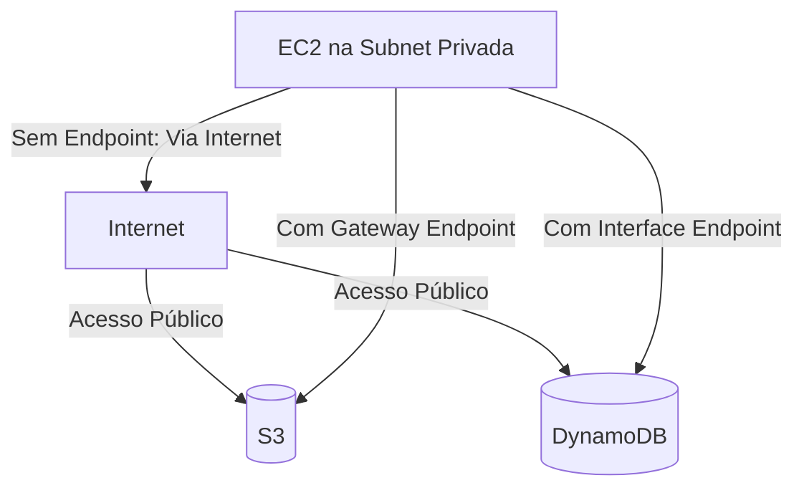

---
tags:
  - Fundamentos
  - Cloud
  - NotaBibliografica
  - Redes
categoria_servico: hibrido
cloud_provider: aws
---
Aqui está um diagrama **Mermaid** que ilustra como um **VPC Endpoint** funciona, comparando o acesso **com e sem** ele:  

### **Explicação do Diagrama:**
1. **Sem VPC Endpoint (setas rosa):**  
   - A EC2 na **sub-rede privada** precisa sair pela internet (via **Internet Gateway** ou **NAT Gateway**) para acessar o S3/DynamoDB.  
   - O tráfego fica exposto e pode ter custos/latência.  

2. **Com VPC Endpoint (setas azuis):**  
   - **Gateway Endpoint** (para S3/DynamoDB): Roteia o tráfego internamente na AWS.  
   - **Interface Endpoint** (para outros serviços, como KMS, API Gateway): Usa uma ENI (Elastic Network Interface) privada.  

### **Fluxo Resumido:**
- **🔒 Seguro:** Nenhum dado trafega pela internet.  
- **⚡ Rápido:** Conexão direta na rede backbone da AWS.  
- **💸 Econômico:** Elimina custos de NAT Gateway/Data Transfer.  

Se quiser ajustar o diagrama (ex.: adicionar mais serviços ou um NAT Gateway), me avise! 😊