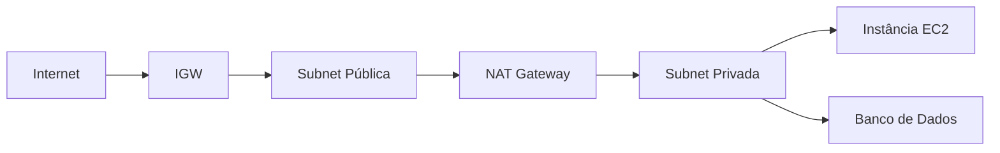

---
tags:
  - Fundamentos
  - Cloud
  - NotaBibliografica
  - Redes
cloud_provider: aws
categoria_servico: hibrido
---
O Nat Gateway é amplamente utilizado como uma alternativa ao [[Internet Gateway (IGW)]], por realizar o processo de [[traducao-enderecos-nat]] é possível acessar a internet através dele, mesmo estando em uma rede privada, basta possuir um roteamento referenciando esse gateway dentro da [[Route Tables|Tabela de Roteamento de Subnet]], essa estratégia é muito parecida com o ocorrido no internet gateway.

A Principal vantagem em comparação com o [[Internet Gateway (IGW)]] é que somente o trafego de saída será permitido, propondo assim um isolamento muito interessante, este é associado geralmente a uma rede privada facilitando muito o acesso além de possuir a redundancia dentro daquele AZ.

