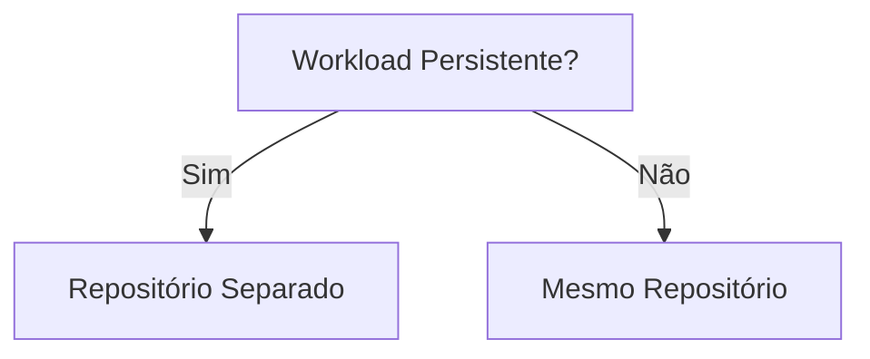

---
tags:
  - Kubernetes
  - NotaBibliografica
categoria: CD
ferramenta: argocd
---
### **Resposta Direta: Sim, em Cenários Específicos**  

Criar um **repositório separado para workloads com armazenamento persistente ([[persistent-volume]]/[[persistent-volume-claim]])** pode ser vantajoso, mas depende do seu contexto. Aqui está uma análise detalhada para ajudar na decisão:

---

## **📌 Quando Vale a Penha um Repositório Separado?**  

### **✅ Benefícios**  
1. **Segurança e Governança**  
   - Isola recursos críticos (como bancos de dados) de aplicações stateless.  
   - Facilita o controle de acesso (ex: apenas a equipe de infra gerencia PVs/PVCs).  

1. **Evitar Problemas com o [[introducao-argocd]]**  
   - Recursos persistentes exigem tratamento especial (ex: `Prune=false`, finalizers).  
   - Um repositório dedicado permite configurar sync policies específicas para esses workloads.  

3. **Facilidade de Rollback**  
   - Dados persistentes raramente são "rollbackáveis". Separar os manifests evita sincronizações acidentais.  

4. **Clareza Organizacional**  
   - Exemplo de estrutura:  
     ```plaintext
     repo-infra/
     ├── storage/
     │   ├── postgres-pv.yaml
     │   └── redis-pvc.yaml
     repo-apps/
     ├── app1/
     │   └── deployment.yaml
     ```

---

### **❌ Quando Não é Necessário**  
- Se seus **workloads persistentes são simples** (ex: PVCs efêmeros para caches).  
- Se você já usa **políticas de sync customizadas** (ex: `ignoreDifferences` para PVs).  

---

## **🛠️ Como Implementar**  

### **1. Estrutura de Repositórios Recomendada**  
```plaintext
repo-persistent-workloads/  # Para PVs, PVCs, StatefulSets
├── base/
│   ├── postgres/
│   │   ├── pv.yaml
│   │   └── statefulset.yaml
│   └── redis/
│       └── pvc.yaml
└── overlays/
    ├── dev/
    └── prod/

repo-apps/                  # Para aplicações stateless
├── app1/
│   └── deployment.yaml
```

### **2. Configuração do Argo CD**  
- **Para workloads persistentes**:  
  ```yaml
  # applicationset-persistent.yaml
  apiVersion: argoproj.io/v1alpha1
  kind: Application
  metadata:
    name: persistent-storage
  spec:
    source:
      repoURL: https://github.com/seu-org/repo-persistent-workloads.git
      path: base/postgres
    syncPolicy:
      syncOptions:
        - Prune=false       # Evita deletar PVs/PVCs acidentalmente
        - Validate=false    # Ignora validação de campos imutáveis
    ignoreDifferences:
      - group: ""
        kind: PersistentVolume
        jsonPointers:
          - /spec/capacity/storage
  ```

- **Para aplicações stateless**:  
  ```yaml
  # applicationset-apps.yaml
  apiVersion: argoproj.io/v1alpha1
  kind: Application
  metadata:
    name: stateless-apps
  spec:
    source:
      repoURL: https://github.com/seu-org/repo-apps.git
      path: app1
    syncPolicy:
      automated:
        prune: true  # Pode deletar recursos sem risco
  ```

---

## **🔍 Alternativas a Repositórios Separados**  
Se preferir manter tudo em um único repositório:  
1. **Use subdiretórios dedicados**:  
   ```plaintext
   repo-all/
   ├── apps/
   │   └── app1/
   └── storage/
       └── postgres/
   ```  
2. **Aplique labels/anotações** para filtrar no Argo CD:  
   ```yaml
   metadata:
     labels:
       workload-type: persistent
   ```

---

## **⚡ Quando Escolher Cada Abordagem**  
| **Critério**               | **Repositório Separado**          | **Subdiretórios no Mesmo Repo**       |  
|----------------------------|-----------------------------------|---------------------------------------|  
| **Controle de acesso**      | ✅ Melhor (RBAC granular)         | ⚠️ Limitado                          |  
| **Complexidade**            | ⚠️ Mais repositórios para gerenciar | ✅ Mais simples                       |  
| **Evitar conflitos no Argo CD** | ✅ Ideal para PVs/PVCs           | ⚠️ Requer syncOptions customizados   |  

---

## **📌 Conclusão**  
- **Para ambientes críticos** (ex: bancos de dados em produção), **um repositório separado é ideal**.  
- **Para projetos pequenos**, subdiretórios com anotações (`Prune=false`) podem ser suficientes.  

**Exemplo de decisão**:  


Quer ajuda para estruturar seus repositórios ou configurar o Argo CD? Posso fornecer templates prontos! 😊