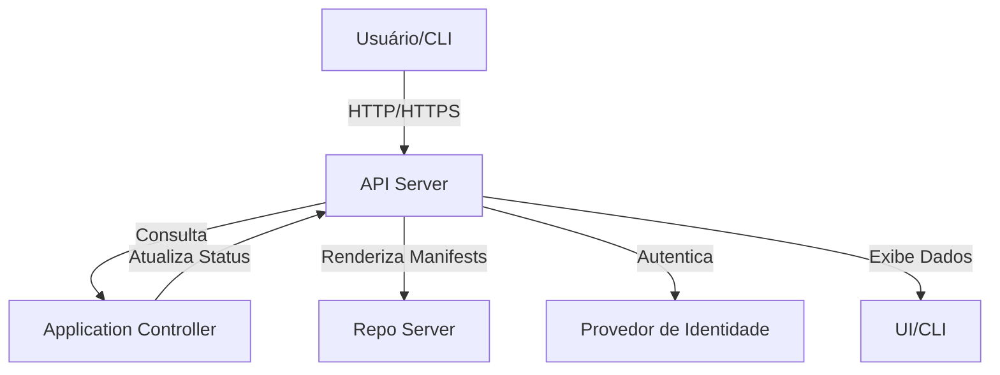

---
tags:
  - Kubernetes
  - NotaBibliografica
categoria: CD
ferramenta: argocd
---
### **API Server do Argo CD: Funcionamento Detalhado**

O **API Server** (também chamado de `argocd-server`) é o **cérebro central** do [[introducao-argocd|Argo CD]], responsável por gerenciar a interface entre usuários, ferramentas externas e os componentes internos do Argo CD. Ele expõe uma API RESTful e uma interface web (UI), além de lidar com autenticação, autorização e orquestração de operações.

---

## **📌 Principais Responsabilidades**
1. **Interface de Comunicação**:  
   - Fornece endpoints REST para interação via CLI, UI ou integrações (ex: Jenkins, GitHub Actions).  
   - Disponibiliza a **UI web** (dashboard) para gerenciamento visual.  

1. **Autenticação e Autorização ([[rbac]])**:  
   - Gerencia logins via SSO ([[Resumo OAUTH 2.0|OAuth2]], LDAP, Dex) ou contas locais.  
   - Aplica políticas de acesso baseadas em roles (ex: `admin`, `read-only`).  

3. **Orquestração de Operações**:  
   - Recebe solicitações (ex: `sync`, `rollback`) e as encaminha ao `Application Controller`.  
   - Armazena estados das aplicações e auditoria de mudanças.  

4. **Integração com Repositórios Git**:  
   - Valida permissões de acesso aos repositórios configurados.  

---

## **🔍 Arquitetura e Fluxo de Trabalho**


### **1. Requisição de Sincronização (Exemplo)**
1. **Usuário** executa:  
   ```sh
   argocd app sync minha-app
   ```
2. **API Server**:  
   - Valida permissões do usuário.  
   - Encaminha a solicitação ao `Application Controller`.  
3. **Application Controller**:  
   - Executa o sync e retorna o status.  
4. **API Server**:  
   - Atualiza a UI e armazena o histórico da operação.  

---

## **⚙️ Componentes Integrados**
### **1. Banco de Dados (Redis)**
- Armazena cache de estados e sessões de usuário.  

### **2. Service Account do [[kubernetes]]**
- O API Server usa uma conta de serviço (`argocd-server`) para interagir com o cluster Kubernetes.  

### **3. [[configmap]] e [[secret|Secrets]]**
- Armazenam configurações globais (ex: `argocd-cm`, `argocd-secret`).  

---

## **📌 Endpoints Principais**
| **Endpoint**                  | **Função**                                  |  
|-------------------------------|--------------------------------------------|  
| `/api/v1/applications`        | Listar/gerenciar aplicações.               |  
| `/api/v1/session`             | Autenticação (login/logout).               |  
| `/api/v1/stream/applications` | Stream de eventos em tempo real (WebSocket). |  
| `/api/v1/repositories`        | Gerenciar repositórios Git.                |  

---

## **🔍 Exemplo de Requisição API**
### **Listar Aplicações via curl**
```sh
curl -sH "Authorization: Bearer $ARGOCD_TOKEN" https://argocd.example.com/api/v1/applications | jq .
```
- O token é obtido via `argocd login`.  

### **Response (JSON)**
```json
{
  "items": [
    {
      "metadata": {
        "name": "minha-app",
        "namespace": "argocd"
      },
      "status": {
        "sync": {
          "status": "Synced"
        },
        "health": {
          "status": "Healthy"
        }
      }
    }
  ]
}
```

---

## **⚠️ Problemas Comuns e Soluções**
| **Problema**                     | **Causa**                                  | **Solução**                                  |  
|----------------------------------|-------------------------------------------|---------------------------------------------|  
| `401 Unauthorized`               | Token inválido ou expirado.               | Renove o token com `argocd login`.          |  
| `403 Forbidden`                  | RBAC insuficiente.                        | Atualize permissões no `argocd-rbac-cm`.    |  
| `500 Internal Server Error`      | Falha no Application Controller.          | Verifique logs do `argocd-application-controller`. |  

---

## **🔧 Configurações Avançadas**
### **1. Habilitar HTTPS**
Edite o `argocd-cm` ConfigMap:  
```yaml
data:
  server.insecure: "false"  # Force HTTPS
  server.certificate: |
    -----BEGIN CERTIFICATE-----
    ...
```

### **2. Escalabilidade**
Para alta disponibilidade:  
```sh
kubectl scale deploy -n argocd argocd-server --replicas=3
```

### **3. Logs Detalhados**
Aumente o nível de log para debug:  
```sh
kubectl edit deploy -n argocd argocd-server
```
Adicione:  
```yaml
args:
  - --loglevel
  - debug
```

---

## **🎯 Por Que o API Server é Importante?**
- **Centraliza o controle**: Toda interação com o Argo CD passa por ele.  
- **Facilita integrações**: APIs REST permitem automação com ferramentas externas.  
- **Garante segurança**: RBAC e autenticação robusta.  

---

## **📚 Referências**
- [Argo CD API Docs](https://argo-cd.readthedocs.io/en/stable/operator-manual/api-docs/)  
- [Configuração do Server](https://argo-cd.readthedocs.io/en/stable/operator-manual/server/)  