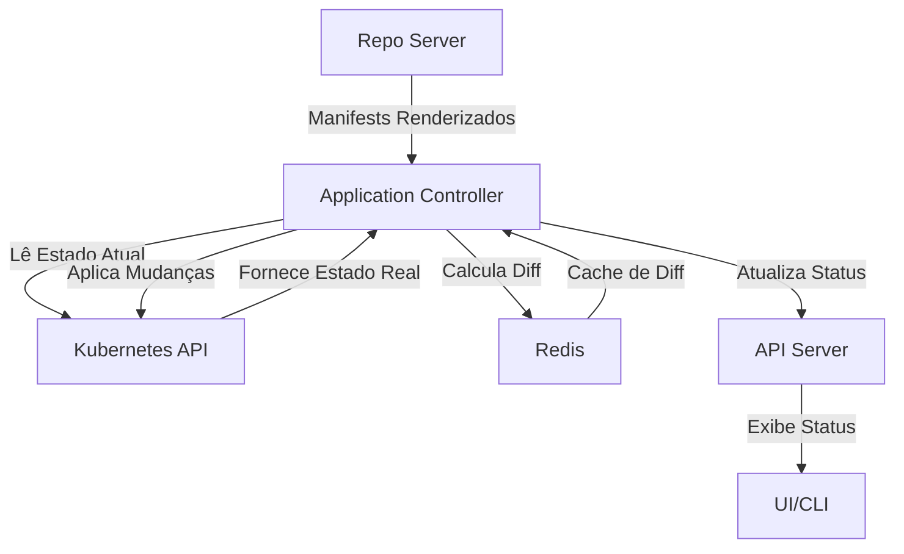

---
tags:
  - Kubernetes
  - NotaBibliografica
categoria: CD
ferramenta: argocd
---
### **Application Controller no Argo CD: Papel e Integração com Outros Componentes**

O **Application Controller** é o núcleo operacional do [[introducao-argocd|Argo CD]], responsável por **garantir que o estado do cluster [[kubernetes]] corresponda ao estado desejado declarado no [[Git]]**. Ele age como um **controlador de loops contínuos**, monitorando, comparando e corrigindo divergências (*[[drift|drift]]*). Aqui está uma explicação detalhada de sua função e como ele interage com outros componentes:

---

## **📌 Funções Principais do Application Controller**
1. **[[processo-reconciliacao|Reconciliação]] Contínua**:  
   - Compara o estado atual do cluster com o estado desejado no Git (usando `kubectl diff`).  
   - Executa ações para alinhá-los (`create`, `update`, [[prune|delete]]).  

2. **Gerenciamento de Ciclo de Vida**:  
   - Aplica recursos, executa [[hooks|hooks]] (pré/pós-sync) e verifica a [[verificacao-saude|saúde das aplicações]].  

3. **Monitoramento de Drift**:  
   - Detecta mudanças manuais no cluster (ex: `kubectl edit`) e as corrige se `selfHeal: true` estiver ativado.  

---

## **🔍 Como o Application Controller se Relaciona com Outros Componentes?**
### **1. Com o [[repo-server]]**
- **Papel do Repo Server**: Renderiza manifests brutos ([[helm]]/Kustomize) em YAMLs válidos para o Kubernetes.  
- **Interação**:  
  - O Application Controller **solicita manifests renderizados** ao Repo Server.  
  - Se o Repo Server falhar (ex: erro no `helm template`), o Application Controller **não prossegue** com o sync.  

### **2. Com a [[api-server]] (argocd-server)**
- **Papel da API Server**: Fornece a interface REST/UI e gerencia autenticação.  
- **Interação**:  
  - O Application Controller **atualiza o status das aplicações** (ex: "Healthy", "Degraded") via API Server.  
  - A UI reflete essas informações em tempo real.  

### **3. Com o Redis**
- **Papel do Redis**: Cacheia resultados de diffs e estados para melhorar performance.  
- **Interação**:  
  - O Application Controller armazena e recupera comparações de estado (`diff`) no Redis.  

### **4. Com o Cluster Kubernetes**
- **Interação Direta**:  
  - O Application Controller **chama a [[kubernetes-api-server|API do Kubernetes]]** para aplicar/remover recursos.  
  - Usa a [[service-account|service account]] `argocd-application-controller` ([[rbac]] deve ser configurado corretamente).  

---

## **⚙️ Fluxo de Trabalho do Application Controller**

---

## **📌 Exemplo Prático de Funcionamento**
1. **Desenvolvedor faz commit** no Git (ex: altera `replicas: 3` para `5` em um Deployment).  
2. **Repo Server**:  
   - Renderiza o novo YAML.  
3. **Application Controller**:  
   - Detecta a mudança (via polling ou webhook).  
   - Compara com o cluster (`kubectl diff`).  
   - Executa `kubectl apply` para escalar o Deployment.  
4. **API Server**:  
   - Atualiza o status da aplicação para "Synced".  

---

## **⚠️ Problemas Comuns e Soluções**
| **Cenário**                          | **Causa**                                  | **Solução**                                  |
|--------------------------------------|-------------------------------------------|---------------------------------------------|
| Sync travado em "Progressing"        | Recursos não ficam saudáveis.             | Verifique eventos do Kubernetes (`kubectl get events -n <namespace>`). |
| Erros de permissão (`cannot get`)    | RBAC insuficiente.                        | Atualize o `ClusterRole` do service account. |
| Drift não corrigido                  | `selfHeal: false` ou `ignoreDifferences`. | Ative `selfHeal` ou ajuste `ignoreDifferences`. |

---

## **🎯 Por Que o Application Controller é Crucial?**
- **GitOps**: Garante que o cluster seja um espelho exato do Git.  
- **Automatização**: Elimina a necessidade de intervenção manual (`kubectl apply`).  
- **Segurança**: Rastreabilidade completa de mudanças.  

---

### **📚 Referência Oficial**
- [Argo CD Architecture](https://argo-cd.readthedocs.io/en/stable/operator-manual/architecture/)  
- [Application Controller Deep Dive](https://argo-cd.readthedocs.io/en/stable/operator-manual/application-controller/)  

Precisa de ajuda para configurar ou debugar? Posso ajudar com exemplos específicos! 😊