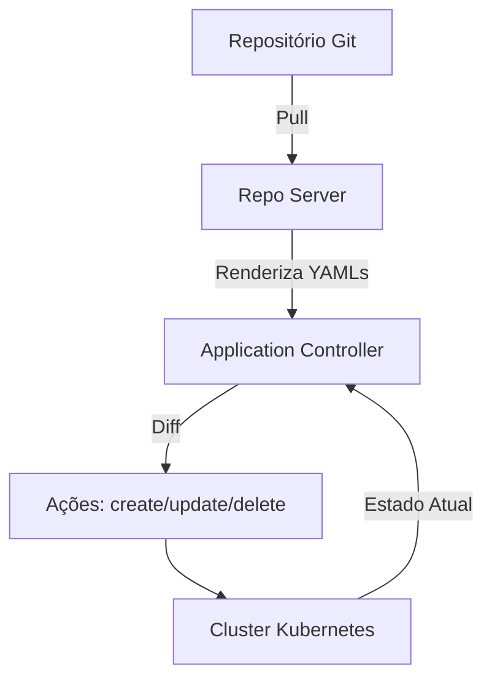

---
tags:
  - Kubernetes
  - NotaBibliografica
categoria: CD
ferramenta: argocd
---
## **📌 [[repo-server]]: Apenas o Estado Desejado ([[Git]] Renderizado)**
O **Repo Server** é responsável **exclusivamente** por:  
1. **Clonar/atualizar** o repositório Git configurado.  
2. **Renderizar os manifests** brutos (se usar [[helm]]/Kustomize/Jsonnet) em YAMLs válidos para o [[kubernetes]].  
3. **Entregar esses YAMLs** ao [[application-controller]].  

### **O que ele NÃO faz**:
- ❌ **Não acessa o cluster Kubernetes** para ler o estado atual.  
- ❌ **Não compara estados** (Git vs. Cluster).  
- ❌ **Não toma decisões** de sincronização.  

**Exemplo**:  
Se você tem um Helm Chart no Git, o Repo Server executa `helm template` e retorna os YAMLs processados.  

---

## **📌 Application Controller: O Orquestrador da [[processo-reconciliacao|Reconciliação]]**
O **Application Controller** é quem:  
1. **Obtém o estado desejado** (YAMLs renderizados pelo Repo Server).  
2. **Consulta o estado atual** do cluster via Kubernetes API.  
3. **Calcula as diferenças** ([[drift|diff]]) entre os dois estados.  
4. **Decide e executa ações** (criar/atualizar/excluir recursos) para alinhar o cluster ao Git.  

**Exemplo**:  
Se o Git define `replicas: 3` mas o cluster tem `replicas: 5`, o Application Controller executa `kubectl scale` para corrigir.  

---

## **🔍 Fluxo Detalhado**


### **Passo a Passo**:
1. **Repo Server** renderiza os manifests do Git (ex: `helm template`).  
2. **Application Controller** pega esses manifests e:  
   - Obtém o estado real do cluster (`kubectl get`).  
   - Compara os dois estados (`kubectl diff`).  
   - Aplica mudanças se necessário (`kubectl apply`).  

---

## **🎯 Divisão Clara de Responsabilidades**
| **Componente**          | **Faz**                                    | **Não Faz**                               |  
|-------------------------|-------------------------------------------|------------------------------------------|  
| **Repo Server**         | Renderiza YAMLs do Git.                   | Interage com o cluster ou compara estados. |  
| **Application Controller** | Orquestra a reconciliação (Git → Cluster). | Renderiza manifests.                     |  

---

## **💡 Por Que Essa Separação?**
- **Segurança**: O Repo Server não precisa de acesso ao cluster.  
- **Escalabilidade**: O Application Controller pode focar em decisões complexas.  
- **Modularidade**: Facilita a manutenção e atualizações.  

---

## **⚠️ Cenário de Erro Comum**
- **Problema**: O Repo Server falha ao renderizar um Helm Chart (`helm template` erro).  
- **Sintoma**: O Application Controller **nunca recebe** os YAMLs para comparar.  
- **Solução**:  
  ```sh
  kubectl logs -n argocd deploy/argocd-repo-server | grep -i "error"
  ```

---

## **📚 Referência Oficial**
- [Argo CD Architecture](https://argo-cd.readthedocs.io/en/stable/operator-manual/architecture/)  

Se precisar de um exemplo prático de debug, posso ajudar! 😊