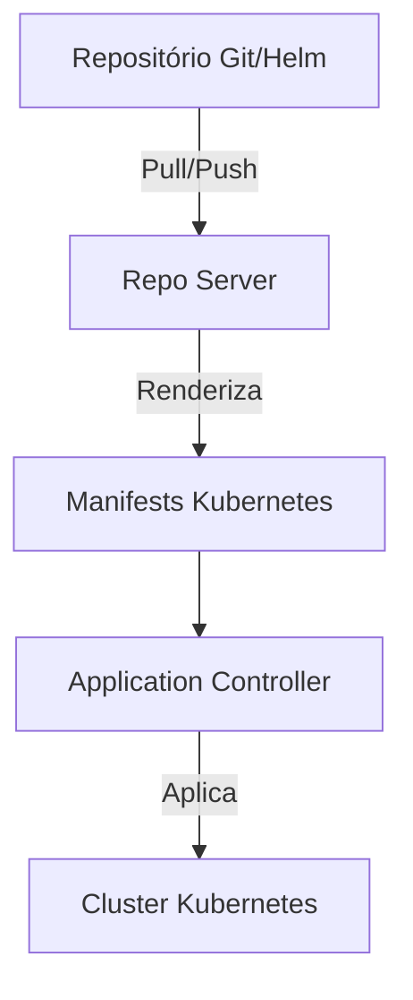

---
tags:
  - Kubernetes
  - NotaBibliografica
categoria: CD
ferramenta: argocd
---
### **Funcionamento do Repo Server no Argo CD**

O **Repo Server** é um componente central do Argo CD, responsável por **renderizar e fornecer manifests [[kubernetes]]** a partir de repositórios [[Git]], [[helm]] charts ou outros armazenamentos declarativos. Ele atua como um "tradutor" entre seu código versionado e os recursos que serão implantados no cluster.

---

## **📌 Principais Responsabilidades**
1. **Clonar repositórios Git** (ou acessar fontes externas como Helm repos).  
2. **Renderizar [[manifestos-kubernetes|manifests]]** (processar Kustomize, Helm, Jsonnet, etc.).  
3. **Fornecer manifests prontos** para o [[application-controller]] sincronizar com o cluster.  

---

## **🔍 Arquitetura Detalhada**
### **1. Fluxo de Trabalho**


### **2. Componentes Internos**
- **Cache de repositórios**: Armazena clones locais dos repositórios Git para performance.  
- **Plugins de renderização**: Suporta Helm, Kustomize, Jsonnet, etc.  
- **Webhooks**: Recebe notificações de atualizações no Git (GitHub, GitLab, etc.).  

---

## **🛠️ Como o Repo Server Processa os Manifests?**
### **Passo 1: Obter o Código Fonte**
- **Para repositórios Git**:  
  - Clona o repo (ou atualiza via `git fetch`).  
  - Usa credenciais configuradas no Argo CD ([[protocolo-ssh|SSH]], [[protocolo-https|HTTPS]], tokens).  

- **Para Helm charts**:  
  - Acessa repositórios Helm (ex: Artifactory, Harbor) ou charts locais.  

### **Passo 2: Renderização**
Dependendo da ferramenta declarativa usada:  
| **Ferramenta**  | **Ação do Repo Server**                                                                 |
|----------------|----------------------------------------------------------------------------------------|
| **Kustomize**  | Executa `kustomize build` no diretório especificado (`path`).                          |
| **Helm**       | Roda `helm template` com os `values.yaml` fornecidos.                                  |
| **Jsonnet**    | Processa arquivos `.jsonnet` usando o engine do Jsonnet.                               |
| **Arquivos RAW** | Serve os YAMLs/JSONs diretamente, sem renderização.                                  |

### **Passo 3: Entrega ao Application Controller**
- Os manifests renderizados são enviados ao `Application Controller`, que os compara com o estado do cluster e decide as ações (criar/atualizar/excluir).  

---

## **⚙️ Configurações Importantes**
### **1. Cache e Performance**
- O Repo Server mantém um **cache local** dos repositórios em `/tmp` (por padrão).  
- Para limpar o cache (útil em casos de inconsistência):  
  ```sh
  kubectl delete pod -n argocd -l app.kubernetes.io/name=argocd-repo-server
  ```

### **2. Segurança**
- **Acesso a repositórios privados**:  
  - Credenciais são armazenadas em Secrets do Kubernetes (`argocd-repo-secret`).  
  - Suporta SSH, OAuth2, e tokens de acesso.  

### **3. High Availability (HA)**
- Para escalar o Repo Server em ambientes críticos:  
  ```sh
  kubectl scale deploy -n argocd argocd-repo-server --replicas=3
  ```

---

## **🔍 Troubleshooting Comum**
### **1. Erros de Renderização**
- **Problema**: Falha ao processar Helm/Kustomize.  
- **Solução**:  
  ```sh
  kubectl logs -n argocd deploy/argocd-repo-server | grep -i "error"
  ```
  - Valide os templates localmente antes do commit:  
    ```sh
    helm template ./meu-chart --debug
    kustomize build ./overlays/prod
    ```

### **2. Falhas de Conexão com Git**
- **Problema**: `Failed to fetch git repository`.  
- **Solução**:  
  - Verifique as credenciais no Secret `argocd-repo-secret`.  
  - Teste o acesso manualmente:  
    ```sh
    kubectl exec -it -n argocd deploy/argocd-repo-server -- sh
    git clone https://github.com/seu-org/repo.git
    ```

### **3. Latência Alta**
- **Problema**: Sincronizações lentas.  
- **Solução**:  
  - Aumente os recursos do Repo Server:  
    ```yaml
    # Em values.yaml do Helm do Argo CD
    repoServer:
      resources:
        limits:
          cpu: 1
          memory: 1Gi
    ```

---

## **📌 Exemplo Prático**
### **Application Usando Helm + Repo Server**
```yaml
apiVersion: argoproj.io/v1alpha1
kind: Application
metadata:
  name: meu-app-helm
spec:
  source:
    repoURL: https://charts.bitnami.com/bitnami  # Repo Helm público
    chart: redis
    targetRevision: 16.0.0
    helm:
      values: |
        auth:
          password: "senha-secreta"
  destination:
    server: https://kubernetes.default.svc
    namespace: redis
```
- O Repo Server:  
  1. Baixa o chart `redis` do repositório Helm.  
  2. Renderiza os manifests com os `values` fornecidos.  
  3. Entrega ao Application Controller para implantação.  

---

## **✅ Conclusão**
O Repo Server é o **"cérebro" da renderização** no Argo CD, convertendo sua configuração declarativa (Git/Helm) em manifests Kubernetes prontos para implantação.  

**Principais pontos**:  
- Suporta múltiplas ferramentas (Kustomize, Helm, Jsonnet).  
- Gerencia cache e credenciais de repositórios.  
- Pode ser escalado para alta disponibilidade.  

Precisa de ajuda para debugar um erro específico? Compartilhe os logs e eu ajudo a decifrar! 😊