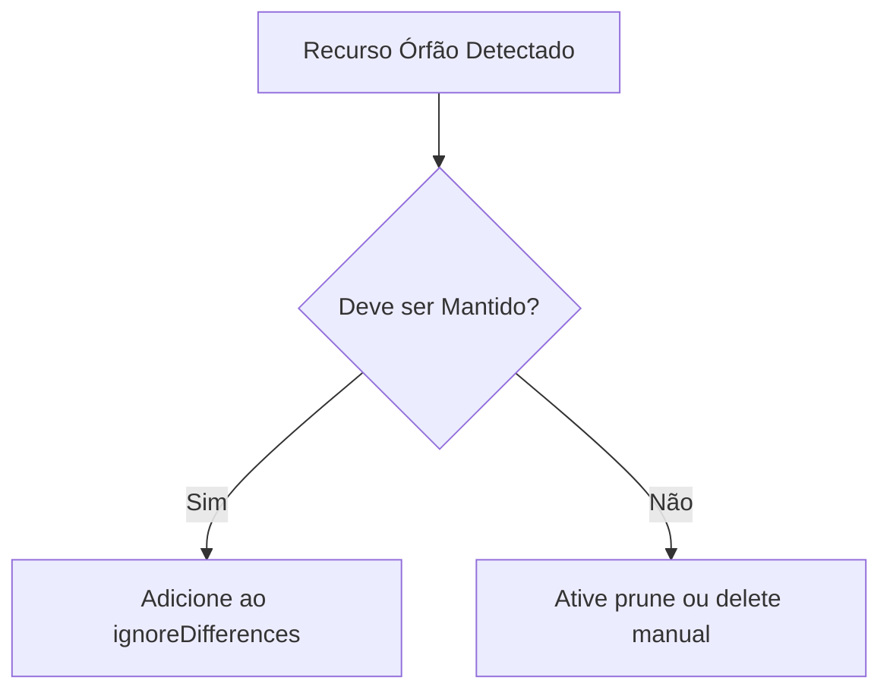

---
tags:
  - Kubernetes
  - NotaBibliografica
categoria: CD
ferramenta: argocd
---
### **Recursos Órfãos no Argo CD: Definição e Tratamento**

No contexto do [[introducao-argocd|Argo CD]], um **recurso órfão** é qualquer objeto Kubernetes (ex: [[deployment]], [[configmap]], [[persistent-volume-claim]]) que:  
1. **Existe no cluster**, mas **não está declarado no [[Git]]** (repositório configurado no Argo CD).  
2. **Não é mais gerenciado** pelo Argo CD, seja porque:  
   - Foi removido do Git, mas não foi pruned (excluído do cluster).  
   - Foi criado manualmente no cluster (via `kubectl`), sem passar pelo [[GitOps]].  


---

## **📌 Como Identificar Recursos Órfãos?**
### **1. Via CLI do Argo CD**
```sh
argocd app resources <nome-da-app> --orphaned
```
- Lista recursos que existem no cluster, mas não estão no Git.

### **2. Via UI do Argo CD**
- Na página da aplicação, vá para **"Resource"** → Filtre por **"Orphaned"**.

### **3. Via Kubernetes**
```sh
kubectl get <resource-type> -l argocd.argoproj.io/instance=<app-name> --no-headers | grep -v "argocd"
```
- Recursos sem a label do Argo CD podem ser órfãos.

---

## **🛠️ O Que Fazer com Recursos Órfãos?**
### **1. Excluí-los Automaticamente ([[prune]])**
Habilite `prune` no `Application` para o Argo CD remover recursos órfãos durante o sync:
```yaml
syncPolicy:
  automated:
    prune: true  # Ativa a exclusão automática
```

### **2. Ignorar Recursos Órfãos**
Se alguns recursos devem ser mantidos (ex: PVs criados manualmente), use:
```yaml
syncPolicy:
  syncOptions:
    - RespectIgnoreDifferences=true  # Preserva recursos listados em ignoreDifferences
```

### **3. Excluir Manualmente**
Para remoção imediata:
```sh
kubectl delete <resource-type> <nome> --now
```

---

## **🔍 Causas Comuns de Recursos Órfãos**
1. **Sync sem `prune`**:  
   - Alguém removeu um manifesto do Git, mas não ativou `prune`.  
2. **Criação manual no cluster**:  
   - Recursos criados via `kubectl apply` fora do fluxo GitOps.  
3. **Falha durante o sync**:  
   - O Argo CD não conseguiu excluir o recurso (ex: finalizers bloqueando).  

---

## **📊 Exemplo Prático**
### **Cenário**:  
- Um `ConfigMap` foi removido do Git, mas ainda existe no cluster.  

### **Solução**:  
1. Verifique o recurso órfão:  
   ```sh
   argocd app resources minha-app --orphaned
   ```
   Saída:
   ```
   ConfigMap  default/my-configmap  Orphaned
   ```
2. Habilite `prune` e sincronize:  
   ```sh
   argocd app sync minha-app --prune
   ```

---

## **✅ Boas Práticas**
1. **Sempre use `prune: true`** em ambientes não efêmeros.  
2. **Revise recursos órfãos periodicamente**:  
   ```sh
   argocd app list --orphaned
   ```
3. **Documente exceções**:  
   - Recursos que devem persistir (ex: PVs com `Retain`) devem ser listados em `ignoreDifferences`.

---

## **⚠️ Cuidados**
- **Prune pode ser perigoso**: Certifique-se de que o Git contém todos os recursos ativos antes de ativá-lo.  
- **Recursos compartilhados**: Se múltiplas aplicações usam o mesmo recurso, evite prune para não causar efeitos colaterais.  

---

### **Fluxo de Tratamento de Órfãos**


Se precisar de ajuda para configurar `prune` ou lidar com casos específicos, posso elaborar! 😊