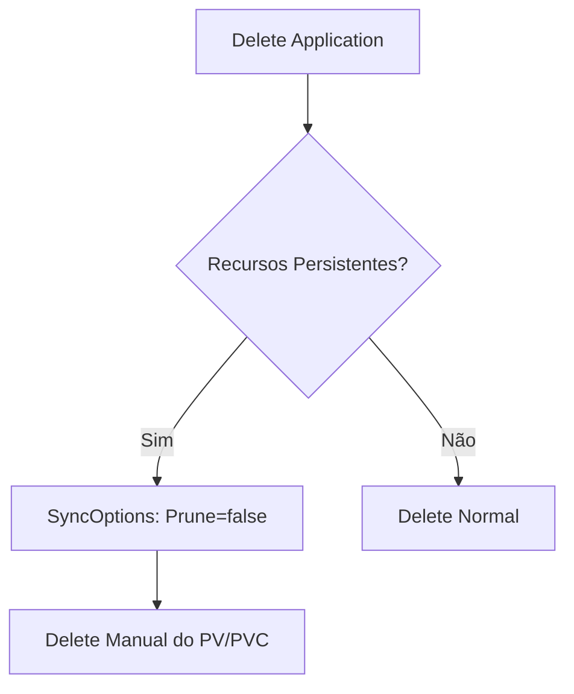

---
tags:
  - Kubernetes
  - NotaBibliografica
  - Arquitetura
categoria: CD
ferramenta: argocd
---
### **Solução para Argo CD Travar ao Deletar Application com Persistent Volume (PV)**

Quando o [[introducao-argocd|Argo CD]] fica travado tentando remover uma [[application|application]] que possui um `PersistentVolume (PV)` ou `PersistentVolumeClaim (PVC)`, o problema geralmente ocorre porque:  
- O [[persistent-volume]]/[[persistent-volume-claim]] está **protegido por finalizers** (como `kubernetes.io/pv-protection`).  
- O Argo CD não consegue deletar recursos com dependências sem **prune** adequado.


Aqui está como resolver:

---

## **📌 Passos para Corrigir**

### **1. Remova Manualmente os [[finalizers]] (Se Aplicável)**
Os finalizers impedem a exclusão acidental de PVs/PVCs. Para liberá-los:

#### **Para PVCs:**
```sh
kubectl patch pvc <nome-do-pvc> -n <namespace> -p '{"metadata":{"finalizers":null}}'
```

#### **Para PVs:**
```sh
kubectl patch pv <nome-do-pv> -p '{"metadata":{"finalizers":null}}'
```

> **Atenção**: Isso força a exclusão imediata. Certifique-se de que o PV não está em uso!

---

### **2. Use [[Sync Policies#**2. `syncOptions` (Opções de Sincronização)**|syncOptions]] para Ignorar Recursos Persistentes**
No `Application` do Argo CD, adicione a opção para **não excluir PVs/PVCs** durante o sync:
```yaml
spec:
  syncPolicy:
    syncOptions:
      - Prune=false  # Evita a exclusão de recursos pelo Argo CD
```

---

### **3. Delete a Application com `--cascade=false`**
Force a remoção da `Application` sem afetar os recursos do Kubernetes:
```sh
argocd app delete <nome-da-app> --cascade=false
```
Isso remove apenas o recurso do Argo CD, deixando os PVs/PVCs intactos no cluster.

---

### **4. Limpe os Recursos Manualmente (Se Necessário)**
Após deletar a `Application`, remova os recursos persistentes manualmente:
```sh
kubectl delete pvc -n <namespace> <nome-do-pvc>
kubectl delete pv <nome-do-pv>
```

---

## **🔍 Por Que Isso Acontece?**
- **Proteção de Dados**: PVs/PVCs têm finalizers para evitar exclusão acidental.  
- **Ordem de Exclusão**: O Argo CD tenta deletar recursos na ordem errada (ex: PV antes do PVC).  
- **Dependências**: Se o PV está em uso por outro recurso não gerenciado pelo Argo CD, a exclusão falha.

---

## **✅ Melhores Práticas para Evitar o Problema**
1. **Adicione Anotações para Ignorar PVs/PVCs**:
   ```yaml
   metadata:
     annotations:
       argocd.argoproj.io/sync-options: Prune=false
   ```
2. **Use `helm uninstall` Antes de Deletar a Application** (se usar Helm):
   ```sh
   helm uninstall <release> -n <namespace>
   ```
3. **Defina Reclaim Policy como `Retain`**:
   ```yaml
   # No PV (para evitar deleção acidental)
   spec:
     persistentVolumeReclaimPolicy: Retain
   ```

---

## **⚠️ Cenários Comuns e Soluções**
| **Cenário**                           | **Solução**                                                                 |
|---------------------------------------|-----------------------------------------------------------------------------|
| PV/PVC bloqueado por finalizer        | Remova o finalizer manualmente (`kubectl patch`).                           |
| Argo CD travado em "Deleting"         | Use `argocd app delete --cascade=false`.                                    |
| PVC em uso por um Pod não gerenciado  | Delete o Pod primeiro ou use `Prune=false`.                                 |

---

## **📊 Fluxo de Exclusão Segura**


Se o problema persistir, compartilhe os logs do `argocd-application-controller` e eu ajudo a diagnosticar! 😊%%  %%