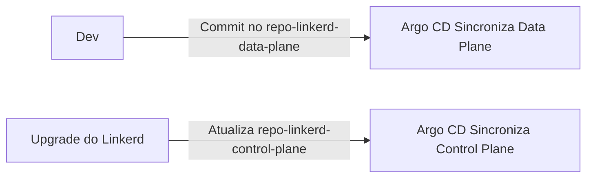

---
tags:
  - Kubernetes
  - NotaBibliografica
categoria: CD
ferramenta: argocd
---
### **Estratégia Comprovada para Gerenciar [[linkerd]] no [[introducao-argocd|Argo CD]]**

Para integrar o **Linkerd** com o **Argo CD** de forma eficiente, evitando *[[drift|drift]]* e garantindo consistência, siga esta abordagem, já validada em ambientes de produção:

---

## **📌 1. Estrutura Recomendada de Repositórios**
Organize seus manifests em **dois repositórios [[Git]]** (ou subdiretórios):

### **a) `repo-linkerd-control-plane`**  
Contém a instalação e configuração central do Linkerd (control plane).  
```plaintext
.
├── base/
│   ├── control-plane/          # Helm chart do Linkerd
│   │   ├── Chart.yaml
│   │   ├── values.yaml         # Configurações globais
│   │   └── crds/               # Custom Resource Definitions
│   └── resources/              # Recursos adicionais (ex: políticas)
│       ├── mesh-policies.yaml
│       └── service-profiles/
│
└── overlays/
    ├── dev/
    │   └── values-dev.yaml     # Overrides para dev
    └── prod/
        └── values-prod.yaml    # Overrides para produção
```

### **b) `repo-linkerd-data-plane`**  
Configurações específicas por aplicação (ex: `ServiceProfiles`, `TrafficSplits`).  
```plaintext
.
├── app1/
│   ├── service-profile.yaml
│   └── traffic-split.yaml
└── app2/
    └── service-profile.yaml
```

---

## **🛠️ 2. Configuração do Argo CD**
### **a) Control Plane (Aplicação Global)**
```yaml
# repo-argocd/applications/linkerd-control-plane.yaml
apiVersion: argoproj.io/v1alpha1
kind: Application
metadata:
  name: linkerd-control-plane
spec:
  source:
    repoURL: https://github.com/seu-org/repo-linkerd-control-plane.git
    path: base/control-plane
    helm:
      valueFiles:
        - ../../overlays/prod/values-prod.yaml
  destination:
    server: https://kubernetes.default.svc
    namespace: linkerd
  syncPolicy:
    automated:
      prune: true
    ignoreDifferences:  # Ignora modificações do Linkerd
      - group: "apps"
        kind: "Deployment"
        jsonPointers:
          - /spec/template/metadata/annotations
          - /spec/template/spec/containers
```

### **b) Data Plane (Aplicações Específicas)**
```yaml
# repo-argocd/applications/linkerd-data-plane.yaml
apiVersion: argoproj.io/v1alpha1
kind: Application
metadata:
  name: linkerd-data-plane
spec:
  source:
    repoURL: https://github.com/seu-org/repo-linkerd-data-plane.git
    path: app1  # Path para a aplicação específica
  destination:
    server: https://kubernetes.default.svc
    namespace: app1
  syncPolicy:
    automated:
      selfHeal: true
```

---

## **🔍 3. Como Evitar Drift com Linkerd?**
### **a) Ignorar Injeção de Sidecars**
O Linkerd modifica Pods para injetar proxies. Adicione ao `Application`:
```yaml
ignoreDifferences:
  - group: ""
    kind: "Pod"
    jsonPointers:
      - /metadata/annotations/linkerd.io~1inject
      - /spec/containers
```

### **b) Gerenciar [[custom-resources|CRDs]] com Cuidado**
- **Instale CRDs manualmente** antes do Argo CD (evite que o Argo CD as remova durante syncs).  
- Use `syncOptions` para evitar conflitos:
  ```yaml
  syncOptions:
    - SkipDryRunOnMissingResource=true  # Ignora CRDs ausentes
  ```

### **c) Health Checks Customizados**
Adicione verificações de saúde para recursos do Linkerd:
```yaml
resourceCustomizations: |
  linkerd.io/ServiceProfile:
    health.lua: |
      hs = {}
      hs.status = "Healthy"
      return hs
```

---

## **🚀 4. Estratégia de Atualização do Linkerd**
### **a) Atualize o Control Plane via [[helm]]**
- Modifique `values.yaml` no `repo-linkerd-control-plane` e deixe o Argo CD sincronizar.  
- **Para upgrades major**, use o CLI do Linkerd (`linkerd upgrade`) e depois atualize o Git.

### **b) Promova Configurações entre Ambientes**
Use **PRs entre [[areas/ti/git/Branch]]/diretórios** para mover `ServiceProfiles` de `dev` → `prod`.

---

## **✅ 5. Melhores Práticas Comprovadas**
1. **Separe Control Plane e Data Plane**:  
   - O control plane é estático; o data plane é dinâmico.  

2. **Use `ignoreDifferences` para Proxies**:  
   - Evite que o Argo CD reverta injeções do Linkerd.  

3. **Monitore Drift com `argocd app diff`**:  
   ```sh
   argocd app diff linkerd-control-plane
   ```

4. **Integre com Observabilidade**:  
   - Grafana + Prometheus para monitorar métricas do Linkerd.  

---

## **📊 Exemplo de Fluxo Completo**


---

## **💡 Por Que Essa Estratégia Funciona?**
- **Controle Granular**: Separar control plane e data plane reduz conflitos.  
- **GitOps Consistente**: Tudo é versionado, incluindo políticas de tráfego.  
- **Drift Minimizado**: `ignoreDifferences` e syncOptions resolvem os principais problemas.  

Quer um exemplo passo a passo para um cenário específico (ex: canary deployments com Linkerd)? Posso elaborar! 😊