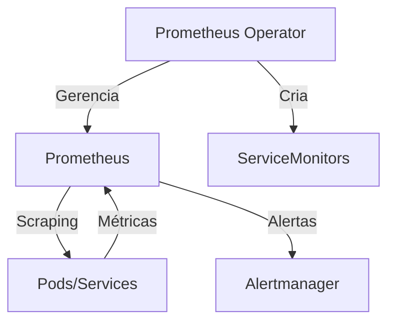

---
tags:
  - Kubernetes
  - NotaBibliografica
  - SRE
categoria: metricas
ferramenta: prometheus-operator
---
# **Prometheus Operator: Simplificando o Gerenciamento do Prometheus no Kubernetes**

O **Prometheus Operator** é um componente essencial para quem usa [[prometheus]] em ambientes [[kubernetes]]. Ele automatiza e simplifica a implantação, configuração e gerenciamento do Prometheus e seus recursos relacionados, seguindo o padrão de **operadores do Kubernetes** (control loops que estendem a API do K8s).

---

## **1. O que é o Prometheus Operator?**
É um operador Kubernetes que permite:
- **Criar/gerenciar instâncias do Prometheus** de forma declarativa (usando CRDs - [[custom-resources|Custom Resource Definitions]]).
- **Automatizar a configuração** de scraping ([[service-discoverry-prometheus|service discovery]]) para monitorar [[pod|Pods]], [[service]] e outros recursos.
- **Gerenciar [[alertmanager]]**, [[thanos]] e outros componentes do ecossistema.

---

## **2. Principais Recursos**
### **A. Custom Resource Definitions (CRDs)**
O Operator introduz novos recursos na API do Kubernetes:
| Recurso (CRD) | Função |
|---------------|--------|
| `Prometheus` | Define uma instância do Prometheus (versão, recursos, retenção). |
| `ServiceMonitor` | Configura scraping para grupos de Services (substitui `scrape_configs`). |
| `PodMonitor` | Monitora Pods diretamente (útil para sidecars). |
| `Alertmanager` | Gerencia instâncias do Alertmanager. |
| `Probe` | Monitora endpoints externos (ingressos, URLs). |

### **B. Funcionalidades-Chave**
- **Auto-descoberta de targets**: Monitora novos Services/Pods sem reconfiguração manual.
- **Gerenciamento de configurações**: Atualiza dinamicamente o Prometheus sem reiniciar.
- **Multi-tenant**: Suporte a namespaces isolados para times diferentes.

---

## **3. Como Funciona?**
### **Arquitetura Básica**


### **Fluxo de Operação**
1. O usuário cria um recurso `Prometheus` (definindo versão, recursos, etc.).
2. O Operator cria um StatefulSet/Deployment do Prometheus.
3. O usuário define `ServiceMonitors` para configurar scraping.
4. O Operator gera automaticamente o `prometheus.yml` e recarrega o Prometheus.

---

## **4. Benefícios**
| Comparação            | Prometheus Tradicional    | Prometheus Operator                   |
| --------------------- | ------------------------- | ------------------------------------- |
| **Configuração**      | Manual (`prometheus.yml`) | Declarativa (CRDs)                    |
| **Service Discovery** | Configuração complexa     | Automática via `ServiceMonitor`       |
| **Atualizações**      | Reinício necessário       | Dinâmica (hot-reload)                 |
| **Escala**            | Complexa                  | Simplificada (CRDs por [[namespace]]) |

---

## **5. Exemplo Prático**
### **Passo 1: Instalar o Operator**
Via Helm (recomendado):
```bash
helm repo add prometheus-community https://prometheus-community.github.io/helm-charts
helm install prometheus-operator prometheus-community/kube-prometheus-stack -n monitoring
```

### **Passo 2: Criar um `ServiceMonitor`**
Monitora todos os Services com label `monitor: true`:
```yaml
apiVersion: monitoring.coreos.com/v1
kind: ServiceMonitor
metadata:
  name: example-app
  namespace: monitoring
spec:
  selector:
    matchLabels:
      monitor: "true"  # Seleciona Services com esta label
  endpoints:
  - port: web  # Nome da porta no Service
    interval: 30s
```

### **Passo 3: Verificar o `Prometheus` CRD**
Exemplo de configuração de uma instância:
```yaml
apiVersion: monitoring.coreos.com/v1
kind: Prometheus
metadata:
  name: main
  namespace: monitoring
spec:
  serviceAccountName: prometheus
  serviceMonitorSelector:  # Seleciona ServiceMonitors a serem incluídos
    matchLabels:
      release: prometheus-operator
  resources:
    requests:
      memory: 8Gi
```

---

## **6. Componentes Adicionais do Operator**
- **Grafana Integration**: Já inclui dashboards pré-configurados.
- **Alertmanager**: Gerenciado via CRD `Alertmanager`.
- **Thanos Integration**: Para armazenamento de longo prazo.

---

## **7. Quando Usar o Prometheus Operator?**
- **Ambientes Kubernetes** (especialmente clusters grandes ou multi-tenant).
- **Equipes que precisam de automação** (evitar edição manual de YAMLs).
- **Cenários com atualizações frequentes** de targets (ex.: [[deployment|deployments]] contínuos).

---

## **8. Limitações**
- **Curva de aprendizado**: Novos conceitos (CRDs, operadores).
- **Complexidade inicial**: Overhead para clusters pequenos.

---

## **Resumo**
| Conceito | Descrição |
|----------|-----------|
| **Objetivo** | Automatizar o gerenciamento do Prometheus no Kubernetes. |
| **Recursos Principais** | `Prometheus`, `ServiceMonitor`, `Alertmanager` CRDs. |
| **Vantagem** | Configuração declarativa e dinâmica. |
| **Indicado para** | Clusters Kubernetes médios/grandes. |
