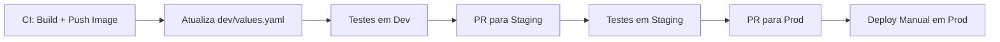

---
tags:
  - Kubernetes
  - NotaBibliografica
  - Laboratorio
categoria: CD
ferramenta: github-actions
---
Aqui está um exemplo completo usando **[[helm]]** e uma estratégia com **PRs entre ambientes**, seguindo as melhores práticas do [[GitOps]]:

---

## **📂 Estrutura de Repositórios**
### **1. `repo-aplicacao`** (Código-fonte + Dockerfile)
```plaintext
.
├── src/
├── Dockerfile
└── .github/workflows/ci.yml  # Pipeline de CI
```

### **2. `repo-manifests`** (Helm Charts e Valores por Ambiente)
```plaintext
.
├── charts/
│   └── minha-app/
│       ├── Chart.yaml          # Metadata do Helm
│       ├── values.yaml         # Valores padrão
│       └── templates/
│           ├── deployment.yaml # Ref: `{{ .Values.image.tag }}`
│           └── service.yaml
│
└── environments/
    ├── dev/
    │   └── values.yaml        # Override para dev
    ├── staging/
    │   └── values.yaml        # Override para staging
    └── prod/
        └── values.yaml        # Override para produção
```

### **3. `repo-argocd`** (Opcional - Applications do Argo CD)
```plaintext
.
└── applications/
    ├── minha-app-dev.yaml
    ├── minha-app-staging.yaml
    └── minha-app-prod.yaml
```

---

## **🛠️ Exemplo com Helm + PRs entre Ambientes**
### **Passo 1: Pipeline no `repo-aplicacao` (CI)**
#### **`.github/workflows/ci.yml`**
```yaml
name: Build, Push, and Update Helm
on:
  push:
    branches:
      - main

jobs:
  deploy-dev:
    runs-on: ubuntu-latest
    steps:
      - name: Checkout repo
        uses: actions/checkout@v4

      - name: Build e push da imagem
        run: |
          docker build -t minha-app:$GITHUB_SHA .
          docker tag minha-app:$GITHUB_SHA meu-registry/minha-app:$GITHUB_SHA
          docker push meu-registry/minha-app:$GITHUB_SHA

      - name: Atualiza tag no Helm (dev)
        uses: actions/checkout@v4
        with:
          repository: meu-org/repo-manifests
          path: manifests
          token: ${{ secrets.GH_TOKEN }}
        run: |
          cd manifests/environments/dev
          echo "imageTag: $GITHUB_SHA" >> values.yaml  # Atualiza apenas para dev

          git config --global user.name "GitHub Actions"
          git config --global user.email "actions@github.com"
          git add .
          git commit -m "[CI] Update image tag to $GITHUB_SHA (dev)"
          git push
```

### **Passo 2: Promoção entre Ambientes via PRs**
#### **Fluxo Recomendado**:
1. **Dev → Staging**:  
   - Um PR é aberto no `repo-manifests` para atualizar `environments/staging/values.yaml` com a tag de `dev`.  
   - **Gatilho**: Testes aprovados em `dev`.  

2. **Staging → Prod**:  
   - Outro PR promove a tag de `staging` para `prod`.  
   - **Gatilho**: Aprovação manual + testes em staging.  

#### **Exemplo de PR Automation** (usando GitHub Actions):
Adicione um workflow em `repo-manifests/.github/workflows/promote.yml`:
```yaml
name: Promote Image
on:
  workflow_run:
    workflows: ["CI"]
    branches: [main]
    types: [completed]

jobs:
  promote-staging:
    if: github.event.workflow_run.conclusion == 'success'
    runs-on: ubuntu-latest
    steps:
      - name: Checkout manifests
        uses: actions/checkout@v4

      - name: Get dev image tag
        id: vars
        run: |
          TAG=$(yq e '.imageTag' environments/dev/values.yaml)
          echo "tag=$TAG" >> $GITHUB_OUTPUT

      - name: Create PR para staging
        uses: peter-evans/create-pull-request@v5
        with:
          branch: "promote/staging-to-${{ steps.vars.outputs.tag }}"
          base: main
          title: "Promote image ${{ steps.vars.outputs.tag }} to staging"
          body: "Automated PR para atualizar staging com a imagem de dev."
          commit-message: "chore: promote ${{ steps.vars.outputs.tag }} to staging"
          labels: "promotion"
```

---

## **🚀 Configuração do [[introducao-argocd|Argo CD]]**
### **`repo-argocd/applications/minha-app-dev.yaml`**
```yaml
apiVersion: argoproj.io/v1alpha1
kind: Application
metadata:
  name: minha-app-dev
spec:
  source:
    repoURL: https://github.com/meu-org/repo-manifests.git
    path: charts/minha-app
    helm:
      valueFiles:
        - ../../environments/dev/values.yaml
  destination:
    server: https://kubernetes.default.svc
    namespace: minha-app-dev
  syncPolicy:
    automated:
      prune: true
```

### **`repo-argocd/applications/minha-app-prod.yaml`**
```yaml
apiVersion: argoproj.io/v1alpha1
kind: Application
metadata:
  name: minha-app-prod
spec:
  source:
    repoURL: https://github.com/meu-org/repo-manifests.git
    path: charts/minha-app
    helm:
      valueFiles:
        - ../../environments/prod/values.yaml
  destination:
    server: https://prod-cluster.example.com
    namespace: minha-app-prod
  syncPolicy: {}  # Sync manual para produção!
```

---

## **🎯 Por Que Usar PRs para Promoção?**
1. **Controle**:  
   - Mudanças em `prod` exigem revisão humana.  
   - Rastreabilidade completa no Git.  

2. **Testes Graduais**:  
   - Imagem é testada em `dev` → `staging` → `prod`.  

3. **Segurança**:  
   - Evita deploy acidental em produção.  

---

## **🔍 Alternativas**
### **1. Sem PRs (Atualização Direta)**
- Use **tags semânticas** (ex: `v1.2.3`) e atualize todos os ambientes via CI:  
  ```yaml
  # Pipeline CI
  - name: Update all environments
    run: |
      echo "imageTag: $TAG" > environments/dev/values.yaml
      echo "imageTag: $TAG" > environments/prod/values.yaml
      git push
  ```
- **Prós**: Mais simples.  
- **Contras**: Menos controle para produção.  

### **2. Usando Helm Dependencies**
- Defina um **chart global** com subcharts por ambiente:  
  ```plaintext
  charts/
  ├── global/
  │   ├── Chart.yaml  # Dependencies: dev, prod
  │   └── values.yaml
  ├── dev/
  └── prod/
  ```
- **Útil** para aplicações complexas com muitos componentes.  

---

## **✅ Resumo das Decisões**
| **Cenário**                | **Estratégia Recomendada**          |
|----------------------------|-------------------------------------|
| **Equipes pequenas**       | Atualização direta (sem PRs).       |
| **Ambientes críticos**     | PRs entre ambientes + aprovação.    |
| **Multi-cluster**          | `ApplicationSet` + promoção por PR. |

---

### **📌 Fluxo Ideal para Produção**


Se precisar de ajuda para implementar o fluxo completo, posso fornecer templates prontos! 😊