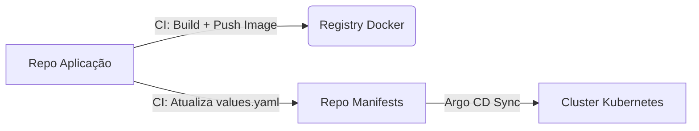

---
tags:
  - Kubernetes
  - NotaBibliografica
  - Laboratorio
categoria: CD
ferramenta: github-actions
---
### **Estratégia para Atualizar Manifests com Novas Imagens [[docker]]**

Para sincronizar a **imagem Docker** atualizada da sua aplicação com o **repositório de manifests** (usando [[GitOps]] com [[introducao-argocd|Argo CD]]), você pode adotar um fluxo automatizado com **CI/CD**. Aqui está uma abordagem robusta e escalável:

---

## **📌 Arquitetura Recomendada**
### **1. Repositórios Separados**
- **`repo-aplicacao`**: Código-fonte da aplicação (Dockerfile, código, etc.).  
- **`repo-manifests`**: Manifests [[kubernetes]] (Kustomize/[[helm]]) e valores de deploy.  
- **`repo-argocd`** (opcional): Applications do Argo CD (se usar multi-repositórios).

### **2. Fluxo de Atualização da Imagem**
1. **CI Pipeline (no `repo-aplicacao`)**:
   - Builda a nova imagem Docker e publica no registry (ex: Docker Hub, ECR, GCR).  
   - Atualiza o **tag da imagem** no `repo-manifests` via PR.  

2. **Argo CD (no cluster)**:
   - Detecta a mudança no `repo-manifests` e sincroniza o deploy automaticamente.

---

## **🛠️ Implementação Passo a Passo**
### **Passo 1: Estrutura dos Repositórios**
#### **`repo-aplicacao/` (Código da App)**
```plaintext
.
├── Dockerfile
├── src/
└── .github/workflows/ci.yml  # Pipeline de CI
```

#### **`repo-manifests/` (Manifests Kubernetes)**
```plaintext
.
├── base/
│   ├── deployment.yaml       # Referência para a imagem (ex: `image: minha-app:{{ .Values.image.tag }}`)
│   └── kustomization.yaml
└── overlays/
    ├── dev/
    │   ├── values.yaml       # Tag da imagem para dev (ex: `image.tag: "v1.2.0"`)
    │   └── kustomization.yaml
    └── prod/
        ├── values.yaml       # Tag da imagem para prod
        └── kustomization.yaml
```

---

### **Passo 2: Pipeline de CI (Exemplo com GitHub Actions)**
#### **`.github/workflows/ci.yml` (no `repo-aplicacao`)**
```yaml
name: Build and Update Manifest
on:
  push:
    branches:
      - main

jobs:
  build-and-update:
    runs-on: ubuntu-latest
    steps:
      - name: Checkout repo da aplicação
        uses: actions/checkout@v4

      - name: Build e Push da Imagem Docker
        run: |
          docker build -t minha-app:$GITHUB_SHA .
          docker tag minha-app:$GITHUB_SHA meu-registry/minha-app:$GITHUB_SHA
          docker push meu-registry/minha-app:$GITHUB_SHA

      - name: Checkout repo de manifests
        uses: actions/checkout@v4
        with:
          repository: meu-org/repo-manifests
          path: manifests
          token: ${{ secrets.GITHUB_TOKEN }}

      - name: Atualiza tag da imagem no repo de manifests
        run: |
          cd manifests/overlays/dev
          yq e ".image.tag = \"$GITHUB_SHA\"" -i values.yaml  # Usando yq para editar YAML
          
          git config --global user.name "GitHub Actions"
          git config --global user.email "actions@github.com"
          git add .
          git commit -m "Update image tag to $GITHUB_SHA"
          git push
```

#### **O que essa pipeline faz?**
1. Builda a imagem Docker e publica no registry com um **tag único** (ex: `GITHUB_SHA`).  
2. Atualiza o arquivo `values.yaml` no `repo-manifests` com a nova tag.  
3. O Argo CD detecta a mudança e sincroniza o deploy.

---

### **Passo 3: Configuração do Argo CD**
#### **`Application` no Argo CD (apontando para `repo-manifests`)**
```yaml
apiVersion: argoproj.io/v1alpha1
kind: Application
metadata:
  name: minha-app-dev
spec:
  source:
    repoURL: https://github.com/meu-org/repo-manifests.git
    path: overlays/dev
    kustomize: {}  # Ou helm, se usar Helm
  destination:
    server: https://kubernetes.default.svc
    namespace: minha-app
  syncPolicy:
    automated:
      prune: true
      selfHeal: true
```

---

## **🔍 Alternativas Avançadas**
### **1. Usando Helm + `image.tag` Dinâmico**
- No `values.yaml` do Helm:
  ```yaml
  image:
    repository: meu-registry/minha-app
    tag: "v1.0.0"  # Atualizado pela CI
  ```
- A CI atualiza apenas o `tag` no `repo-manifests`.

### **2. Usando Git Submodules ou Update CLI**
- Se os manifests estão no mesmo repositório da aplicação, use **submodules** ou ferramentas como:  
  - [`updatecli`](https://www.updatecli.io/): Para atualizar valores em arquivos YAML automaticamente.  
  - [`argocd-image-updater`](https://argocd-image-updater.readthedocs.io/): Atualiza tags de imagem diretamente no Argo CD.

### **3. Usando `ApplicationSet` para Multi-Environments**
- Se você tem vários ambientes (dev, staging, prod), use `ApplicationSet` para evitar repetição:
  ```yaml
  apiVersion: argoproj.io/v1alpha1
  kind: ApplicationSet
  metadata:
    name: minha-app
  spec:
    generators:
      - git:
          repoURL: https://github.com/meu-org/repo-manifests.git
          revision: HEAD
          directories:
            - path: "overlays/*"
    template:
      metadata:
        name: 'minha-app-{{path.basename}}'
      spec:
        source:
          repoURL: https://github.com/meu-org/repo-manifests.git
          path: '{{path}}'
        destination:
          server: https://kubernetes.default.svc
          namespace: minha-app
  ```

---

## **✅ Vantagens Dessa Abordagem**
1. **Separação clara**: Código vs. configuração de deploy.  
2. **Rastreabilidade**: Todas as alterações de imagem são versionadas no Git.  
3. **GitOps puro**: O Argo CD só sincroniza o estado definido no `repo-manifests`.  

---

## **⚠️ Cuidados**
- **Registry privado**: Use `imagePullSecrets` no Kubernetes para acessar imagens privadas.  
- **Rollback**: Reverta o commit no `repo-manifests` para voltar a uma versão anterior.  
- **Segurança**: Restrinja quem pode aprovar PRs no `repo-manifests`.

---

### **📌 Exemplo de Fluxo Completo**


Se precisar de ajuda para configurar a pipeline ou o Argo CD, posso fornecer exemplos mais detalhados! 😊