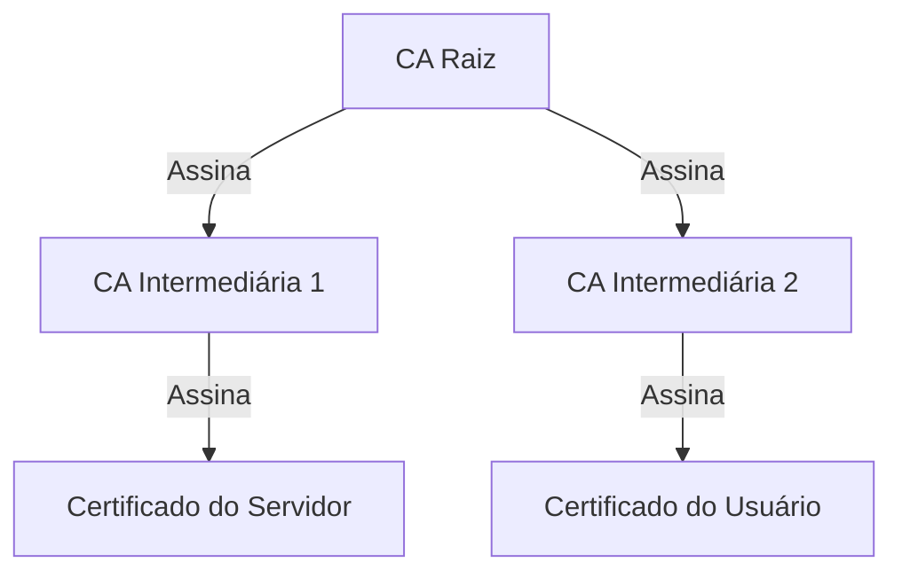
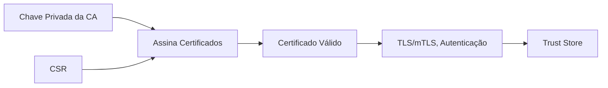

---
tags:
  - Fundamentos
  - Segurança
  - NotaBibliografica
---
# **Autoridade Certificadora (CA) - O Coração da PKI**

Uma Autoridade Certificadora (CA) é a entidade central que garante a **confiança digital** em sistemas criptográficos. Vamos explorar seu funcionamento, tipos e conexão com os conceitos já discutidos ([[csr]], [[certificado-digital|certificados]], [[pki]], etc.).

---

## **1. O Que é uma Autoridade Certificadora (CA)?**
É uma **entidade confiável** que:
- **Emite certificados digitais** vinculando chaves públicas a identidades (pessoas, servidores, organizações).
- **Assina digitalmente** esses certificados, atestando sua validade.
- **Gerencia o ciclo de vida** dos certificados (renovação, revogação via [[crl]]/OCSP).

---

## **2. Componentes Fundamentais de uma CA**
| Componente                    | Descrição                                                                        | Exemplo                                |
| ----------------------------- | -------------------------------------------------------------------------------- | -------------------------------------- |
| **Chave Privada da CA**       | Usada para assinar certificados. Guardada em [[hsm]] (Hardware Security Module). | `ca.key`                               |
| **Certificado da CA**         | Contém a chave pública e metadados da CA. Autoassinado (se for raiz).            | `ca.crt`                               |
| **Políticas de Certificação** | Regras para emissão (ex: validação de identidade, algoritmos permitidos).        | CPS (Certification Practice Statement) |
| **Sistema de Emissão**        | Software que automatiza a criação/assinatura de certificados.                    | Microsoft AD CS, OpenSSL CA, EJBCA     |

---

## **3. Hierarquia de CAs**

### **Níveis de CAs:**
1. **[[autoridade-certificadora-raiz|CA Raiz (Root CA)]]**:
   - Âncora de confiança máxima.
   - Fica offline (protegida em HSM).
   - Assina apenas CAs intermediárias.

2. **CA Intermediária**:
   - Emite certificados finais.
   - Permite isolamento de riscos (se comprometida, só afeta seus certificados).

3. **Certificados Finais (End-Entity)**:
   - Usados por servidores, usuários ou dispositivos.
   - **Não podem emitir outros certificados** (`CA:FALSE`).

---

## **4. Tipos de CAs**
### **a) Públicas (Comerciais)**
- **Função**: Emitem certificados para a Internet (ex: [[protocolo-https|HTTPS]], S/MIME).
- **Exemplos**: Let's Encrypt, DigiCert, Sectigo.
- **Validação**:
  - **DV (Domain Validation)**: Verifica domínio.
  - **OV (Organization Validation)**: Verifica organização.
  - **EV (Extended Validation)**: Auditoria rigorosa.

### **b) Privadas (Corporativas)**
- **Função**: Usadas em redes internas (VPNs, service meshes, Active Directory).
- **Exemplos**: Microsoft AD CS, OpenSSL CA, HashiCorp Vault PKI.
- **Vantagem**: Controle total sobre políticas e revogação.

---

## **5. Como uma CA Funciona? (Passo a Passo)**
### **Passo 1: Receber uma CSR**
- O solicitante envia uma **CSR** (com chave pública e metadados).
- Exemplo de CSR:
  ```bash
  openssl req -new -key servidor.key -out servidor.csr -subj "/CN=meu-servico.com"
  ```

### **Passo 2: Validar o Solicitante**
- **DV**: Verifica domínio via DNS/e-mail.
- **OV/EV**: Checa documentos legais (CNPJ, contrato social).

### **Passo 3: Emitir o Certificado**
A CA assina a CSR com sua chave privada, gerando um certificado válido:
```bash
openssl x509 -req -in servidor.csr -CA ca.crt -CAkey ca.key -out servidor.crt -days 365
```

### **Passo 4: Distribuir o Certificado**
- Para o solicitante (ex: arquivo `.crt`).
- Para clientes (via trust stores de navegadores/SOs, no caso de CAs públicas).

---

## **6. Conexão com os Tópicos Anteriores**
| Conceito | Relação com a CA |
|----------|------------------|
| **CSR** | Pedido formal para a CA emitir um certificado. |
| **Certificados** | São assinados pela CA e herdam sua confiança. |
| **PKI** | A CA é o núcleo da Infraestrutura de Chave Pública. |
| **mTLS** | CAs definem quais certificados são confiáveis para autenticação mútua. |
| **CRL/OCSP** | Mecanismos gerenciados pela CA para revogação. |

---

## **7. Segurança de uma CA**
### **Boas Práticas**
1. **Proteção da Chave Privada**:
   - Use HSMs (Hardware Security Modules).
   - Para CAs raiz, mantenha a chave **offline**.
2. **Validade Curta para Certificados**:
   - Certificados finais: 90 dias (Let's Encrypt) a 2 anos.
   - CAs intermediárias: 5-10 anos.
3. **Monitoramento**:
   - Alertas para certificados perto de expirar.
   - Auditoria de emissões.

### **Riscos**
- **Comprometimento da CA raiz**: Invalida **toda a PKI**.
- **Emissão fraudulenta**: Se a CA intermediária for hackeada.

---

## **8. Exemplo Prático: Criando uma CA Privada com OpenSSL**
### **8.1 Gerar CA Raiz**
```bash
# Chave privada (protegida por senha)
openssl genrsa -aes256 -out ca-root.key 4096

# Certificado autoassinado
openssl req -x509 -new -key ca-root.key -days 3650 -out ca-root.crt \
  -subj "/CN=Minha CA Raiz/O=Empresa XYZ/C=BR"
```

### **8.2 Gerar CA Intermediária**
```bash
# Chave privada
openssl genrsa -out ca-intermediaria.key 4096

# CSR
openssl req -new -key ca-intermediaria.key -out ca-intermediaria.csr \
  -subj "/CN=CA Intermediária/O=Empresa XYZ/C=BR"

# Assinar com a CA raiz
openssl x509 -req -in ca-intermediaria.csr -CA ca-root.crt -CAkey ca-root.key \
  -CAcreateserial -out ca-intermediaria.crt -days 1825 -extensions v3_intermediate_ca
```

### **8.3 Emitir Certificado para Servidor**
```bash
# Gerar CSR do servidor
openssl req -new -key servidor.key -out servidor.csr \
  -subj "/CN=meu-servico.com/O=Empresa XYZ/C=BR"

# Assinar com a CA intermediária
openssl x509 -req -in servidor.csr -CA ca-intermediaria.crt -CAkey ca-intermediaria.key \
  -CAcreateserial -out servidor.crt -days 365
```

---

## **9. CAs na Prática: Exemplos Reais**
### **a) Let's Encrypt**
- **Tipo**: CA pública gratuita.
- **Validação**: Automatizada (ACME protocol).
- **Certificados**: DV apenas, válidos por 90 dias.

### **b) Microsoft AD CS**
- **Tipo**: CA privada para Active Directory.
- **Usos**: Autenticação de usuários, VPNs, assinatura de documentos.

### **c) [[linkerd]]**
- **Tipo**: CA interna para service mesh.
- **Função**: Emite certificados para proxies (mTLS entre Pods).

---

## **10. Perguntas Frequentes**
### **P: Posso ser minha própria CA?**
- **Sim**, com OpenSSL ou ferramentas como EJBCA. Mas certificados autoassinados **não são confiáveis por padrão** na Internet.

### **P: Como confiar em uma CA privada?**
- Instale seu `ca-root.crt` no **trust store** de dispositivos/clientes.

### **P: Qual CA usar para HTTPS?**
- **Pública**: Let's Encrypt (simples e gratuito).  
- **Privada**: Apenas para redes internas.

---

## **11. Resumo Visual**


---

### **Próximos Passos**
Quer aprofundar em:
- **Como configurar uma CA no Active Directory**?
- **Automatizar emissões com cert-manager no Kubernetes**?
- **Auditar certificados emitidos por uma CA**?

Posso detalhar qualquer um desses tópicos!