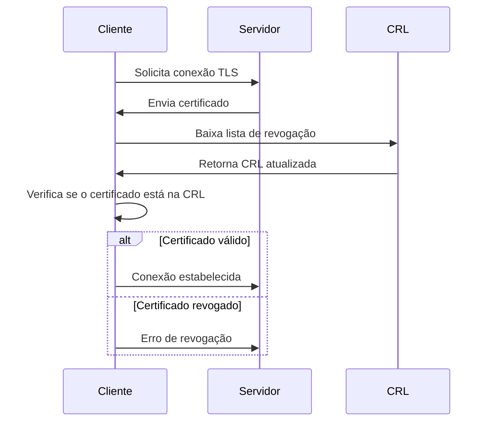

---
tags:
  - Fundamentos
  - Segurança
  - NotaBibliografica
---
# **CRL (Certificate Revocation List) - Lista de Revogação de Certificados**

Uma **CRL** (do inglês *Certificate Revocation List*) é um mecanismo fundamental em [[pki]] (Infraestrutura de Chave Pública) que permite **revogar [[certificado-digital|certificados digitais]] antes de sua data de expiração**, garantindo que certificados comprometidos ou inválidos não sejam mais confiáveis.

---

## **1. Para Que Serve uma CRL?**
Quando um certificado é **comprometido** (ex: chave privada vazada) ou **não deve mais ser usado** (ex: funcionário demitido), a [[autoridade-certificadora]] (CA) o adiciona a uma CRL.  
Os sistemas que validam certificados (navegadores, servidores, APIs) **consultam a CRL** para verificar se um certificado foi revogado.

---

## **2. Como Funciona?**
1. **A CA gera e publica a CRL** em um endpoint público (ex: `http://crl.example.com/root.crl`).  
2. **Clientes/Servidores** baixam periodicamente a CRL para verificar se um certificado está revogado.  
3. Durante a validação de um certificado, o sistema checa:  
   - Se o **número de série** do certificado está na CRL.  
   - Se a CRL ainda está **dentro do período de validade**.  

---

## **3. Estrutura de uma CRL**
Uma CRL é um arquivo (geralmente no formato **DER ou PEM**) que contém:  
- **Identificação da CA** que emitiu a lista.  
- **Data da próxima atualização**.  
- **Lista de certificados revogados**, com:  
  - Número de série do certificado.  
  - Motivo da revogação (ex: `keyCompromise`, `cessationOfOperation`).  
  - Data da revogação.  

Exemplo de visualização (OpenSSL):  
```bash
openssl crl -in crl.pem -text -noout
```

**Saída:**  
```
Certificate Revocation List (CRL):
    Version 2
    Signature Algorithm: sha256WithRSAEncryption
    Issuer: CN = Minha CA Raiz, O = Empresa Ltda
    Last Update: Jun  1 12:00:00 2023 GMT
    Next Update: Jun  8 12:00:00 2023 GMT
    Revoked Certificates:
        Serial Number: 01A2B3C4D5E6F
            Revocation Date: May 15 10:30:00 2023 GMT
            Reason: Key compromise
```

---

## **4. Tipos de CRL**
| Tipo | Descrição |
|------|-----------|
| **CRL Completa** | Lista todos os certificados revogados. Pode ficar grande. |
| **Delta CRL** | Lista apenas as revogações desde a última CRL completa. |
| **CRL Particionada** | Divide a CRL por critérios (ex: por tipo de certificado). |

---

## **5. Vantagens e Desvantagens**
### **✔️ Vantagens:**
- **Simplicidade**: Fácil de implementar e compatível com sistemas legados.  
- **Controle centralizado**: A CA gerencia toda a revogação.  

### **❌ Desvantagens:**
- **Latência**: Se um certificado for revogado agora, os clientes só saberão na **próxima atualização da CRL**.  
- **Overhead**: CRLs podem ficar muito grandes (ex: CAs globais).  
- **Dependência de acesso**: Clientes precisam baixar a CRL regularmente.  

---

## **6. Alternativas à CRL**
### **OCSP (Online Certificate Status Protocol)**
- **Funcionamento**: O cliente consulta um servidor OCSP em tempo real para verificar o status do certificado.  
- **Vantagem**: Resposta imediata (sem esperar pela CRL).  
- **Problema**: Requer disponibilidade do servidor OCSP.  

### **OCSP Stapling**
- O **servidor** (ex: Nginx) consulta o OCSP periodicamente e anexa a resposta ao handshake TLS, reduzindo a carga no cliente.  

---

## **7. Exemplo Prático: Criando uma CRL com OpenSSL**
### **7.1 Gerar CRL a partir da CA**
```bash
openssl ca -gencrl -keyfile ca-intermediaria.key -cert ca-intermediaria.crt -out crl.pem
```

### **7.2 Revogar um Certificado**
```bash
openssl ca -revoke servico.crt -keyfile ca-intermediaria.key -cert ca-intermediaria.crt
openssl ca -gencrl -keyfile ca-intermediaria.key -cert ca-intermediaria.crt -out crl.pem
```

### **7.3 Configurar Servidor Web para Usar CRL (Nginx)**
```nginx
ssl_crl /path/crl.pem;  # Adicionar ao bloco server { ... }
```

---

## **8. Quando Usar CRL?**
- **Ambientes corporativos** com PKI privada.  
- **Sistemas legados** que não suportam OCSP.  
- **Cenários onde a conectividade com OCSP é limitada**.  

Para sistemas modernos, **OCSP Stapling** é geralmente preferido.

---

## **9. Fluxograma de Validação com CRL**


---

### **Resumo**
- **CRL** é uma lista de certificados revogados antes do vencimento.  
- **Usada em PKIs** para invalidar certificados comprometidos.  
- **Alternativas modernas**: OCSP e OCSP Stapling (mais eficientes).  
- **OpenSSL** permite gerar/gerenciar CRLs para CAs privadas.  

Quer ver como implementar **OCSP Stapling** ou integrar CRL com **Kubernetes**? Posso explicar