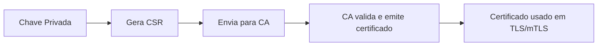
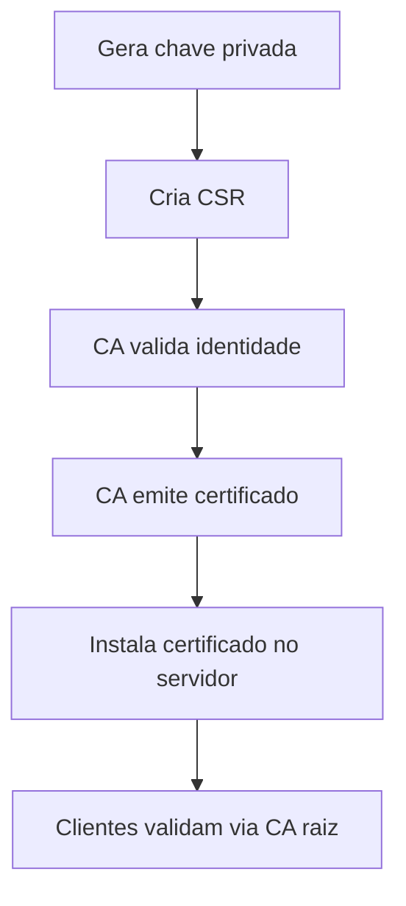

---
tags:
  - Fundamentos
  - Segurança
  - NotaBibliografica
---
# **CSR (Certificate Signing Request) - Pedido de Assinatura de Certificado**

Uma **CSR** (*Certificate Signing Request*) é um arquivo criptográfico que contém informações sobre a entidade (pessoa, servidor ou dispositivo) que solicita um certificado digital a uma Autoridade Certificadora (CA). Ela é o **primeiro passo** para obter um certificado válido e está intrinsecamente ligada a todos os conceitos que discutimos até agora (PKI, CAs, certificados, chaves privadas, etc.).

---

## **1. O Que é uma CSR?**
- **Definição**: Arquivo (geralmente no formato `.csr` ou `.pem`) que contém:
  - **Chave pública** do solicitante.
  - **Metadados** sobre a entidade (nome comum, organização, domínio, etc.).
  - **Assinatura digital** (prova de posse da chave privada correspondente).
- **Propósito**: Solicitar a uma CA que assine e emita um certificado digital válido.

---

## **2. Conteúdo de uma CSR**
Você pode inspecionar uma CSR com:
```bash
openssl req -in meu-pedido.csr -text -noout
```

### **Campos Principais:**
| Campo | Exemplo | Obrigatório? | Descrição |
|-------|---------|--------------|-----------|
| **Common Name (CN)** | `www.exemplo.com` | Sim | Nome do domínio ou identidade do solicitante. |
| **Organization (O)** | `Empresa XYZ Ltda` | Depende | Nome da organização (obrigatório para OV/EV). |
| **Organizational Unit (OU)** | `TI` | Opcional | Departamento responsável. |
| **Country (C)** | `BR` | Sim | Código do país (ex: BR para Brasil). |
| **State (ST)** | `São Paulo` | Depende | Estado ou província. |
| **Locality (L)** | `São Paulo` | Opcional | Cidade. |
| **Subject Alternative Names (SANs)** | `DNS:exemplo.com, DNS:*.exemplo.com` | Recomendado | Lista de domínios alternativos cobertos pelo certificado. |

---

## **3. Como a CSR se Conecta com Tudo que Já Vimos?**
A CSR é o **elo central** entre os componentes da PKI:



### **Relação com os Tópicos Anteriores:**
1. **PKI (Infraestrutura de Chave Pública)**:
   - A CSR é o mecanismo padrão para solicitar certificados dentro de uma PKI.

2. **CA (Autoridade Certificadora)**:
   - A CA usa a CSR para emitir um certificado assinado, vinculando a chave pública aos dados do solicitante.

3. **Certificados Autoassinados vs. Assinados por CA**:
   - Se você é sua própria CA (ex: OpenSSL CA), pode assinar a CSR localmente.
   - Se usa uma CA pública (ex: Let's Encrypt), envia a CSR para validação externa.

4. **mTLS e Service Meshes (Linkerd)**:
   - No Linkerd, o controlador de identidade age como uma CA interna, processando CSRs para emitir certificados para proxies.

5. **Validação (CRL/OCSP)**:
   - O certificado emitido a partir da CSR pode ser revogado via CRL ou OCSP se comprometido.

---

## **4. Como Gerar uma CSR?**
### **Passo a Passo com OpenSSL**
1. **Gerar chave privada** (se ainda não tiver):
   ```bash
   openssl genrsa -out meu-servico.key 2048
   ```

2. **Gerar CSR**:
   ```bash
   openssl req -new -key meu-servico.key -out meu-servico.csr \
     -subj "/CN=meu-servico.com/O=Minha Empresa/C=BR" \
     -addext "subjectAltName=DNS:meu-servico.com,DNS:*.meu-servico.com"
   ```
   - **`-subj`**: Define os metadados (ajuste conforme necessário).
   - **`-addext`**: Adiciona SANs (obrigatório para certificados modernos).

3. **Enviar CSR para a CA**:
   - Para CAs públicas (ex: DigiCert), faça upload do `.csr` no painel deles.
   - Para CAs privadas, use comandos como:
     ```bash
     openssl ca -in meu-servico.csr -out meu-servico.crt -keyfile ca.key -cert ca.crt
     ```

---

## **5. Validação pela CA**
Dependendo do tipo de certificado, a CA pode exigir:
| Tipo de Validação | O que a CA Verifica? | Exemplo |
|-------------------|----------------------|---------|
| **DV (Domain Validation)** | Posse do domínio (via e-mail/DNS/HTTP). | Let's Encrypt |
| **OV (Organization Validation)** | Documentos da empresa (CNPJ, contrato social). | DigiCert OV |
| **EV (Extended Validation)** | Auditoria presencial e verificação jurídica. | Certificado EV para bancos |

---

## **6. O Que Acontece Depois que a CA Assina?**
1. **Você recebe**:
   - Um **certificado assinado** (`.crt`, `.pem`).
   - Possivelmente um **cadeia de certificados** (`.ca-bundle`).

2. **Instalação**:
   - No servidor web (ex: Nginx, Apache).
   - Em load balancers (ex: AWS ALB).
   - Em service meshes (ex: Linkerd, como `identity.issuer.tls.crtPEM`).

---

## **7. Perguntas Frequentes**
### **P: Posso reutilizar uma CSR para renovar um certificado?**
- **Não**. Cada CSR deve ser única (gerada com uma nova chave privada para segurança).

### **P: O que acontece se a chave privada for perdida após gerar a CSR?**
- **Gere uma nova CSR com uma nova chave privada**. A CSR está vinculada à chave original.

### **P: Como adicionar SANs (Subject Alternative Names)?**
- Use `-addext` no OpenSSL ≥ 1.1.1 ou crie um arquivo `.cnf` com:
  ```ini
  [ req ]
  req_extensions = v3_req

  [ v3_req ]
  subjectAltName = DNS:exemplo.com, DNS:*.exemplo.com
  ```

---

## **8. Exemplo Completo: CSR + Certificado para HTTPS**
```bash
# 1. Gerar chave privada
openssl genrsa -out exemplo.com.key 2048

# 2. Gerar CSR com SANs
openssl req -new -key exemplo.com.key -out exemplo.com.csr \
  -subj "/CN=exemplo.com/O=Empresa ABC/C=BR" \
  -addext "subjectAltName=DNS:exemplo.com,DNS:*.exemplo.com"

# 3. Enviar CSR para a CA (ex: DigiCert)
# 4. CA retorna: exemplo.com.crt + ca-bundle.crt

# 5. Configurar Nginx
ssl_certificate /path/exemplo.com.crt;
ssl_certificate_key /path/exemplo.com.key;
ssl_trusted_certificate /path/ca-bundle.crt;
```

---

## **9. Resumo da Jornada da CSR**


---

### **Próximos Passos**
Quer aprender a:
- Automatizar CSRs com **cert-manager no Kubernetes**?
- Criar uma **CA privada completa** com OpenSSL?
- Configurar **mTLS com certificados baseados em CSR**?

Posso detalhar qualquer um desses tópicos