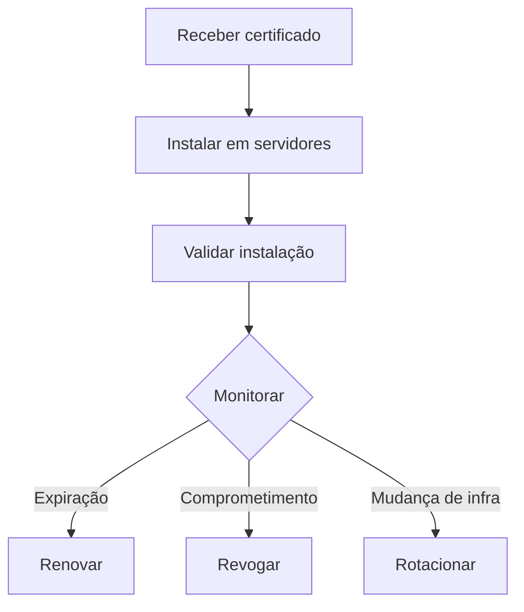

---
tags:
  - Fundamentos
  - Segurança
  - NotaBibliografica
---
Após receber as chaves e certificados de uma [[autoridade-certificadora|Autoridade Certificadora (CA)]], você tem várias possibilidades de uso e gerenciamento. Aqui está um guia completo:

---

### **1. Instalação em Servidores/Serviços**
**Onde aplicar os certificados:**
- **Servidores Web** (Apache, Nginx, IIS)
- **Load Balancers** (AWS ALB, NGINX Plus, F5)
- **Bancos de Dados** (MySQL com SSL, MongoDB TLS)
- **Serviços de E-mail** (Postfix, Exchange)
- **APIs** (Kubernetes Ingress, Service Mesh como Linkerd/Istio)
- **VPNs** (OpenVPN, WireGuard)

**Exemplo para Nginx:**
```nginx
server {
    listen 443 ssl;
    ssl_certificate /path/seu_dominio.crt;
    ssl_certificate_key /path/seu_dominio.key;
    ssl_trusted_certificate /path/ca-bundle.crt;
}
```

---

### **2. Validação da Instalação**
**Ferramentas para verificar:**
- **OpenSSL**:  
  ```bash
  openssl s_client -connect seu_dominio:443 -showcerts
  ```
- **Online**: SSL Labs (https://www.ssllabs.com/ssltest/)
- **Browser**: Cadeado verde no Chrome/Firefox

**Checar:**
- Cadeia de confiança completa
- Criptografia forte ([[protocolo-tls|TLS]] 1.2/1.3)
- Nenhum aviso de segurança

---

### **3. Renovação**
**Ciclo típico:**
- **Certificados DV**: 90 dias (Let's Encrypt)  
- **Certificados OV/EV**: 1-3 anos  
**Processo:**
1. Gerar novo [[csr]] (se necessário)
2. Revalidar domínio/organização (para OV/EV)
3. Instalar o novo certificado antes da expiração

**Automação recomendada:**
- **Certbot** (para Let's Encrypt)
- **scripts cron** ou **Kubernetes Cert-Manager**

---

### **4. Revogação**
**Quando revogar:**
- Chave privada comprometida
- Certificado não será mais usado
- Erros na emissão

**Como revogar:**
- Via painel da CA (ex: DigiCert, Sectigo)
- Usar números de série do certificado
- **[[crl]] (Certificate Revocation List)** ou **OCSP** serão atualizados

---

### **5. Backup e Segurança**
**Boas práticas:**
- **[[chave-privada]] (`*.key`)**:
  - Armazenar em **[[hsm]]** ou **KMS** (AWS KMS, HashiCorp Vault)
  - Nunca commit em repositórios Git
- **Certificados**:
  - Backup em local criptografado
  - Usar ferramentas como **Ansible Vault** ou **Sealed Secrets**

---

### **6. Rotação de Chaves**
**Por que rotacionar?**
- Mitigar riscos de comprometimento
- Atualizar para algoritmos mais fortes (ex: migrar de RSA-2048 para ECC)

**Frequência sugerida:**
- Chaves raiz: 5-10 anos (HSM)
- Chaves de serviço: 1-2 anos

---

### **7. Monitoramento**
**O que monitorar:**
- **Expiração** (alertas 30/15/7 dias antes)
  ```bash
  openssl x509 -in certificado.crt -noout -enddate
  ```
- **Revogação** (status OCSP)
- **Configuração TLS** (ferramentas como **cfssl**)

**Soluções:**
- [[prometheus]] + SSL Exporter
- Datadog/Splunk para alertas

---

### **8. Multi-Cloud/Híbrido**
**Casos de uso avançados:**
- **[[kubernetes]]**: Usar `Cert-Manager` com Issuers para diferentes CAs
- **[[AWS]]**: Upload no ACM para uso com ALB/CloudFront
- **Azure**: Key Vault para gerenciamento

---

### **9. Documentação e Compliance**
**Registros obrigatórios (para auditorias):**
- Data de emissão/expiração
- Finalidade do certificado
- Localização da chave privada
- Histórico de revogações

---

### **Fluxograma Pós-Emissão**


---

### **Erros Comuns a Evitar**
1. **Chave privada exposta** (vazamento em logs ou GitHub)
2. **Cadeia incompleta** (falta do `ca-bundle.crt`)
3. **Algoritmos obsoletos** (SHA-1, TLS 1.0)
4. **Esquecer renovação** (causa downtime)

---

### **Ferramentas Recomendadas**
| Tarefa | Ferramentas |
|--------|------------|
| Gerenciamento | **Cert-Manager**, **HashiCorp Vault** |
| Validação | **SSL Labs**, **testssl.sh** |
| Automação | **Ansible**, **Terraform** |
| Monitoramento | **Prometheus**, **Nagios** |

---

**Próximos passos:**  
Se você está usando Kubernetes, considere configurar um **Cert-Manager** para automatizar a renovação. Para ambientes críticos, avalie HSMs para proteção de chaves.