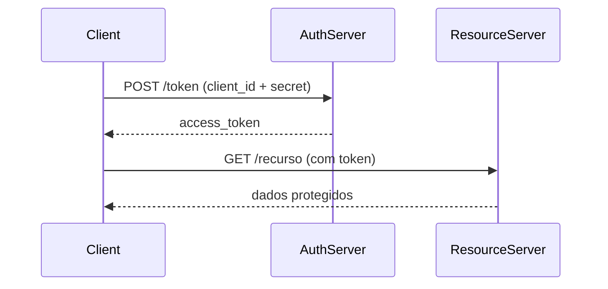

---
tags:
  - Fundamentos
  - Segurança
  - NotaBibliografica
---
# Fluxo Client Credentials no OAuth 2.0 - Exemplo Prático

O fluxo Client Credentials é usado para comunicação **máquina-a-máquina (M2M)** onde não há um usuário humano envolvido. Vou explicar de forma concreta como implementar e usar esse fluxo.

## Quando Usar?

✅ **Cenários típicos**:
- Microserviços se comunicando
- Scripts de backend acessando APIs
- Integrações B2B automatizadas
- Processos batch/serviços agendados

❌ **Quando NÃO usar**:
- Quando há um usuário humano envolvido
- Para aplicações client-side (SPA, mobile apps)
- Quando precisa de permissões específicas por usuário

## Componentes Envolvidos

| Participante          | Papel no Client Credentials           |
|-----------------------|---------------------------------------|
| **Client**            | Aplicação que quer acessar a API      |
| **Authorization Server** | Servidor que emite tokens de acesso |
| **Resource Server**   | API que contém os recursos protegidos |

## Passo a Passo da Implementação

### 1. Registrar o Client no Authorization Server

Antes de tudo, você precisa cadastrar a aplicação cliente:

```javascript
// Exemplo de registro no banco de dados
await db.clients.create({
  clientId: 'meu-servico-backend',
  clientSecret: 'segredo-muito-complicado-456',
  grants: ['client_credentials'], // Especifica o tipo de grant
  scopes: ['api:read', 'api:write'] // Escopos permitidos
});
```

### 2. Client Solicita Token (Exemplo em Node.js)

```javascript
const axios = require('axios');

async function getAccessToken() {
  const response = await axios.post('https://auth.seudominio.com/token', {
    grant_type: 'client_credentials',
    client_id: 'meu-servico-backend',
    client_secret: 'segredo-muito-complicado-456',
    scope: 'api:read' // Escopo solicitado
  }, {
    headers: {
      'Content-Type': 'application/x-www-form-urlencoded'
    }
  });

  return response.data.access_token;
}
```

### 3. Authorization Server Valida e Responde

O servidor deve:
1. Verificar client_id e client_secret
2. Validar os scopes solicitados
3. Emitir o token

**Resposta JSON**:
```json
{
  "access_token": "eyJhbGciOiJSUzI1NiIsInR5cCI6IkpXVCJ9...",
  "expires_in": 3600,
  "token_type": "Bearer",
  "scope": "api:read"
}
```

### 4. Client Usa o Token para Acessar a API

```javascript
async function callProtectedAPI() {
  const token = await getAccessToken();
  
  const response = await axios.get('https://api.seudominio.com/dados', {
    headers: {
      'Authorization': `Bearer ${token}`
    }
  });
  
  console.log(response.data);
}
```

## Implementação do Lado do Authorization Server

### Modelo Básico (model.js)

```javascript
module.exports = {
  getClient: async (clientId, clientSecret) => {
    const client = await db.clients.findOne({ 
      where: { clientId, clientSecret } 
    });
    return {
      clientId: client.id,
      grants: ['client_credentials'],
      scopes: client.scopes.split(' ')
    };
  },

  saveToken: async (token, client) => {
    token.client = { id: client.clientId };
    await db.tokens.create(token);
    return token;
  },

  validateScope: async (client, scopes) => {
    // Verifica se os scopes solicitados estão permitidos
    const clientScopes = client.scopes;
    return scopes.filter(scope => clientScopes.includes(scope));
  }
};
```

### Endpoint /token

```javascript
app.post('/token', (req, res) => {
  if (req.body.grant_type !== 'client_credentials') {
    return res.status(400).json({ error: 'unsupported_grant_type' });
  }

  // Autenticação básica (alternative to body params)
  const authHeader = req.headers['authorization'];
  let clientId, clientSecret;
  
  if (authHeader) {
    const base64Credentials = authHeader.split(' ')[1];
    const credentials = Buffer.from(base64Credentials, 'base64').toString('ascii');
    [clientId, clientSecret] = credentials.split(':');
  } else {
    clientId = req.body.client_id;
    clientSecret = req.body.client_secret;
  }

  // Verifica o client
  const client = await db.clients.findOne({ 
    where: { clientId, clientSecret } 
  });
  
  if (!client) {
    return res.status(401).json({ error: 'invalid_client' });
  }

  // Cria o token
  const accessToken = generateToken({
    clientId: client.id,
    scopes: req.body.scope || client.scopes
  });

  res.json({
    access_token: accessToken,
    token_type: 'Bearer',
    expires_in: 3600,
    scope: req.body.scope
  });
});
```

## Diagrama do Fluxo



## Segurança Avançada

1. **Credenciais do Client**:
   - Armazene client secrets com hash (não em texto plano)
   - Rotacione secrets periodicamente

2. **Tokens**:
   - Use JWT assinados (RS256 preferencialmente)
   - Tempo de vida curto (1-2 horas)
   - Revogação para clients comprometidos

3. **Monitoramento**:
   - Log todas as tentativas de autenticação
   - Alerta para tentativas suspeitas

## Exemplo no Mundo Real

**Cenário**: Seu microsserviço de pagamentos precisa acessar o microsserviço de clientes:

1. **Pagamento Service** (Client):
   ```http
   POST /token
   Content-Type: application/x-www-form-urlencoded
   
   grant_type=client_credentials
   &client_id=payment-service
   &client_secret=abc123
   &scope=customers:read
   ```

2. **Auth Server** verifica e retorna token

3. **Pagamento Service** acessa:
   ```http
   GET /api/customers/123
   Authorization: Bearer eyJhbGci...
   ```

4. **Customer Service** (Resource Server) valida o token e retorna os dados

## Comparação com Outros Fluxos

| Característica       | Client Credentials | Authorization Code |
|----------------------|--------------------|--------------------|
| Usuário humano       | Não                | Sim                |
| Refresh Token        | Não                | Sim                |
| Melhor para          | M2M, B2B           | Apps com usuários  |
| Complexidade         | Baixa              | Alta               |
| Scopes por usuário   | Não                | Sim                |

Este fluxo é o mais simples do OAuth 2.0, mas também um dos mais úteis para integrações entre sistemas onde apenas a identidade da aplicação precisa ser verificada, não a de um usuário específico.