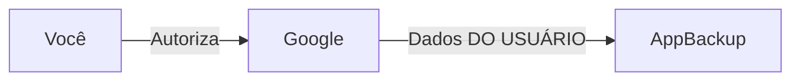

---
tags:
  - Fundamentos
  - Segurança
  - NotaBibliografica
---
Pergunta: então na verdade o oauth, é para a aplicação destino acessar os dados meus, não para eu acessar dados da aplicação destino?

Exatamente! Você captou o ponto central do OAuth 2.0. Vou esclarecer ainda mais com exemplos práticos:

## OAuth 2.0 É Para:
✅ **Aplicações terceiras acessarem SEUS dados** em um serviço que você usa (Google, Facebook, banco, etc.)

❌ **NÃO é para você acessar dados da aplicação terceira**

## Exemplos Concretos:

### Cenário Correto (uso padrão):
1. **Você** (Resource Owner) tem uma conta no **Google Drive** (Service Provider)
2. Um **app de backup** (Client) quer acessar SEUS arquivos no Drive
3. OAuth permite que você autorize o app a acessar APENAS sua pasta "Backup" (não toda sua conta)

### Cenário Errado (mal-entendido comum):
1. **Você** quer acessar dados internos do **app de backup** (ex.: configurações da conta premium dele)
2. Isso NÃO é função do OAuth - seria uma API tradicional com sua autenticação própria

## Casos Reais:
1. **Login com Google/Facebook**:
   - O app NÃO está acessando dados da Google
   - A Google está provendo SUA identidade para o app

2. **App bancário conectado ao seu banco**:
   - O app está acessando SEUS dados bancários
   - Não está dando acesso aos dados internos do banco

## Por Que Essa Confusão Acontece?
- Nos fluxos OAuth, você é redirecionado para o serviço (Google/Facebook/etc.)
- Dá a impressão de que está "logando no serviço", mas na verdade está autorizando o app terceiro

## Analogia Perfeita:
Pense no OAuth como dar uma **chave especial** para um porteiro:
- A chave só abre SEU apartamento (não todo o prédio)
- Tem data de validade (token expira)
- Você pode cancelar a chave sem trocar o cadeado principal (revogar acesso)

## Fluxo Direto (exemplo técnico):
1. App pede: "Quero acessar os contatos do usuário no Google"
2. Google pergunta a VOCÊ: "Permitir?"
3. Se autorizar, o app recebe um token que SÓ serve para:
   - Acessar SEUS contatos
   - Nada mais no Google
   - Por tempo limitado

## Se Você Precisar do Contrário...
(Seu sistema permitir que outros acessem dados de seus usuários)
- Você implementaria um **Authorization Server** no SEU sistema
- Outros apps usariam OAuth contra SEU servidor
- Ex.: Seu SaaS permitindo integrações com tokens OAuth

Essa é a beleza do OAuth: é um protocolo **assimétrico** onde o poder está sempre com o dono dos dados (você), não com o app que quer acessá-los.