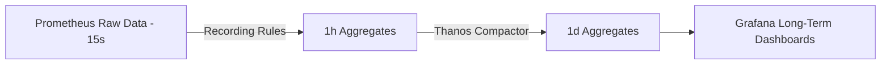

---
tags:
  - SRE
  - NotaBibliografica
  - Conceito
categoria: metricas
ferramenta: prometheus
---
# **Downsampling no Prometheus: Conceito, Benefícios e Implementação**

O **downsampling** é uma técnica crítica para gerenciamento eficiente de dados temporais em sistemas como o [[prometheus]], especialmente quando lidamos com longos períodos de retenção. Vamos explorar seu funcionamento e relação com a arquitetura que estudamos.

---

## **1. Definição de Downsampling**
Processo de **redução da granularidade** de dados históricos ao:
1. **Agregar** métricas brutas (alta resolução) em médias/somas.  
2. **Manter** apenas amostras representativas em intervalos maiores.  

### **Exemplo Prático:**
- **Dados brutos**: `cpu_usage` coletado a cada 15s (5.760 pontos/dia).  
- **Downsampled**: Média horária armazenada (24 pontos/dia).  

---

## **2. Por que Downsampling é Essencial?**
| Problema sem Downsampling | Solução com Downsampling |
|---------------------------|--------------------------|
| Armazenamento cresce infinitamente | Reduz 95%+ do espaço em disco |
| Consultas lentas em longos ranges | Acelera queries históricas |
| Custo elevado de retenção | Permite manter dados por anos |

---

## **3. Como Funciona no Prometheus?**
O Prometheus **não faz downsampling automático**, mas oferece mecanismos para implementá-lo:

### **a) Via Recording Rules**
Agrega métricas brutas em intervalos maiores:
```yaml
# rules/downsampling.yml
groups:
  - name: downsampling
    interval: 1h  # Executa a cada hora
    rules:
      - record: cpu_usage:avg1h
        expr: avg_over_time(cpu_usage[1h])
      - record: http_requests:sum1h
        expr: sum_over_time(http_requests_total[1h])
```

### **b) Ferramentas Externas**
- **[[thanos]]/Cortex**: Implementam downsampling distribuído.  
- **VictoriaMetrics**: Compressão automática agressiva.  

---

## **4. Relação com os Conceitos Estudados**
| Conceito                  | Integração com Downsampling                           |
| ------------------------- | ----------------------------------------------------- |
| **[[time-series\|TSDB]]** | Dados downsampled são armazenados como novas séries.  |
| **[[recording-rules]]**   | Principal mecanismo nativo para downsampling.         |
| **[[promql]]**            | Funções como `avg_over_time()` habilitam a agregação. |
| **Retention**             | Permite reter dados por anos sem custo proibitivo.    |

---

## **5. Casos de Uso Típicos**
1. **Monitoramento de Tendências**  
   - Dashboards de "visão anual" usam médias diárias.  

2. **Alertas Históricos**  
   - Detectar aumentos graduais (ex.: "crescimento de 10% no erro médio diário").  

3. **Otimização de Custo**  
   - Reduzir espaço em disco para métricas pouco acessadas.  

---

## **6. Boas Práticas**
1. **Defina Objetivos Claros**  
   - Qual a granularidade necessária para dados com 1 mês vs. 1 ano?  

2. **Use Camadas de Armazenamento**  
   - Dados recentes (15s), médio prazo (1h), longo prazo (1d).  

3. **Monitore Impacto**  
   - Verifique `prometheus_tsdb_compactions_total` para ajustar agressividade.  

---

## **7. Exemplo de Arquitetura com Downsampling**


---

## **8. Limitações do Prometheus Puro**
- **Sem downsampling automático**: Depende de rules manuais.  
- **Soluções recomendadas**:  
  - **Thanos**: Downsampling distribuído + armazenamento em objeto ([[S3]]).  
  - **Cortex**: Agregação em escala.  

---

## **Resumo**
- **O que é**: Redução controlada da resolução de dados históricos.  
- **Benefícios**: Economia de espaço, queries rápidas e retenção prolongada.  
- **Como implementar**: Recording Rules ou soluções como Thanos.  
- **Integração**: Complementa TSDB, PromQL e estratégias de retenção.  