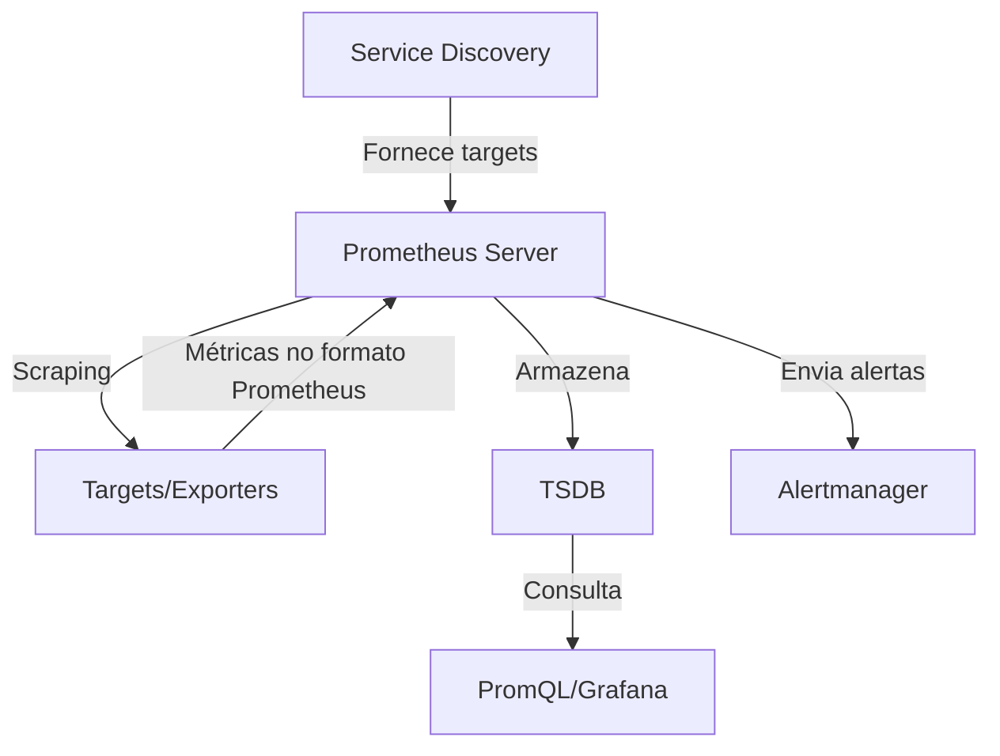

---
tags:
  - SRE
  - NotaBibliografica
  - Conceito
categoria: metricas
ferramenta: prometheus
---
# **Prometheus Server: Núcleo da Arquitetura e Integração com os Conceitos Estudados**

O **Prometheus Server** é o componente central do ecossistema [[prometheus]], responsável por **coletar, armazenar, processar e disponibilizar métricas** para consulta e alertas. Ele é o "cérebro" que orquestra tudo o que estudamos até agora: **[[scrapping|scraping]], [[service-discoverry-prometheus|service discovery]], [[time-series|TSDB]], [[relabeling|relabeling]] e [[promql]]**.

---

## **1. O que é o Prometheus Server?**
É um servidor monolítico (mas altamente eficiente) que combina as seguintes funções:
1. **Coleta de métricas** (scraping) de targets.  
2. **Armazenamento** em banco de dados de séries temporais (TSDB).  
3. **Processamento de consultas** (PromQL).  
4. **Gerenciamento de alertas** (via [[alertmanager]]).  

---

## **2. Posição na Arquitetura do Prometheus**
O Prometheus Server é o **centro de todas as interações** no ecossistema. Veja como ele se relaciona com os conceitos estudados:



### **Relação com os Componentes Estudados**
| Conceito              | Como se Integra ao Prometheus Server?                                                            |
| --------------------- | ------------------------------------------------------------------------------------------------ |
| **Scraping**          | O Server faz HTTP GET nos targets (exporters/apps) para coletar métricas.                        |
| **Service Discovery** | O Server consulta fontes ([[kubernetes]], Consul) para descobrir targets dinâmicos.              |
| **Relabeling**        | O Server aplica regras de pós-processamento às [[labels-prometheus\|labels]] antes de armazenar. |
| **TSDB**              | O Server gerencia o armazenamento eficiente das séries temporais.                                |
| **PromQL**            | O Server processa consultas contra o TSDB.                                                       |
| **Alertmanager**      | O Server avalia regras de alerta e envia notificações.                                           |

---

## **3. Funcionamento Interno do Prometheus Server**
### **Componentes Principais**
1. **Retrieval (Coleta)**  
   - Gerencia o **scraping** de targets (estáticos ou via service discovery).  
   - Aplica **relabeling** para filtrar/modificar labels.  

2. **TSDB (Time-Series Database)**  
   - Armazena métricas em blocos compactados no disco.  
   - Otimizado para alta ingestão de dados e consultas rápidas.  

3. **HTTP Server**  
   - Expõe a API para consultas (PromQL) e configurações.  
   - Endpoints úteis:  
     - `/metrics`: Métricas internas do Prometheus.  
     - `/api/v1/query`: Executa consultas PromQL.  

4. **Alert Rules Evaluation**  
   - Avalia regras de alerta definidas em `prometheus.yml` e envia notificações ao Alertmanager.  

---

## **4. Exemplo Prático: Fluxo Completo**
Suponha um ambiente Kubernetes com **[[node-exporter]]**:

1. **Service Discovery**  
   - O Server descobre Pods do Node Exporter via Kubernetes API.  
   ```yaml
   scrape_configs:
     - job_name: 'node-exporter'
       kubernetes_sd_configs:
         - role: pod
       relabel_configs:
         - source_labels: [__meta_kubernetes_pod_label_app]
           action: keep
           regex: 'node-exporter'
   ```

2. **Scraping**  
   - O Server coleta métricas de `http://node-exporter-pod:9100/metrics` a cada 15s.  

3. **Relabeling**  
   - Labels como `__meta_kubernetes_pod_name` são convertidas em `pod="node-exporter-xyz"`.  

4. **Armazenamento no TSDB**  
   - Métricas como `node_cpu_seconds_total` são armazenadas com timestamps.  

5. **Consulta via PromQL**  
   - Usuário consulta:  
     ```promql
     sum(rate(node_cpu_seconds_total{mode="idle"}[5m])) by (instance)
     ```

6. **Alertas**  
   - Se `up{job="node-exporter"} == 0`, o Server dispara um alerta para o Alertmanager.  

---

## **5. Boas Práticas com o Prometheus Server**
- **Defina `scrape_interval`** adequado para cada job (ex.: 15s para infra, 1m para apps).  
- **Use relabeling** para reduzir [[cardinalidade-metricas|cardinalidade]] (evite [[labels-prometheus|labels]] com valores únicos).  
- **Monitore o próprio Server** com métricas como:  
  ```promql
  prometheus_target_interval_length_seconds  # Tempo real entre scrapes
  prometheus_tsdb_head_series               # Série temporais ativas
  ```

---

## **6. Limitações e Alternativas**
- **Escala Vertical**: O Server é monolítico e pode ter limites em ambientes muito grandes.  
- **Soluções para Escala Horizontal**:  
  - **[[thanos]]** ou **Cortex**: Adicionam armazenamento distribuído e downsampling.  
  - **VictoriaMetrics**: TSDB mais eficiente para alta cardinalidade.  

---

## **Resumo**
- **Prometheus Server** é o núcleo que **coordena scraping, storage, querying e alerting**.  
- **Integra-se com tudo** que estudamos: service discovery, relabeling, TSDB e PromQL.  
- **Posição central**: Recebe dados de targets, armazena no TSDB e responde a consultas.  
- **Para escalar**: Use Thanos, Cortex ou VictoriaMetrics.  