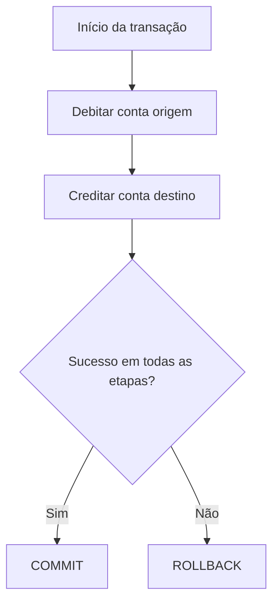

# ACID

## Definição
ACID é um conjunto de propriedades de transações em bancos de dados relacionais (e alguns bancos distribuídos) que garante confiabilidade mesmo com falhas, concorrência e interrupções. O acrônimo significa Atomicity, Consistency, Isolation e Durability.

## Porque iso existe
Sem ACID, operações críticas (como pagamento, transferência bancária ou baixa de estoque) podem terminar pela metade, gerar dados inválidos ou perder confirmações após falhas. ACID existe para proteger invariantes de negócio e manter o banco em um estado confiável.

## Como funciona
Uma transação ACID segue quatro propriedades:

- Atomicity: ou todas as operações da transação são confirmadas (commit), ou nenhuma é aplicada (rollback).
- Consistency: a transação respeita regras de integridade (constraints, chaves, validações) e leva o banco de um estado válido para outro estado válido.
- Isolation: transações concorrentes não devem se corromper mutuamente. O nível de isolamento define quais efeitos temporários podem ser observados.
- Durability: após commit, os dados persistem mesmo se houver crash, por meio de mecanismos como WAL (Write-Ahead Log), flush e replicação.

Em aplicações Java com Spring, a fronteira transacional geralmente é definida por `@Transactional`, delegando ao SGBD a execução atômica e o controle de commit/rollback.

```java
@Service
public class TransferService {

    @Transactional
    public void transferir(Long origemId, Long destinoId, BigDecimal valor) {
        contaRepository.debitar(origemId, valor);
        contaRepository.creditar(destinoId, valor);
    }
}
```

Se `creditar` falhar, o Spring dispara rollback e o débito também é desfeito.

## Quando usar
- Operações financeiras, faturamento, pedidos e estoque.
- Fluxos com múltiplas escritas que precisam sucesso total ou falha total.
- Cenários com forte requisito de integridade e auditoria.
- Sistemas onde perder confirmação de escrita é inaceitável.

## Exemplos
- Transferência bancária entre duas contas.
- Checkout de e-commerce: criar pedido, reservar estoque e registrar pagamento.
- Emissão de nota fiscal com atualização de múltiplas tabelas relacionadas.

## Representação visual


## Notas Relacionadas
- [[BASE]]
- [[Teorema CAP]]
- [[Teorema PACELC]]
