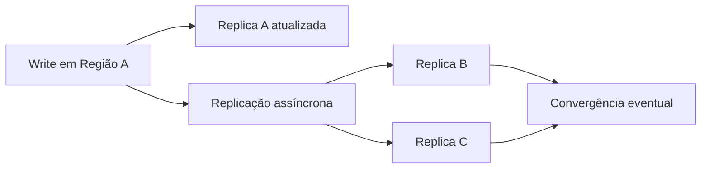

# BASE

## Definição
BASE é uma abordagem de consistência para sistemas distribuídos, comum em bancos NoSQL, que prioriza disponibilidade e escalabilidade. O acrônimo significa Basically Available, Soft state e Eventually consistent.

## Porque iso existe
Em ambientes distribuídos com alto volume, baixa latência e presença global, manter consistência forte em toda operação pode elevar custo e tempo de resposta. BASE existe para permitir que o sistema continue respondendo mesmo durante partições de rede e picos de carga.

## Como funciona
No modelo BASE:

- Basically Available: o sistema tende a responder, mesmo que parte dos dados esteja temporariamente desatualizada.
- Soft state: o estado pode mudar com o tempo sem novas entradas explícitas, devido a replicação assíncrona.
- Eventually consistent: réplicas convergem para o mesmo valor depois de um intervalo.

Na prática, escreve-se em um nó primário/região e a propagação para outras réplicas ocorre de forma assíncrona. Durante a janela de propagação, leituras podem retornar versões antigas.

## Quando usar
- Feeds, timelines, contadores, catálogo de produtos e recomendações.
- Sistemas globais com usuários distribuídos geograficamente.
- Cenários em que pequena inconsistência temporária é aceitável.
- Produtos que priorizam alta disponibilidade e baixa latência.

## Exemplos
- Em um marketplace, preço atualizado em uma região aparece alguns segundos depois em outra.
- Contador de curtidas pode variar entre réplicas por alguns instantes.
- Sistema de DNS em que mudanças levam tempo para propagar globalmente.

## Representação visual

## Notas Relacionadas
- [ACID](ACID.md)
- [Teorema CAP](Teorema CAP.md)
- [Teorema PACELC](Teorema PACELC.md)
