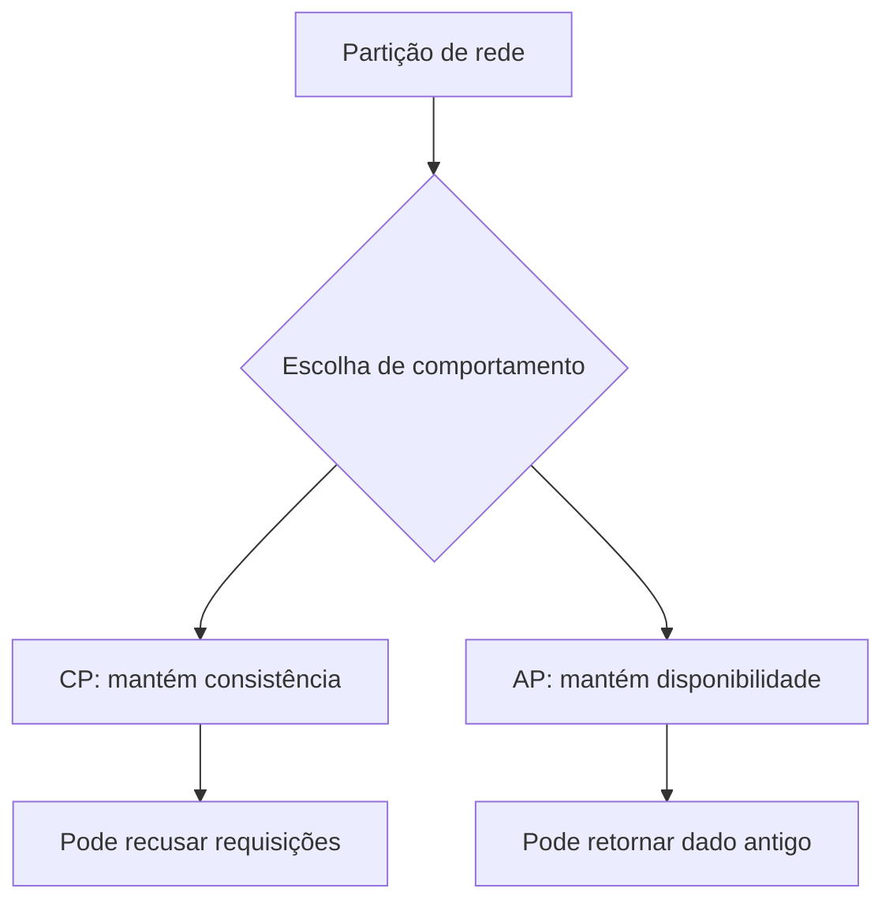

# Teorema CAP

## Definição
O teorema CAP afirma que, em um sistema distribuído sujeito a partições de rede, não é possível garantir simultaneamente Consistency, Availability e Partition tolerance em nível forte para todas as operações.

## Porque iso existe
Sistemas distribuídos reais enfrentam falhas de rede. CAP existe para formalizar os trade-offs inevitáveis nesses cenários e orientar decisões arquiteturais conscientes.

## Como funciona
CAP considera três propriedades:

- Consistency (C): toda leitura recebe o dado mais recente (ou erro), como se houvesse uma única cópia.
- Availability (A): toda requisição recebe resposta não-erro, mesmo que o dado não seja o mais recente.
- Partition tolerance (P): o sistema continua operando apesar de perda/atraso de mensagens entre nós.

Ponto central: quando ocorre partição, você precisa escolher entre C ou A:

- CP: prioriza consistência; pode recusar/atrasar respostas em parte do cluster.
- AP: prioriza disponibilidade; pode responder com dados potencialmente desatualizados.

Não existe sistema distribuído útil que “desligue P” no mundo real, então a escolha prática é como se comportar em presença de partições.

## Quando usar
- Na definição de arquitetura de bancos distribuídos.
- Ao escolher estratégia de leitura/escrita entre regiões.
- Em discussões de SLA onde disponibilidade e frescor do dado entram em tensão.
- Em design reviews de resiliência e replicação.

## Exemplos
- Banco CP: durante partição, prefere bloquear escrita/leitura em nós sem quorum.
- Banco AP: durante partição, continua aceitando escrita local e reconcilia depois.
- Sistema de carrinho global: pode aceitar divergência temporária para manter UX responsiva.

## Representação visual

## Notas Relacionadas
- [ACID](ACID.md)
- [BASE](BASE.md)
- [Teorema PACELC](Teorema PACELC.md)
