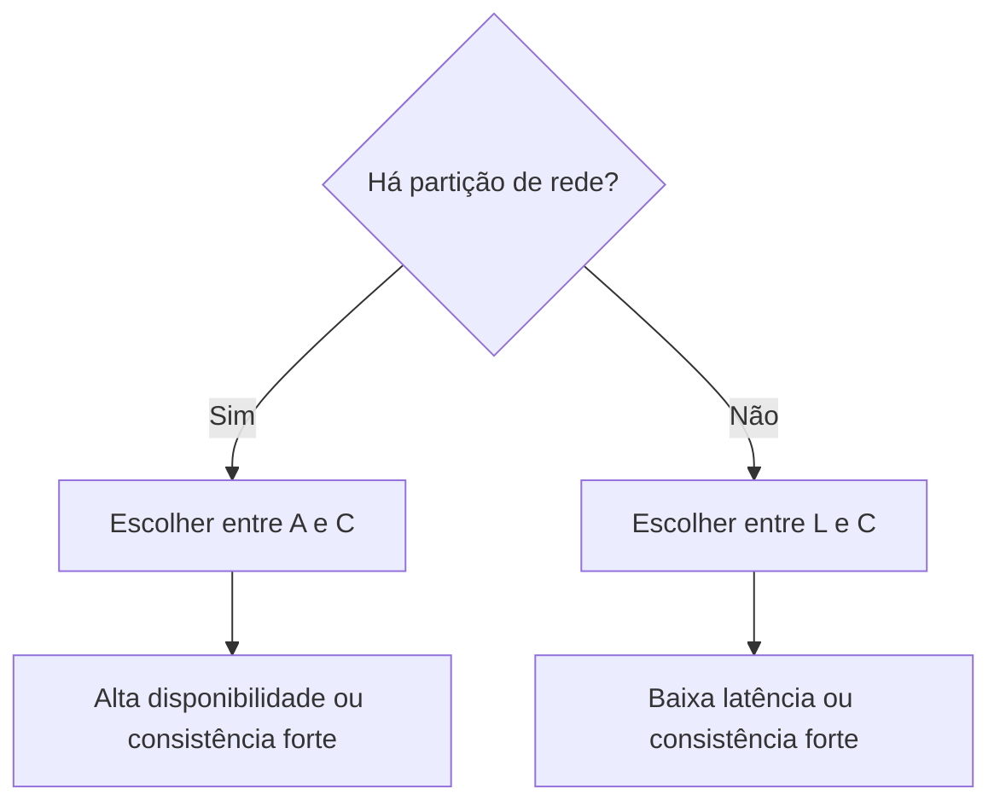

# Teorema PACELC

## Definição
PACELC complementa CAP ao afirmar: se houver Partição (P), há trade-off entre Availability (A) e Consistency (C); Else (E), sem partição, há trade-off entre Latency (L) e Consistency (C).

## Porque iso existe
CAP explica apenas o comportamento em falhas de rede. PACELC existe para cobrir também o cenário normal (sem partição), onde a arquitetura ainda precisa decidir entre menor latência e consistência mais forte.

## Como funciona
PACELC pode ser lido como:

- PA/EL: durante partição, favorece disponibilidade; sem partição, favorece baixa latência.
- PA/EC: durante partição, favorece disponibilidade; sem partição, favorece consistência.
- PC/EL: durante partição, favorece consistência; sem partição, favorece baixa latência.
- PC/EC: durante partição, favorece consistência; sem partição, continua favorecendo consistência.

Isso ajuda a entender decisões como replicação síncrona (mais consistência, maior latência) versus assíncrona (menor latência, consistência eventual).

## Quando usar
- Comparar bancos distribuídos além do simplismo “CP vs AP”.
- Definir estratégia multi-região com metas de p95/p99 de latência.
- Projetar produtos globais que precisam equilibrar UX e integridade do dado.
- Negociar requisitos de negócio: frescor imediato versus resposta rápida.

## Exemplos
- Aplicativo social global tende a PA/EL: resposta rápida e alta disponibilidade.
- Sistema de pagamentos tende a PC/EC: consistência rigorosa mesmo com custo de latência.
- Plataforma de e-commerce pode usar abordagens diferentes por domínio: catálogo em PA/EL e pagamento em PC/EC.

## Representação visual

## Notas Relacionadas
- [[Teorema CAP]]
- [[BASE]]
- [[ACID]]
