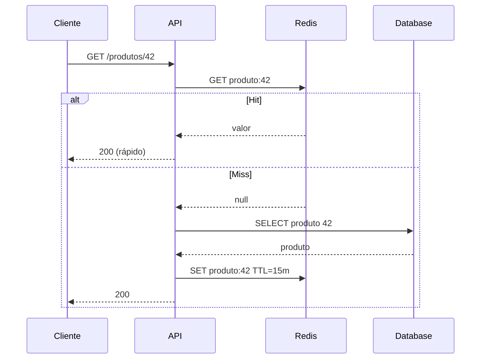

# Implementações de cache em aplicações

## Definição
Implementações de cache são estratégias e componentes usados para armazenar dados temporariamente e reduzir acessos repetidos ao sistema de origem. Isso inclui cache local, cache distribuído e padrões como cache-aside, write-through e write-back.

## Porque iso existe
A implementação correta de cache existe para equilibrar performance, custo e consistência. Sem uma implementação bem definida, o sistema pode ter dados obsoletos, efeito avalanche em misses e comportamento imprevisível em picos.

## Como funciona
Abordagens mais comuns:

1. **Cache local (in-memory no processo)**
   - Muito rápido
   - Escopo por instância da aplicação
   - Exemplo: Caffeine

2. **Cache distribuído (serviço externo)**
   - Compartilhado entre várias instâncias
   - Bom para escala horizontal
   - Exemplo: Redis

3. **Padrões de escrita/leitura**
   - **Cache-aside**: aplicação lê cache antes de buscar fonte de verdade
   - **Write-through**: toda escrita atualiza cache e banco
   - **Write-back**: escrita vai para cache e persiste depois (assíncrono)

Pontos críticos de implementação:

- definição de chave (`cache key`) estável e sem colisão;
- TTL por domínio de negócio (não único para tudo);
- estratégia de invalidação por evento;
- proteção contra cache stampede (lock por chave, jitter de TTL, warmup).

## Quando usar
- **Cache local**: leitura extremamente frequente e dados pequenos por instância.
- **Cache distribuído**: múltiplos pods/instâncias precisando de visão compartilhada.
- **Cache-aside**: padrão padrão para maioria dos serviços backend.
- **Write-through / write-back**: cenários com alta taxa de escrita e necessidade de controle explícito de sincronização.

## Exemplos
Exemplo de cache-aside com Redis em Java:

```java
public Produto getProduto(String id) {
    String key = "produto:" + id;

    Produto cached = redisTemplate.opsForValue().get(key);
    if (cached != null) return cached;

    Produto produto = produtoRepository.findById(id).orElseThrow();
    redisTemplate.opsForValue().set(key, produto, Duration.ofMinutes(15));
    return produto;
}
```

Exemplo com Spring Cache:

```java
@Cacheable(cacheNames = "produto", key = "#id")
public Produto buscarProduto(String id) {
    return produtoRepository.findById(id).orElseThrow();
}

@CacheEvict(cacheNames = "produto", key = "#id")
public void atualizarProduto(String id, AtualizacaoProduto payload) {
    produtoService.update(id, payload);
}
```

## Representação visual


## Notas Relacionadas
- [Métricas de cache: hit, miss e hit rate](./metricas-de-cache-hit-rate-e-miss-rate.md)
- [Políticas de evicção e substituição de cache](./politicas-de-eviccao-e-substituicao-de-cache.md)
- [Cache](../Fundamentos/cache.md)
