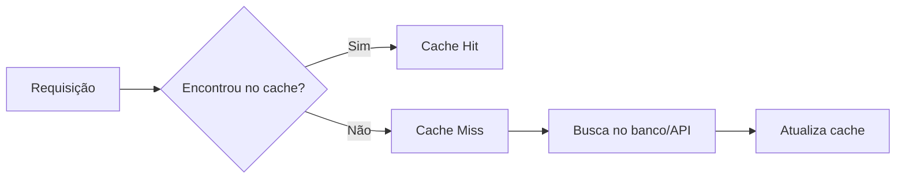

# Métricas de cache: hit, miss e hit rate

## Definição
Métricas de cache são indicadores que mostram a eficiência da camada de cache. As principais são cache hit (requisição atendida pelo cache), cache miss (requisição que precisou buscar no sistema de origem) e hit rate (percentual de acertos do cache).

## Porque iso existe
Sem medição, cache vira suposição. Essas métricas existem para validar se o cache realmente reduz latência, protege banco/API de origem e diminui custo de infraestrutura.

## Como funciona
A cada leitura, o sistema classifica o resultado como `hit` ou `miss`.

Fórmulas práticas:

- `hit rate = hits / (hits + misses)`
- `miss rate = misses / (hits + misses)`

Interpretação operacional:

- hit rate alto costuma indicar bom reaproveitamento de dados quentes;
- hit rate baixo pode indicar TTL curto demais, cardinalidade alta de chaves ou estratégia de chave ruim;
- picos de miss rate normalmente antecedem aumento de latência e carga no banco.

Para produção, monitore essas métricas por rota, por tipo de chave e por janela de tempo (1 min, 5 min, 1 h), em vez de olhar apenas média diária.

## Quando usar
Use em qualquer sistema com cache em memória local (ex.: Caffeine) ou distribuído (ex.: Redis), especialmente quando há meta de p95/p99, limitação de custo de banco ou risco de saturação em horário de pico.

## Exemplos
Exemplo real de leitura de dashboard:

- `hits = 92.000`
- `misses = 8.000`
- `hit rate = 92%`

Com 92% de hit rate, apenas 8% do tráfego de leitura chega ao banco. Se esse valor cair para 70%, a tendência é aumento de latência e de custo.

Exemplo com Micrometer + Spring:

```java
Counter cacheHit = registry.counter("cache.requests", "result", "hit", "cache", "usuarios");
Counter cacheMiss = registry.counter("cache.requests", "result", "miss", "cache", "usuarios");

public Usuario getUsuario(String id) {
    Usuario cached = redisOps.get(id);
    if (cached != null) {
        cacheHit.increment();
        return cached;
    }

    cacheMiss.increment();
    Usuario fromDb = usuarioRepository.findById(id).orElseThrow();
    redisOps.set(id, fromDb, Duration.ofMinutes(5));
    return fromDb;
}
```

## Representação visual


## Notas Relacionadas
- [Políticas de evicção e substituição de cache](./politicas-de-eviccao-e-substituicao-de-cache.md)
- [Implementações de cache em aplicações](./implementacoes-de-cache-em-aplicacoes.md)
- [Cache](../Fundamentos/cache.md)
