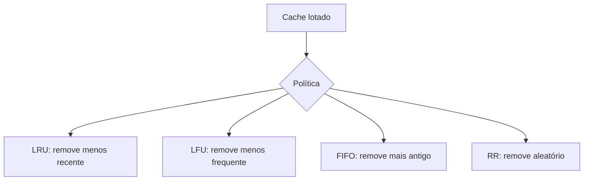

# Políticas de evicção e substituição de cache

## Definição
Políticas de evicção e substituição definem qual item sai do cache quando a capacidade máxima é atingida. As políticas mais comuns em sistemas distribuídos e aplicações backend são LRU, LFU, FIFO e RR.

## Porque iso existe
Cache tem memória finita. Sem política de substituição, o sistema não sabe quais itens remover e perde eficiência. Essas políticas existem para priorizar permanência de dados com maior probabilidade de reutilização.

## Como funciona
Resumo das políticas:

- **LRU (Least Recently Used)**: remove o item menos recentemente acessado.
- **LFU (Least Frequently Used)**: remove o item com menor frequência de acesso.
- **FIFO (First In, First Out)**: remove o item mais antigo inserido.
- **RR (Random Replacement)**: remove um item aleatório.

Trade-offs práticos:

- LRU funciona bem quando recência é bom preditor de reuso.
- LFU é útil quando alguns itens são muito mais populares que outros.
- FIFO é simples, previsível e barato computacionalmente.
- RR pode ser aceitável em cenários de alta escala quando simplicidade extrema é prioridade.

## Quando usar
- Use **LRU** em APIs com padrão temporal forte (conteúdo acessado recentemente tende a ser acessado de novo).
- Use **LFU** em catálogos e dados com “itens campeões” estáveis.
- Use **FIFO** quando simplicidade operacional é mais importante que taxa de acerto máxima.
- Use **RR** em experimentos, ambientes restritos ou quando custo de manutenção de metadados precisa ser mínimo.

## Exemplos
Decisão comum em e-commerce:

- páginas de produto popular: LFU
- sessão de navegação recente: LRU
- fila temporária de objetos curtos: FIFO

Exemplo de configuração Redis (conceitual):

```conf
maxmemory 2gb
maxmemory-policy allkeys-lru
```

Exemplo de configuração Caffeine (Java) com LRU aproximado:

```java
Cache<String, Produto> cache = Caffeine.newBuilder()
    .maximumSize(100_000)
    .expireAfterWrite(Duration.ofMinutes(10))
    .build();
```

## Representação visual


## Notas Relacionadas
- [Métricas de cache: hit, miss e hit rate](./metricas-de-cache-hit-rate-e-miss-rate.md)
- [Implementações de cache em aplicações](./implementacoes-de-cache-em-aplicacoes.md)
- [Cache](../Fundamentos/cache.md)
