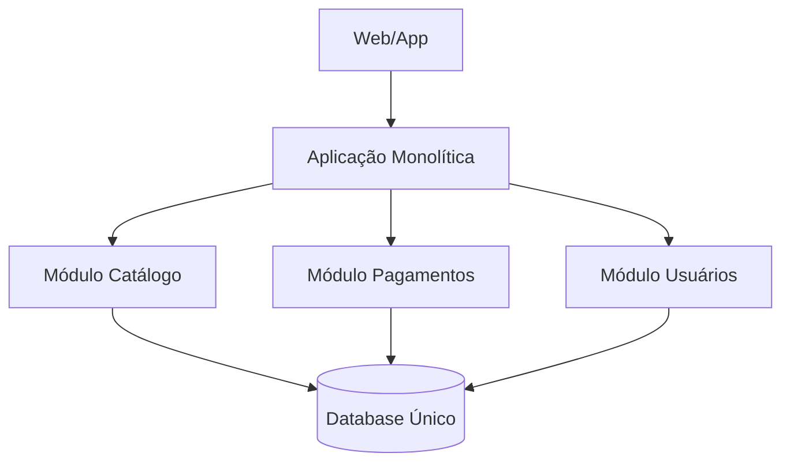

# Arquitetura Monolítica

## Definição
Arquitetura monolítica é um modelo em que toda a aplicação (interface, regras de negócio, autenticação, integrações e acesso a dados) é construída, versionada e implantada como uma única unidade executável. Em vez de vários serviços independentes, existe um único deploy com módulos internos compartilhando o mesmo processo.

## Porque iso existe
A arquitetura monolítica existe para reduzir complexidade operacional no início do ciclo de vida de um produto. Ela resolve principalmente:

- necessidade de entregar valor rápido com equipe pequena;
- menor custo inicial de infraestrutura, observabilidade e deploy;
- fluxo de desenvolvimento mais direto, sem precisar lidar com comunicação distribuída entre serviços;
- curva de aprendizado menor para times que ainda não precisam de escala organizacional ou técnica elevada.

Em termos práticos, ela prioriza velocidade de entrega e simplicidade antes de otimizações de escala distribuída.

## Como funciona
Em um monólito, os módulos da aplicação ficam no mesmo código-fonte e normalmente no mesmo runtime. Uma chamada entre módulos ocorre por função/método local, sem rede.

### Estrutura comum
- camada de apresentação (API REST, MVC ou páginas server-side);
- camada de domínio/aplicação (casos de uso e regras de negócio);
- camada de persistência (ORM, repositórios, queries SQL);
- integrações externas (pagamento, e-mail, mensageria), todas orquestradas no mesmo deploy.

### Vantagens
- desenvolvimento inicial mais rápido;
- debug mais simples (stack trace único);
- testes de integração mais diretos em ambiente local;
- deploy único e padronizado;
- manutenção geralmente mais simples em times pequenos, porque o contexto de negócio está centralizado.

### Desvantagens
- alto acoplamento entre módulos ao longo do tempo;
- deploy de qualquer mudança afeta o sistema inteiro;
- crescimento da base de código pode reduzir produtividade;
- escalabilidade limitada: geralmente é necessário escalar tudo, mesmo quando apenas um módulo está sobrecarregado;
- maior risco de regressão quando não há fronteiras claras entre responsabilidades.

### Por que monólitos usam o mesmo database
Monólitos normalmente usam um único banco de dados porque isso simplifica consistência e desenvolvimento:

- transações ACID em um único lugar (mais simples para operações que envolvem múltiplas tabelas);
- modelo de dados centralizado, evitando sincronização entre vários bancos;
- menos overhead operacional (backup, replicação, migrações e observabilidade em uma única plataforma);
- consultas e joins diretos entre domínios, acelerando a implementação inicial.

O trade-off é que esse banco tende a virar ponto de acoplamento entre módulos. Com o tempo, mudanças em tabelas podem impactar várias partes do sistema e dificultar evolução independente.

## Quando usar
Arquitetura monolítica costuma ser uma escolha adequada quando:

- o produto está em fase de MVP e precisa validar hipóteses rapidamente;
- a equipe é pequena e generalista;
- o domínio ainda muda com frequência e a arquitetura precisa ser flexível;
- o volume de tráfego ainda é previsível/moderado;
- a prioridade é time-to-market, não escala extrema desde o primeiro dia.

Ela tende a deixar de ser ideal quando diferentes partes do sistema exigem escalas muito diferentes, quando muitos times precisam atuar em paralelo sem conflitos ou quando o acoplamento começa a bloquear entregas.

## Exemplos
### Exemplo 1: MVP SaaS B2B
Uma startup cria um sistema de gestão para clínicas com:

- cadastro de pacientes;
- agenda;
- faturamento;
- relatórios.

Tudo roda em uma aplicação Spring Boot com um único PostgreSQL. O time entrega rápido, aprende com clientes e evita custo de operar múltiplos serviços antes da validação do produto.

### Exemplo 2: E-commerce em fase inicial
Um e-commerce começa com catálogo, carrinho, checkout e painel administrativo em um único deploy. Quando o tráfego cresce muito no checkout, percebe-se que escalar o sistema inteiro aumenta custo e complexidade, mostrando o limite da abordagem monolítica.

## Representação visual

## Notas Relacionadas
- [Acoplamento e coesão](../Fundamentos/acoplamento-e-coesao.md)
- [Contratos de API](../Fundamentos/contratos-de-api.md)
- [Sistemas distribuídos](../../../../03%20-%20Deep%20Dives/Sistemas%20distríbuidos/Sistemas%20distribuídos.md)
