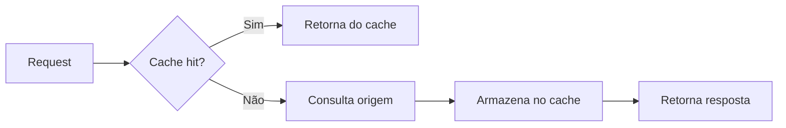

# Cache

## Definição
Cache é uma camada de armazenamento temporário que mantém dados de alto reaproveitamento para reduzir latência e diminuir chamadas ao sistema de origem.

## Porque iso existe
Sistemas distribuídos precisam responder rápido e com custo controlado. Cache existe para reduzir tempo de resposta, proteger banco/API em picos e melhorar escalabilidade de leitura.

## Como funciona
A aplicação tenta ler no cache antes de consultar a fonte de verdade.

- Se encontrar o dado, ocorre cache hit.
- Se não encontrar, ocorre cache miss, a aplicação consulta a origem e popula o cache.

Para funcionar bem, cache depende de:

- chave bem definida;
- TTL apropriado;
- estratégia de invalidação;
- métricas contínuas de hit/miss.

## Quando usar
Use cache quando há leitura repetitiva, custo alto de consulta na origem ou necessidade de reduzir p95/p99. Evite uso indiscriminado em dados que exigem consistência imediata sem estratégia de invalidação.

## Exemplos
Exemplo simples com Spring Cache:

```java
@Cacheable("usuarios")
public Usuario buscarUsuario(String id) {
    return repo.findById(id).orElseThrow();
}
```

## Representação visual


## Notas Relacionadas
- [Métricas de cache: hit, miss e hit rate](../Cache/metricas-de-cache-hit-rate-e-miss-rate.md)
- [Políticas de evicção e substituição de cache](../Cache/politicas-de-eviccao-e-substituicao-de-cache.md)
- [Implementações de cache em aplicações](../Cache/implementacoes-de-cache-em-aplicacoes.md)
