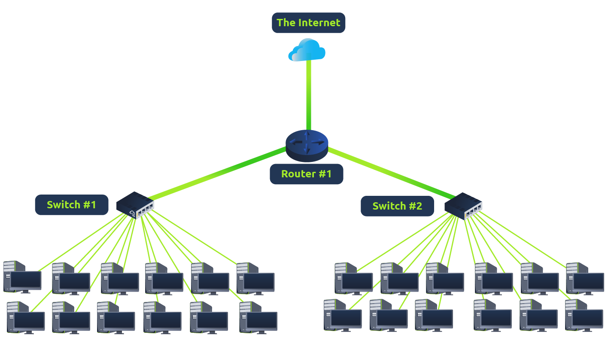

Switches são dispositivos dedicados com rede, designados a se agregarem com múltipls outros dispositivos como computadores, impressoras ou qualquer outro dispositivo capaz de usar a Ethernet. Esses vários disposítivos se conectam em portas do Switch.

## Escala:
Normalmente, switches são usados em redes de grande escala, como escolas, empresas ou lugares similares, onde há muitos dispositivos para conectar na rede.

Switches podem conectar uma grande escala de dispositivos, pois eles podem possuir 4, 8, 16, 24, 32, ou 64 dispositivos plugados.

## Eficiência:
Switches são muito amis eficientes do que sua contraparte menor como Hub e Repearters. Eles  mantêm o controle de qual dispositivo está conectado a qual porta.

Desta forma, quando um pacote é transmitido ao invés de repetir o pacote para cada porta como um hub faria, ele apenas envia o pacote para o seu destino, reduzindo o tráfego da rede.

## Conexão entre switch e Router:
Ambos podem se conectarem. Essa redudância retorna disponibilidade e confiabilidade para a rede, além de adicionar múltiplos caminhos para os dados trafegarem. Se um caminho cair, o outro pode ser usado.

A contrapartida é que os dados terão um caminho maior para percorrer, aumento a latência, no entanto será mais difícil a rede cair. --Um pequeno preço a se pagar por essa alterativa.

#redes #lan 

---
## Notas relacionadas:
- [Router](Router.md)
- [Ethernet](Ethernet.md)

