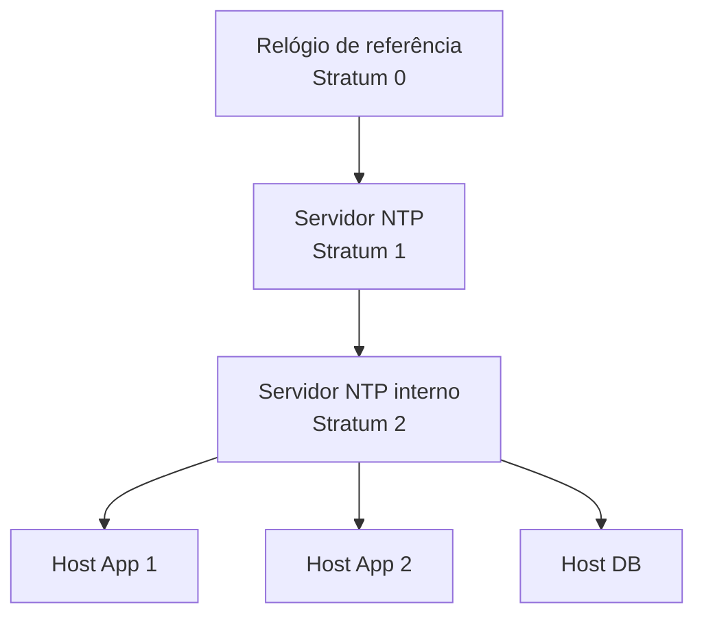

# NTP (Network Time Protocol)

## Definition
NTP (Network Time Protocol) é um protocolo de rede usado para sincronizar o relógio de sistemas distribuídos com uma referência de tempo confiável, como servidores de stratum baixo conectados a relógios atômicos ou GNSS (como GPS). Ele opera tipicamente sobre UDP na porta 123 e busca manter o desvio de tempo (clock offset) em níveis baixos, mesmo com latência variável.

## Why it exists
Em sistemas distribuídos, tempo incorreto causa problemas difíceis de diagnosticar: logs fora de ordem, falhas em autenticação por certificados, expiração incorreta de tokens, inconsistências em jobs agendados e problemas em correlação de eventos.

O NTP existe para resolver exatamente isso: fornecer uma base de tempo comum, estável e auditável para múltiplos hosts, reduzindo drift de relógio e melhorando confiabilidade operacional.

## How it works
O NTP segue um modelo hierárquico de referências de tempo chamado stratum:

- Stratum 0: fontes de alta precisão (relógio atômico, GPS, rádio clock).
- Stratum 1: servidores conectados diretamente às fontes stratum 0.
- Stratum 2, 3, ...: servidores sincronizados a partir de strata superiores.

De forma simplificada, um cliente NTP:

1. consulta um ou mais servidores NTP;
2. mede timestamps de ida e volta;
3. estima offset (diferença de relógio) e delay (atraso de rede);
4. escolhe fontes com melhor qualidade estatística;
5. ajusta o relógio local gradualmente (slew) quando possível, em vez de saltos bruscos.

Conceitos práticos importantes:

- Offset: diferença entre o relógio local e o remoto.
- Delay: tempo de rede de ida e volta (RTT aproximado).
- Jitter: variação da latência e do offset ao longo do tempo.
- Step vs Slew: correção imediata (step) vs correção gradual (slew).

Implementações comuns em Linux:

- `chrony` (geralmente preferido em ambientes modernos e instáveis, como VMs e cloud);
- `ntpd` (implementação clássica);
- `systemd-timesyncd` (mais simples, com foco em sincronização básica).

## When to use
Use NTP sempre que o host participar de qualquer fluxo que dependa de ordem temporal consistente:

- servidores de aplicação com logs centralizados;
- bancos de dados, filas e sistemas distribuídos;
- autenticação com TLS, Kerberos, JWT e OAuth;
- clusters Kubernetes e plataformas de observabilidade;
- ambientes regulados que exigem trilha de auditoria confiável.

Critérios de decisão práticos:

- Se você precisa de precisão de milissegundos para operação comum de backend, NTP é suficiente na maioria dos casos.
- Se você precisa precisão sub-milisegundo ou microsegundo (trading de alta frequência, telecom, instrumentação), avaliar PTP (IEEE 1588) pode ser mais adequado.

## Examples
Exemplo real 1: Falha intermitente de autenticação

Uma API emite JWT com `exp` de 5 minutos. Parte dos nós estava 2 minutos adiantada. Resultado: tokens válidos eram rejeitados como expirados em alguns pods. Após padronizar sincronização com `chrony` e fontes internas confiáveis, o erro desapareceu.

Exemplo real 2: Incidente difícil de investigar

Durante um incidente, os logs de três serviços mostravam ordens de eventos conflitantes por drift de tempo entre hosts. A correlação no observability stack ficou ambígua. Com NTP consistente em todos os nós, a linha do tempo voltou a ser confiável.

Exemplo prático de configuração (`chrony.conf` simplificado):

```conf
server 0.pool.ntp.org iburst
server 1.pool.ntp.org iburst
server 2.pool.ntp.org iburst

makestep 1.0 3
rtcsync
```

Exemplo de verificação operacional:

```bash
chronyc tracking
chronyc sources -v
```

## Visual Representation


## Related Notes
- [UDP](UDP.md)
- [DNS](../04 - Serviços de Rede/DNS/DNS.md)
- [Protocolos de Rede](Protocolos de Rede.md)
- [Observabilidade](../../Programação/Fundamentos/observabilidade.md)
