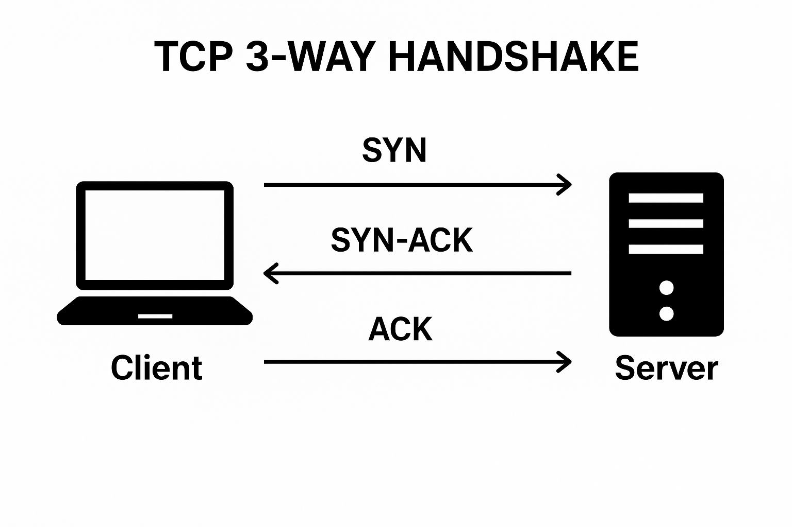

**O handshake é o processo de estabelecimento de conexão entre cliente e servidor, no protocolo TCP, que opera na camada 4 (Transporte) do modelo OSI.**

O processo tem **3 etapas** (por isso é chamado de **3-way handshake**):

1️⃣ **SYN (Synchronize)**  
O cliente envia um pacote TCP com o **bit SYN=1**.  
Esse pacote contém:
- Um **Número de Sequência Inicial (ISN)** aleatório.
- Esse número é usado para identificar a ordem dos bytes na comunicação.

2️⃣ **SYN-ACK (Synchronize + Acknowledge)**  
O servidor responde com:
- **SYN=1** → também enviando o seu próprio número de sequência inicial (ISN do servidor).
- **ACK=1** → confirmando que recebeu o ISN do cliente (faz o **incremento +1** e envia no campo ACK).

3️⃣ **ACK (Acknowledge)**  
O cliente envia um pacote com:
- **ACK=1**, confirmando que recebeu o ISN do servidor (também incrementado +1).  
    Agora ambos sabem onde a comunicação começa e podem enviar dados com confiabilidade.

---
### 🧠 Complementos importantes:

- **Por que os números são incrementados?**  
    Para indicar que o próximo byte esperado é o seguinte ao último confirmado.  
    (Ex.: se cliente enviou ISN=1000, servidor responde com ACK=1001 → quer dizer “recebi o byte 1000, me envie o 1001 em diante”).
    
- **Por que o ISN é aleatório?**  
    Isso ajuda na segurança, evitando ataques de injeção de pacotes e impedindo reutilização de conexões antigas.
    
- **Falha no Handshake:**  
    Se alguma etapa falhar (por exemplo, servidor não responde), o cliente retransmite SYN algumas vezes antes de desistir (timeout).