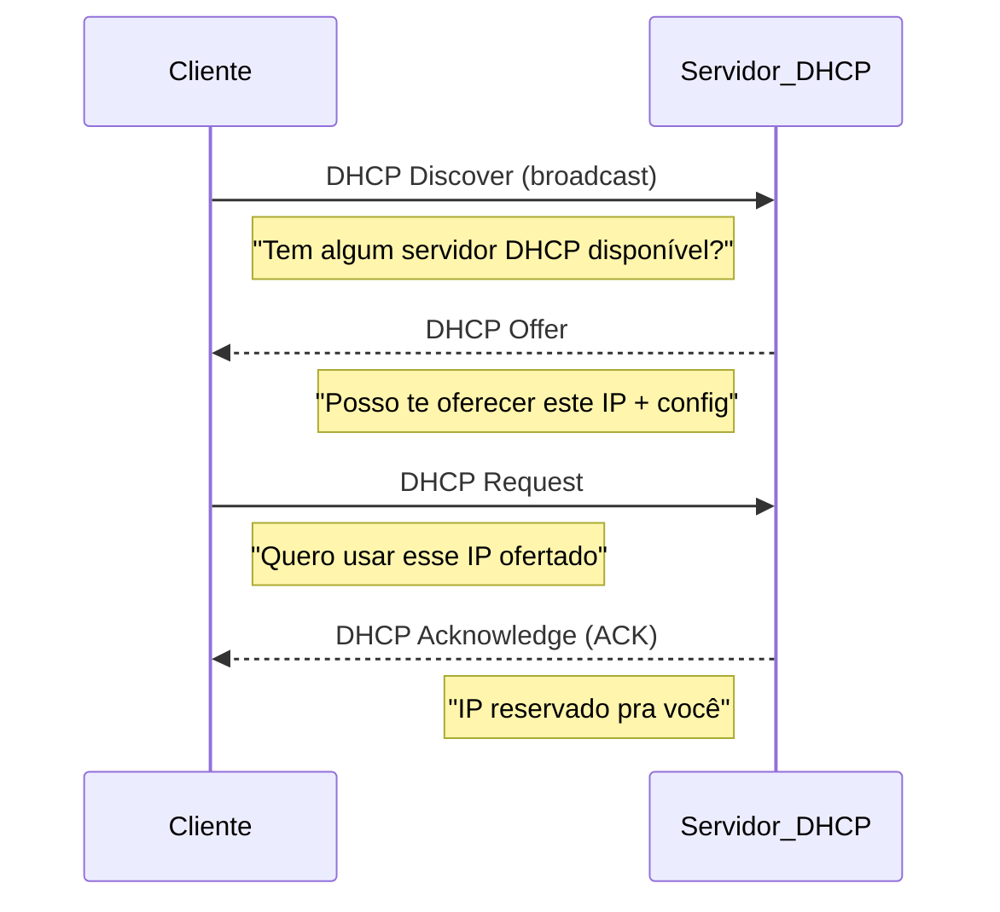

DHCP (Dynamic Host Configuration Protocol), serve para atrelar um endereço [IP](../03 - Protocolos/IP.md).

Ha varias maneiras de atrelar um endereço [IP](../03 - Protocolos/IP.md) à um dispositivo na rede. Pode ser inserido manualmente, fisicamente ou a forma mais comum que é a automática.

É aí que o DHCP entra. Este protocolo serve para atribuir um endereço IP a quem estiver pedindo, de maneira dinâmica. Alocando endereços IPs disponíveis no momento.

O processo é feito em quatro etapas, e é conhecido como DORA (Discovery, Offer, Request, Acknowledgment)

