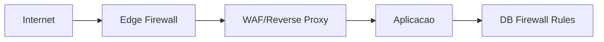

Firewall é uma ferramenta de segurança, que estipula regras de quem pode entrar e sair no tráfego de pacotes na rede. O firewall pode ser tanto um software, como um hardware.

### Para estipular as regras, o firewall leva alguns fatores em consideração:
    - De onde o tráfego está vindo?
    - Para onde o tráfego está indo?
    - Para qual porta o tráfego está indo?
    - Qual protocolo o tráfego está usando?

O firewall faz uma inspeção do pacote para determinar as respostas para estes tipos de perguntas.
 
### Categorias de firewall:
Stateful:
Este tipo de firewall usa todas as informações de uma conexão; em vez de inspecionar um pacote individual, este firewall determina o comportamento de um dispositivo com base em toda a conexão.
Este tipo de firewall consome muitos recursos em comparação com firewalls sem estado, pois a tomada de decisões é dinâmica. Por exemplo, um firewall pode permitir as primeiras partes de um handshake TCP que posteriormente falhará.
Se uma conexão de um host estiver ruim, ele bloqueará todo o dispositivo.

Stateless:
Este tipo de firewall utiliza um conjunto estático de regras para determinar se pacotes individuais são aceitáveis ​​ou não. Por exemplo, o envio de um pacote inválido por um dispositivo não significa necessariamente que todo o dispositivo seja bloqueado.

Embora esses firewalls utilizem muito menos recursos do que as alternativas, eles são muito mais eficientes. Por exemplo, esses firewalls são eficazes apenas conforme as regras definidas neles. Se uma regra não for exatamente correspondida, ela é efetivamente inútil.

No entanto, esses firewalls são ótimos para receber grandes volumes de tráfego de um conjunto de hosts (como em um ataque de negação de serviço distribuído).


## Diagrama de filtragem de firewall

```text
[Pacote entra na interface]
            |
            v
[Regra 1 confere?] -- sim --> [ALLOW/DENY]
            |
           nao
            v
[Regra 2 confere?] -- sim --> [ALLOW/DENY]
            |
           nao
            v
[Policy padrao (default deny/allow)]
```

## Firewall em camadas


