## 1. Resolução DNS
Ao digitarmos o site `www.google.com`, o serviço DNS entra em ação para descobrir qual é o endereço IP do destino.

```
CLIENTE DNS RECURSIVO / AUTORITATIVO  
| |  
| --- Consulta DNS (A/AAAA) ------>|  
| |  
| <--- Resposta DNS (IP) ----------|  
| |
```

Com o IP resolvido, o sistema verifica se o destino está na mesma rede local. 

## 2. Verificação de rede e ARP
Como normalmente não está, o pacote precisa ser enviado ao gateway (roteador).

Para isso, é feita uma consulta ARP para descobrir o endereço MAC do gateway, que é necessário para que o frame Ethernet possa ser entregue fisicamente na rede local.

```
CLIENTE GATEWAY (ROTEADOR)  
| |  
| --- ARP Request ---------------->|  
| "Quem tem 192.168.15.1?" |  
| |  
| <--- ARP Reply ------------------|  
| "MAC do gateway" |  
| |
```

Após o ARP Response, o cliente conhece o MAC correspondente ao IP do gateway e consegue montar o frame de rede corretamente.

## 3. Estabelecimento da conexão TCP (3-Way Handshake)
Em seguida, é estabelecida a conexão de transporte através do TCP 3-way handshake:
```
CLIENTE SERVIDOR  
| |  
| --- SYN ------------------------>|  
| |  
| <--- SYN + ACK ------------------|  
| |  
| --- ACK ------------------------>|  
| |
```

Nesse ponto:
- a conexão é confiável,
- portas de origem e destino estão definidas,
- a sessão TCP está ativa.

## 4. TLS Handshake (HTTPS)
Se a conexão for segura (HTTPS), ocorre então o TLS Handshake, responsável por criar uma canal criptografado.
```
CLIENTE SERVIDOR  
| |  
| --- ClientHello ---------------->|  
| (versões TLS, cipher suites) |  
| |  
| <--- ServerHello ----------------|  
| <--- Certificado ----------------|  
| |  
| --- Validação do Certificado |  
| |  
| --- Troca de Chaves ------------>|  
| |  
| --- Finished ------------------->|  
| <--- Finished -------------------|  
| |  
| === Comunicação Criptografada ===|
```

Durante esse processo:
- o certificado do servidor é validado,
- a cipher suite é negociada,
- uma chave de sessão é estabelecida.

## 5. Comunicação HTTP (Camada de Aplicação)
Somente após esses handshakes a comunicação entra na camada de aplicação, onde o protocolo HTTP é utilizado.
```
CLIENTE SERVIDOR  
| |  
| --- HTTP GET / ----------------->|  
| |  
| <--- HTTP 200 OK ----------------|  
| <--- HTML / CSS / JS ------------|  
| |
```

O cliente envia a requisição HTTP (por exemplo, um GET), o servidor processa a solicitação e devolve a resposta pelo mesmo caminho lógico da requisição inicial.

## 6. Visão resumida por camadas (OSI / TCP-IP)
Aplicação: HTTP  
Segurança: TLS  
Transporte: TCP  
Rede: IP  
Enlace: ARP / Ethernet

## 7. Linha do tempo simplificada
DNS → ARP → TCP Handshake → TLS Handshake → HTTP

## 8. Diagrama único da jornada completa

```mermaid
sequenceDiagram
    participant U as Usuário/Navegador
    participant R as DNS Recursivo
    participant G as Gateway
    participant W as Servidor Web

    U->>R: Consulta DNS (A/AAAA)
    R-->>U: IP do domínio

    U->>G: ARP Request (Quem tem o gateway?)
    G-->>U: ARP Reply (MAC do gateway)

    U->>W: TCP SYN
    W-->>U: SYN-ACK
    U->>W: ACK

    U->>W: TLS ClientHello
    W-->>U: ServerHello + Certificado
    U->>W: Key Exchange + Finished
    W-->>U: Finished

    U->>W: HTTP GET /
    W-->>U: HTTP 200 + HTML/CSS/JS
```


