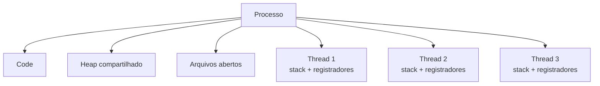

# Processo vs Thread

## Definition
Processo e thread são duas unidades de execução usadas pelo sistema operacional, mas em níveis diferentes. Um processo é um programa em execução com espaço de memória, identificador e recursos próprios. Uma thread é uma linha de execução dentro de um processo, compartilhando a maior parte dos recursos desse processo, mas mantendo seu próprio contexto de CPU, como stack, registradores e program counter.

## Why it exists
Essa distinção existe porque sistemas operacionais precisam equilibrar isolamento, segurança e eficiência. Processos resolvem o problema de separar aplicações para que uma falha ou corrupção de memória em um programa não derrube os demais. Threads existem para permitir concorrência com menor custo dentro da mesma aplicação, evitando a necessidade de criar vários processos quando diferentes tarefas precisam avançar ao mesmo tempo.

Na prática, processos favorecem isolamento e robustez. Threads favorecem desempenho, responsividade e compartilhamento rápido de dados.

## How it works
O kernel enxerga processos como contêineres de recursos e threads como unidades escalonáveis de execução. Um processo normalmente possui seu próprio espaço de endereçamento virtual, arquivos abertos, credenciais, PID e estruturas de controle. Já múltiplas threads de um mesmo processo compartilham heap, código, descritores de arquivo e outros recursos, mas cada uma mantém stack e estado de execução próprios.

A principal consequência dessa diferença aparece em criação, comunicação e troca de contexto:

| Aspecto | Processo | Thread |
|---|---|---|
| Unidade | Programa em execução | Fluxo de execução dentro de um processo |
| Memória | Espaço isolado | Compartilha espaço do processo |
| Criação e término | Mais custosos | Mais leves |
| Comunicação | Normalmente via IPC | Compartilhamento direto de memória |
| Context switch | Mais caro | Mais barato |
| Falha | Tende a ficar isolada no processo | Pode comprometer todo o processo |
| Identidade | PID | TID |

Isso explica por que abrir duas aplicações distintas normalmente cria dois processos, enquanto um servidor web pode usar várias threads para atender múltiplas requisições dentro do mesmo processo.

Em sistemas modernos, o scheduler alterna a CPU entre threads ou processos para dar a sensação de paralelismo. Em CPU multicore, diferentes threads ou processos podem realmente executar em paralelo. Quando a concorrência acontece entre threads do mesmo processo, a comunicação tende a ser mais rápida, porque os dados já estão no mesmo espaço de memória. Em compensação, essa proximidade exige sincronização para evitar [[race-conditions]], [[deadlocks]] e corrupção de estado.



## When to use
Use processo quando isolamento é prioridade. Isso é especialmente importante para aplicações independentes, workloads com diferentes níveis de privilégio, execução de binários externos, sandboxing e cenários em que uma falha não pode contaminar outra parte do sistema.

Use thread quando a aplicação precisa executar tarefas concorrentes compartilhando o mesmo contexto de memória. Isso é comum em servidores HTTP, interfaces gráficas, processamento paralelo de tarefas pequenas, pools de workers e pipelines com muito I/O.

Uma regra prática útil é:

- prefira processo quando o custo extra compensa o ganho de segurança e independência;
- prefira thread quando o compartilhamento de estado e o menor overhead trazem vantagem real;
- se houver muito estado compartilhado e sincronização complexa, o modelo com threads pode introduzir bugs difíceis de depurar.

## Examples
Exemplo 1: no navegador, cada aba ou grupo de abas pode ser isolado em processos diferentes para melhorar segurança e estabilidade. Dentro de cada processo, várias threads cuidam de renderização, rede, JavaScript e outras tarefas internas.

Exemplo 2: em uma aplicação Java com Spring Boot, o processo da JVM é único, mas o servidor pode usar múltiplas threads para atender requisições simultâneas. Isso evita criar um novo processo por requisição.

```java
@RestController
class RelatorioController {

    private final ExecutorService pool = Executors.newFixedThreadPool(4);

    @GetMapping("/relatorios/{id}")
    public CompletableFuture<String> gerar(@PathVariable String id) {
        return CompletableFuture.supplyAsync(() -> "Relatório " + id + " processado", pool);
    }
}
```

Nesse exemplo, o processo continua o mesmo, mas diferentes threads do pool executam tarefas concorrentes.

Exemplo 3: um pipeline que chama `ffmpeg`, `tar` ou outro binário externo normalmente cria um novo processo do sistema operacional, porque a execução ocorre fora do processo principal da aplicação.

## Visual Representation
Pense no processo como uma casa com paredes, portas e recursos próprios. As threads são as pessoas trabalhando dentro dessa casa. Elas compartilham o mesmo ambiente e os mesmos objetos, mas cada uma segue sua própria sequência de trabalho. Criar outra pessoa trabalhando na mesma casa costuma ser mais barato do que construir uma casa nova, mas qualquer erro grave dentro da casa pode afetar tudo que está lá dentro.

## Related Notes
- [[Processos]]
- [[Threads]]
- [[concorrencia]]
- [[thread-safety]]
- [[race-conditions]]
- [[deadlocks]]
