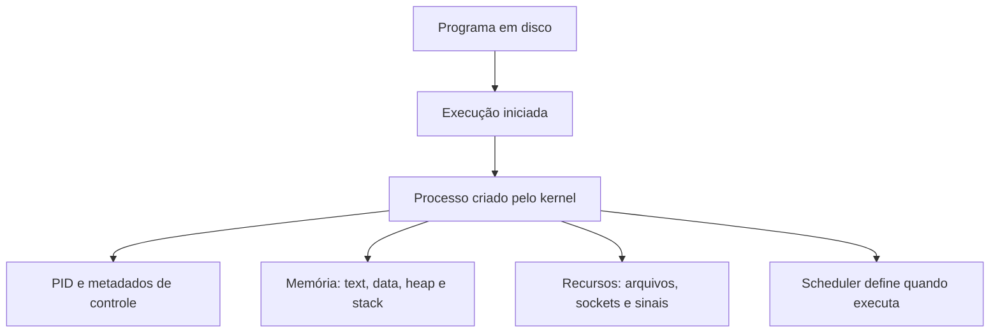

# Processo no Linux

## Definition
Processo é uma instância de um programa em execução. No Linux, isso significa que o kernel criou um contexto ativo para aquele programa, com identificador próprio, espaço de memória, estado de execução e recursos associados. Um binário em disco é apenas código; ele só vira processo quando começa a executar.

## Why it exists
O processo existe para permitir que o sistema operacional execute vários programas de forma controlada, segura e previsível. Essa abstração resolve alguns problemas centrais:

- isolar programas para que uma falha em um deles não corrompa diretamente a memória de outro;
- permitir escalonamento de CPU entre múltiplas cargas de trabalho;
- controlar acesso a memória, arquivos, dispositivos e rede;
- registrar identidade, permissões, prioridade e uso de recursos de cada execução.

Sem o conceito de processo, o sistema teria dificuldade para multiplexar CPU, aplicar segurança e administrar concorrência entre aplicações.

## How it works
Quando um programa é iniciado, o kernel cria uma estrutura de controle para ele e passa a tratá-lo como uma unidade de execução gerenciável. Em termos práticos, um processo costuma envolver os seguintes elementos.

### Identidade e controle
Cada processo recebe um PID (Process ID), possui um processo pai e mantém metadados que o kernel usa para gerenciá-lo. Esses metadados incluem estado atual, prioridade, registradores, informações de escalonamento, arquivos abertos e dados de memória. Em sistemas operacionais, esse conjunto costuma ser associado ao PCB (Process Control Block).

### Organização na memória
Um processo em execução normalmente é dividido em regiões com papéis diferentes:

- text section: instruções executáveis do programa;
- data section: variáveis globais e estáticas inicializadas;
- heap: memória alocada dinamicamente durante a execução;
- stack: parâmetros de função, variáveis locais e endereços de retorno.

Essa separação ajuda o kernel e o runtime a organizar o uso de memória e manter previsibilidade durante a execução.

### Ciclo de vida
Em Linux, um processo geralmente segue um fluxo parecido com este:

1. criação, normalmente a partir de outro processo;
2. carregamento do programa na memória;
3. execução ou espera por CPU, I/O ou eventos;
4. término;
5. coleta do status de saída pelo processo pai.

Se o processo termina e o pai ainda não coleta seu status, ele pode aparecer temporariamente como zombie.

### Estados de execução
Ao longo da vida, o processo alterna entre estados como:

- running: está usando CPU ou pronto para usar;
- ready: pode executar assim que o scheduler escolher;
- waiting / sleeping: está aguardando I/O, timer ou outro evento;
- stopped: foi pausado;
- zombie: terminou, mas ainda aguarda coleta do pai.

Esses estados explicam por que um programa pode “existir” mesmo sem estar consumindo CPU o tempo todo.

### Relação com o scheduler
O scheduler do kernel decide qual processo ou thread executa em cada núcleo de CPU. Para isso, ele considera prioridade, política de escalonamento, tempo de CPU consumido e estado atual. O processo, portanto, não “roda sozinho”; ele disputa tempo de execução com os demais.

### Relação com recursos do sistema
Além da CPU e da memória, um processo pode possuir:

- descritores de arquivo abertos;
- sockets de rede;
- pipes;
- diretório de trabalho atual;
- credenciais de usuário e grupo;
- handlers de sinais.

É isso que torna um processo uma unidade prática de isolamento e administração dentro do Linux.

## When to use
Entender processos é essencial quando você precisa:

- analisar consumo de CPU e memória de uma aplicação;
- investigar travamentos, zombies ou processos órfãos;
- enviar sinais com `kill`, `pkill` ou `killall`;
- interpretar saídas de `ps`, `top`, `htop` e `pstree`;
- decidir entre isolamento por processo e concorrência por thread;
- entender como serviços são iniciados e supervisionados pelo sistema.

Na prática, esse conceito aparece em troubleshooting, observabilidade, performance, automação operacional e desenvolvimento backend.

## Examples
### Exemplo 1: executando um comando simples
Ao rodar `sleep 60`, o Linux cria um processo com PID próprio. Mesmo sendo um programa simples, ele passa a ter estado, memória, descritores de arquivo e relação com um processo pai, normalmente o shell.

### Exemplo 2: múltiplas execuções do mesmo programa
Se você abrir o mesmo navegador duas vezes, o executável pode ser o mesmo, mas cada instância ativa será tratada como processo separado ou como conjunto separado de processos, dependendo da arquitetura da aplicação. O programa em disco é um; as execuções são entidades independentes.

### Exemplo 3: inspeção operacional
Um fluxo comum de troubleshooting é:

```bash
ps -ef | grep nginx
pstree -p
top
kill -TERM <PID>
```

Esse conjunto ajuda a descobrir quem é o processo, quem é o pai, quanto recurso ele consome e como encerrá-lo de forma graciosa.

## Visual Representation


## Related Notes
- [Threads](Threads.md)
- [System Calls](System%20Calls.md)
- [Memória Stack](Mem%C3%B3ria%20Stack.md)
- [Processos, PID e Sinais](Processos%2C%20PID%20e%20Sinais.md)
