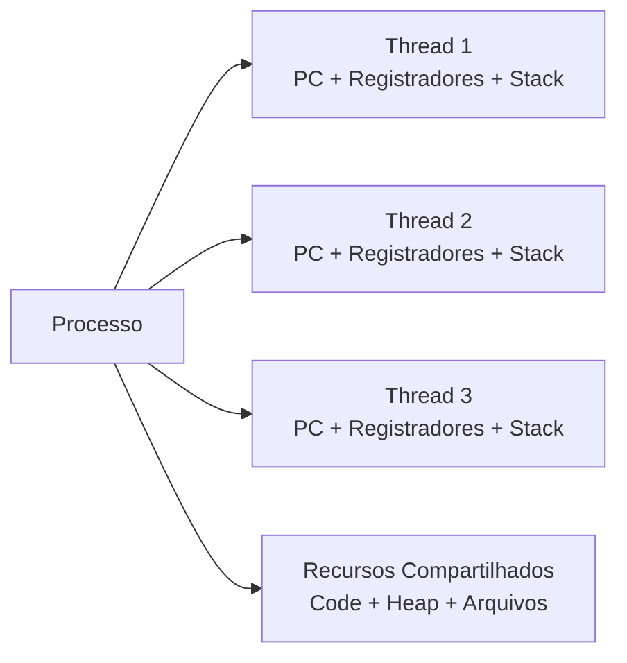

# Thread

## Definition
Thread é a menor unidade de execução que o sistema operacional agenda dentro de um processo. Em vez de criar um processo inteiro para cada fluxo de trabalho, uma aplicação pode criar múltiplas threads que compartilham o mesmo espaço de endereçamento, o mesmo código e vários recursos do processo, mas mantêm contexto próprio de execução, como program counter, registradores e stack.

Na prática, thread é o mecanismo que permite uma aplicação fazer mais de uma coisa “ao mesmo tempo”: processar requisições, esperar I/O, atualizar interface ou executar tarefas em background sem necessariamente abrir novos processos.

## Why it exists
Threads existem para reduzir o custo de concorrência dentro de uma aplicação.

Se cada atividade paralela exigisse um processo novo, o sistema teria mais overhead de criação, troca de contexto, isolamento de memória e comunicação entre unidades de execução. Threads resolvem isso ao permitir que múltiplos fluxos compartilhem recursos do mesmo processo.

Elas são úteis principalmente por quatro motivos:

- melhoram responsividade, porque uma thread pode continuar atendendo o usuário enquanto outra espera I/O;
- aproveitam CPUs multicore, permitindo paralelismo real quando há mais de um core disponível;
- facilitam concorrência em tarefas independentes, como processamento de arquivos, filas e requisições HTTP;
- tornam o compartilhamento de dados mais barato do que comunicação entre processos, embora isso aumente o risco de bugs de concorrência.

## How it works
Cada thread possui contexto próprio de execução:

- program counter;
- register set;
- stack.

Ao mesmo tempo, threads do mesmo processo compartilham:

- code segment;
- data/heap;
- arquivos abertos;
- sinais e outros recursos controlados pelo sistema operacional.

Isso cria um modelo híbrido: isolamento suficiente para cada fluxo continuar seu trabalho, mas compartilhamento suficiente para comunicação rápida.

### Escalonamento
O scheduler do sistema operacional decide quando cada thread usa CPU. Em máquina single-core, isso gera concorrência com alternância rápida entre threads, criando a sensação de paralelismo. Em máquina multicore, diferentes threads podem realmente executar em paralelo.

### User-level threads vs kernel-level threads
Existem dois modelos conceituais importantes:

- User-Level Threads (ULT): gerenciadas em user space por uma biblioteca. São leves e rápidas para criar e trocar, mas o kernel não as enxerga individualmente.
- Kernel-Level Threads (KLT): gerenciadas diretamente pelo kernel. O sistema operacional agenda cada thread separadamente, permitindo melhor uso de múltiplos cores e melhor tratamento de operações bloqueantes.

Trade-off principal:

- ULT tende a ter menor overhead;
- KLT tende a ter melhor integração com escalonamento real do sistema operacional.

### Operações bloqueantes e impacto
Como threads compartilham o processo, o comportamento diante de chamadas bloqueantes depende do modelo de implementação. Em modelos puramente user-level, uma chamada bloqueante pode parar o processo inteiro. Em kernel threads, o kernel consegue bloquear apenas a thread afetada e continuar executando outras do mesmo processo.

### Problemas clássicos
O mesmo compartilhamento que torna threads eficientes também cria riscos:

- race condition: duas threads acessam e alteram o mesmo estado sem coordenação adequada;
- deadlock: duas ou mais threads esperam indefinidamente por recursos umas das outras;
- starvation: uma thread fica continuamente sem acesso ao recurso necessário;
- contenção excessiva: sincronização correta, porém lenta, por disputa de locks.

### Sincronização
Para manter corretude, aplicações usam primitivas como:

- mutex;
- semáforo;
- read-write lock;
- variáveis de condição;
- estruturas lock-free e tipos atômicos, quando apropriado.

A regra prática é simples: quanto menor o estado compartilhado, menor a chance de bugs difíceis de reproduzir.

## When to use
Use threads quando houver ganho claro em concorrência ou paralelismo dentro do mesmo processo.

Cenários comuns:

- servidor web processando múltiplas requisições simultâneas;
- aplicação consumindo filas enquanto executa trabalho em background;
- pipeline com etapas independentes de leitura, processamento e escrita;
- tarefas I/O-bound, como chamadas de rede, acesso a banco ou leitura de arquivos;
- workloads CPU-bound divididos em partes independentes, desde que o número de threads seja controlado.

Evite criar threads manualmente sem critério quando:

- a tarefa é pequena demais e o overhead supera o ganho;
- há alto compartilhamento de estado mutável;
- um thread pool ou modelo assíncrono resolve melhor;
- a aplicação já usa um runtime que abstrai concorrência, como pools gerenciados por framework.

## Examples
### Exemplo conceitual
Um servidor HTTP pode receber uma requisição para gerar relatório enquanto outra thread atende uma consulta simples de status. Ambas fazem parte do mesmo processo do servidor, compartilham heap e conexões abertas, mas têm stacks e contexto de execução diferentes.

### Exemplo em Java
```java
import java.util.concurrent.ExecutorService;
import java.util.concurrent.Executors;

public class ProcessadorDePedidos {
    public static void main(String[] args) {
        ExecutorService pool = Executors.newFixedThreadPool(4);

        pool.submit(() -> processar("pedido-1"));
        pool.submit(() -> processar("pedido-2"));
        pool.submit(() -> processar("pedido-3"));

        pool.shutdown();
    }

    private static void processar(String pedidoId) {
        System.out.println(
            Thread.currentThread().getName() + " processando " + pedidoId
        );
    }
}
```

Esse exemplo mostra o uso de múltiplas threads para executar tarefas independentes dentro do mesmo processo. Em produção, normalmente não se cria thread “na mão” para cada tarefa; usa-se pool para limitar consumo de CPU e memória.

### Exemplo prático em backend
Em uma aplicação Spring Boot, o servidor pode usar várias threads para:

- aceitar conexões HTTP;
- executar filtros e controllers;
- aguardar resposta de integrações externas;
- disparar tarefas assíncronas controladas.

Se o código compartilhar objetos mutáveis sem proteção, erros podem surgir apenas sob carga, o que torna [Thread safety](../../../../Programa%C3%A7%C3%A3o/Fundamentos/thread-safety.md) um requisito central.

## Visual Representation


## Related Notes
- [Processos](Processos.md)
- [Concorrência](../../../../Programa%C3%A7%C3%A3o/Fundamentos/concorrencia.md)
- [Thread safety](../../../../Programa%C3%A7%C3%A3o/Fundamentos/thread-safety.md)
- [deadlocks](../../../../Programa%C3%A7%C3%A3o/Fundamentos/deadlocks.md)
- [race-conditions](../../../../Programa%C3%A7%C3%A3o/Fundamentos/race-conditions.md)
