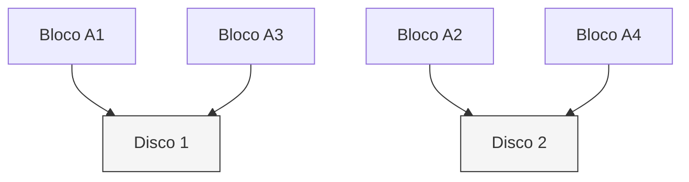

# RAID 0

## Definition
RAID 0 é um nível de RAID baseado em **striping sem redundância**, onde blocos são distribuídos entre dois ou mais discos para aumentar performance.

## Why it exists
Foi criado para maximizar throughput e IOPS agregando discos em paralelo, especialmente para workloads de leitura/escrita intensiva que toleram perda de dados.

## How it works
Os dados são quebrados em blocos (stripes) e gravados alternadamente entre discos do arranjo.
- Capacidade útil: soma de todos os discos.
- Tolerância a falhas: nenhuma.
- Se um disco falha, o volume inteiro se torna inconsistente.

Com 2 discos de 1 TB:
- Capacidade útil: 2 TB
- Falha tolerada: 0 discos

## When to use
Use quando performance é prioridade absoluta e os dados são descartáveis ou facilmente recriáveis:
- Cache temporário
- Scratch disk para processamento
- Workloads de laboratório

Evite para dados críticos de produção.

## Examples
Exemplo real:
- Workstation de edição de vídeo usa RAID 0 para área de trabalho temporária.
- Projeto final fica salvo em storage redundante separado.

## Visual Representation

## Related Notes
- [[RAID]]
- [[RAID 1]]
- [[Armazenamento e Mounts]]
