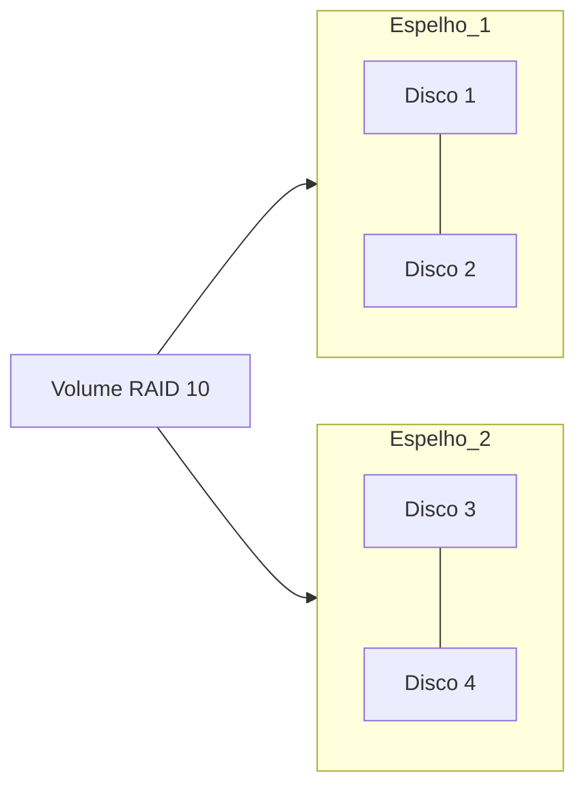

# RAID 10

## Definition
RAID 10 (1+0) combina **mirroring e striping**, exigindo no mínimo 4 discos.

## Why it exists
Existe para unir alta performance de escrita/leitura com boa tolerância a falhas, sendo comum em ambientes transacionais.

## How it works
Primeiro cria espelhos (RAID 1) e depois distribui os dados entre esses espelhos (RAID 0).
- Capacidade útil: aproximadamente 50% da capacidade bruta.
- Tolerância a falhas: pode suportar múltiplas falhas, desde que não ocorram no mesmo par espelhado.
- Rebuild tende a ser mais rápido que RAID com paridade.

Com 4 discos de 1 TB:
- Capacidade útil: 2 TB
- Falha tolerada: no mínimo 1, podendo ser 2 dependendo dos pares afetados

## When to use
Use para workloads críticos com muitas escritas aleatórias e baixa latência:
- Bancos de dados OLTP
- Hosts de virtualização
- Sistemas de mensageria e filas

## Examples
Exemplo real:
- Cluster de banco de dados com SSDs em RAID 10 para reduzir latência de transações e acelerar rebuild.

## Visual Representation

## Related Notes
- [[RAID]]
- [[RAID 1]]
- [[RAID 5]]
- [[RAID 6]]
- [[Armazenamento e Mounts]]
