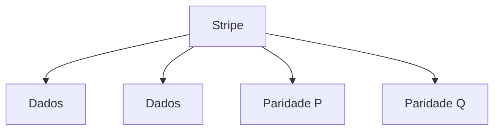

# RAID 6

## Definition
RAID 6 é similar ao RAID 5, mas usa **dupla paridade distribuída**, exigindo no mínimo 4 discos.

## Why it exists
Foi criado para reduzir risco durante rebuild em arranjos grandes, tolerando falha simultânea de dois discos.

## How it works
Os dados são distribuídos com dois blocos de paridade por stripe.
- Capacidade útil: `(N - 2) x tamanho do menor disco`.
- Tolerância a falhas: 2 discos.
- Leitura: boa.
- Escrita: mais penalizada que RAID 5 devido à dupla paridade.

Com 6 discos de 1 TB:
- Capacidade útil: 4 TB
- Falha tolerada: 2 discos

## When to use
Use quando disponibilidade e segurança de dados são mais importantes que performance de escrita:
- Arrays com HDDs de grande capacidade
- Storage de arquivos corporativos
- Ambientes com janela de manutenção limitada

## Examples
Exemplo real:
- Appliance de backup local com 12 HDDs em RAID 6 para suportar falhas múltiplas durante operação contínua.

## Visual Representation

## Related Notes
- [[RAID]]
- [[RAID 5]]
- [[RAID 10]]
- [[Armazenamento e Mounts]]
