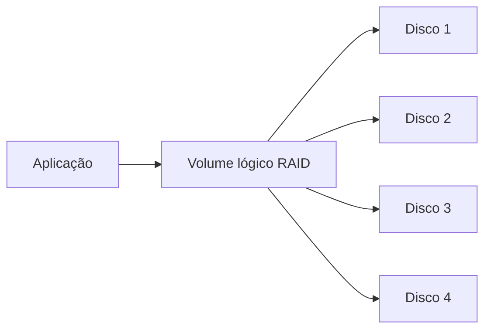

# RAID (Redundant Array of Independent Disks)

## Definition
RAID é uma técnica para combinar múltiplos discos físicos em um arranjo lógico com foco em performance, tolerância a falhas, capacidade, ou combinação desses objetivos.

## Why it exists
Um único disco é um ponto único de falha e também limita throughput e IOPS. RAID existe para reduzir risco de indisponibilidade por falha de disco e para escalar desempenho de leitura/escrita em workloads de infraestrutura, bancos de dados e virtualização.

## How it works
RAID distribui dados entre discos usando estratégias como:
- **Striping**: divide blocos entre discos para paralelismo (ganho de performance).
- **Mirroring**: duplica dados entre discos (ganho de redundância).
- **Parity**: grava informação matemática para reconstrução após falha (equilíbrio entre capacidade e tolerância).

A implementação pode ser:
- **Hardware RAID**: controladora dedicada com cache e bateria/supercap.
- **Software RAID**: gerenciado pelo sistema operacional (ex.: `mdadm`, ZFS RAIDZ).

Cada nível RAID define regras específicas de distribuição, redundância, capacidade útil e tempo de rebuild.

## When to use
Use RAID quando você precisa de disponibilidade e previsibilidade operacional em storage local:
- Hosts de virtualização
- Servidores de banco de dados
- Storage de serviços críticos

Não use RAID como substituto de backup. Mesmo com redundância, eventos como exclusão acidental, ransomware e corrupção lógica exigem estratégia de backup separada.

## Examples
Exemplo prático em um host Linux com 4 discos:
- Ambiente com VMs críticas: RAID 10 para baixa latência e tolerância a falha.
- Ambiente com foco em capacidade: RAID 5 ou RAID 6 para melhor aproveitamento de espaço.

## Visual Representation

## Related Notes
- [RAID 0](RAID 0.md)
- [RAID 1](RAID 1.md)
- [RAID 5](RAID 5.md)
- [RAID 6](RAID 6.md)
- [RAID 10](RAID 10.md)
- [Armazenamento e Mounts](Armazenamento e Mounts.md)
