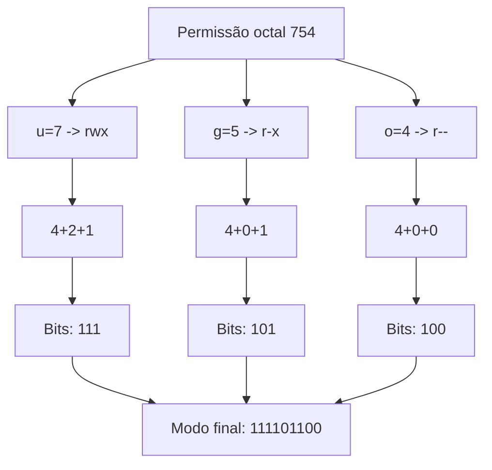

# chmod

## Definition
`chmod` (change mode) é o comando usado para alterar os bits de permissão de arquivos e diretórios no Linux/Unix. Ele controla quem pode ler (`r`), escrever (`w`) e executar/atravessar (`x`) um inode: dono (`u`), grupo (`g`) e outros (`o`).

Em baixo nível, `chmod` grava um novo valor no campo `st_mode` do inode (metadado do filesystem), mudando os bits de permissão e, opcionalmente, bits especiais como `setuid`, `setgid` e `sticky bit`.

## Why it exists
Sem um mecanismo simples para alterar permissões:

- qualquer usuário poderia modificar arquivos sensíveis;
- scripts e binários não teriam controle de execução;
- diretórios compartilhados ficariam inseguros;
- operações administrativas exigiriam mudanças complexas no sistema de arquivos.

`chmod` existe para oferecer um controle rápido, previsível e auditável de acesso em sistemas multiusuário.

## How it works
### 1) Modelo de permissões em bits
Cada arquivo/diretório possui 9 bits principais de permissão, em 3 trincas:

- `u` (user/owner)
- `g` (group)
- `o` (others)

Cada trinca tem 3 bits:

- `r` = 4 (`100` em binário)
- `w` = 2 (`010` em binário)
- `x` = 1 (`001` em binário)

A soma forma o modo octal por classe:

- `7` = `4+2+1` = `rwx`
- `6` = `4+2` = `rw-`
- `5` = `4+1` = `r-x`
- `4` = `r--`
- `0` = `---`

Exemplo `chmod 754 arquivo.txt`:

- dono: `7` (`rwx`)
- grupo: `5` (`r-x`)
- outros: `4` (`r--`)

Representação binária das 3 classes:

- `7` -> `111`
- `5` -> `101`
- `4` -> `100`
- resultado concatenado: `111101100`

### 2) Notação simbólica vs octal
Você pode alterar permissões de duas formas.

Notação simbólica:

```bash
chmod u+x script.sh      # adiciona execução ao dono
chmod g-w arquivo.txt    # remove escrita do grupo
chmod o=r arquivo.txt    # define outros apenas como leitura
chmod a+r docs.md        # adiciona leitura para todos
```

Notação octal:

```bash
chmod 644 arquivo.txt
chmod 755 script.sh
chmod 640 .env
```

Regra prática:

- simbólica: boa para ajustes incrementais;
- octal: boa para definir estado exato e reproduzível.

### 3) Bits especiais
Além dos 9 bits padrão, há 3 bits especiais (primeiro dígito octal).

- `setuid` (`4xxx`): executável roda com UID do dono do arquivo.
- `setgid` (`2xxx`):
  - em executável, roda com GID do grupo;
  - em diretório, novos arquivos herdam o grupo do diretório.
- `sticky bit` (`1xxx`): em diretório compartilhado, só dono do arquivo (ou root) pode apagar/renomear.

Exemplos:

```bash
chmod 4755 binario
chmod 2775 /projeto-compartilhado
chmod 1777 /tmp
```

### 4) Arquivo vs diretório (diferença crítica)
Em arquivo:

- `r`: ler conteúdo;
- `w`: modificar conteúdo;
- `x`: executar.

Em diretório:

- `r`: listar nomes dos arquivos;
- `w`: criar/remover/renomear entradas;
- `x`: atravessar diretório (entrar com `cd` e acessar itens por nome).

Sem `x` em diretório, mesmo com `r`, você tende a não conseguir acessar os arquivos internos por caminho normal.

### 5) Relação com umask
`chmod` altera permissões após criação. Já `umask` define permissões iniciais padrão no momento da criação.

Fluxo comum:

1. processo cria arquivo/diretório com base default;
2. `umask` remove bits;
3. se necessário, `chmod` ajusta para o valor final esperado.

## When to use
Use `chmod` quando precisar:

- permitir execução de script (`chmod +x`);
- restringir arquivo sensível (`chmod 600` em chaves privadas);
- padronizar permissões de aplicação/deploy;
- corrigir permissões quebradas após cópia/restore;
- preparar diretórios colaborativos com `setgid`.

Critérios práticos:

- prefira menor privilégio possível;
- evite `777` em quase todos os cenários;
- para segredo (`.env`, chaves): `600` ou `640`;
- para script executável: `750` ou `755`, conforme necessidade de leitura/execução para outros usuários.

## Examples
### Exemplo 1: tornar script executável sem abrir escrita indevida

```bash
ls -l backup.sh
# -rw-r--r-- 1 dev dev 1200 mar 24 10:00 backup.sh

chmod u+x backup.sh
ls -l backup.sh
# -rwxr--r-- 1 dev dev 1200 mar 24 10:01 backup.sh
```

Uso real: script operacional local que só o dono deve editar.

### Exemplo 2: proteger chave privada SSH

```bash
chmod 600 ~/.ssh/id_ed25519
ls -l ~/.ssh/id_ed25519
# -rw------- 1 dev dev ... id_ed25519
```

Uso real: evita erro de segurança do OpenSSH por permissões muito abertas.

### Exemplo 3: diretório compartilhado de time com herança de grupo

```bash
sudo chgrp -R devops /srv/devops
sudo chmod 2775 /srv/devops
```

Uso real: todos no grupo `devops` colaboram e arquivos novos permanecem no mesmo grupo automaticamente.

### Exemplo 4: liberar leitura para todos, mantendo escrita restrita

```bash
chmod 644 relatorio.txt
# dono: rw-, grupo: r--, outros: r--
```

Uso real: arquivos de configuração e documentação lidos por vários usuários, mas alterados apenas pelo dono.

### Exemplo 5: ajuste recursivo com cuidado

```bash
# diretórios: 755
find app -type d -exec chmod 755 {} \;

# arquivos: 644
find app -type f -exec chmod 644 {} \;
```

Uso real: correção em massa após extração de artefato com permissões inconsistentes.

## Visual Representation


## Related Notes
- [Usuários, Grupos e Permissões](../02 - Usuário, grupos e permissões/Usuários, Grupos e Permissões.md)
- [Operadores do Terminal Linux](Operadores do Terminal Linux.md)
- [Linux](../00 - Introdução/Linux.md)
