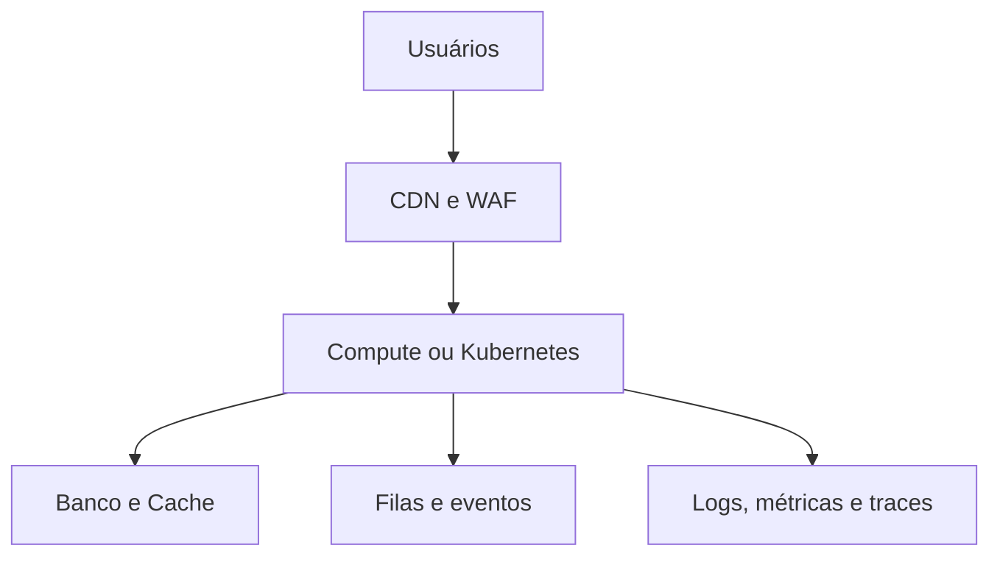

# Arquitetura Cloud para DevOps

## Definition
Arquitetura Cloud para DevOps é o desenho de componentes, serviços gerenciados, segurança, observabilidade e automação necessários para operar aplicações em nuvem com velocidade e confiabilidade.

## Why it exists
Ela existe para transformar requisitos de deploy, escala, resiliência e segurança em uma base operacional consistente, evitando ambientes improvisados e difíceis de manter.

## How it works
A arquitetura combina rede, identidade, computação, armazenamento, observabilidade e entrega contínua. Em vez de tratar cada recurso isoladamente, o time define padrões de VPC, IAM, balanceamento, banco, filas, monitoramento e pipelines como partes do mesmo sistema operacional da plataforma.

## When to use
Use quando o time precisa desenhar ou evoluir uma plataforma em nuvem com foco em automação, escalabilidade, segurança por padrão e suporte a múltiplos serviços ou squads.

## Examples
Um exemplo realista é uma aplicação composta por API em containers, banco gerenciado, fila assíncrona, CDN, WAF, observabilidade centralizada e deploy automatizado por pipeline. O valor da arquitetura está na integração entre esses blocos e não apenas na escolha individual de cada serviço.

## Visual Representation

## Related Notes
- [00 - AWS Overview](AWS/00%20-%20AWS%20Overview.md)
- [Terraform para Infraestrutura como Código (IaC)](../Terraform/Terraform%20para%20Infraestrutura%20como%20C%C3%B3digo%20(IaC).md)
- [11 - CI-CD para DevOps](../CI-CD/11%20-%20CI-CD%20para%20DevOps.md)
